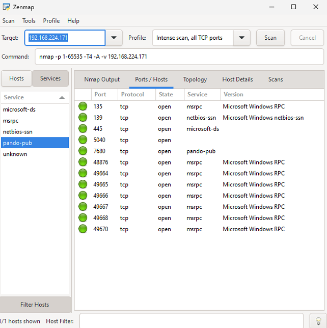
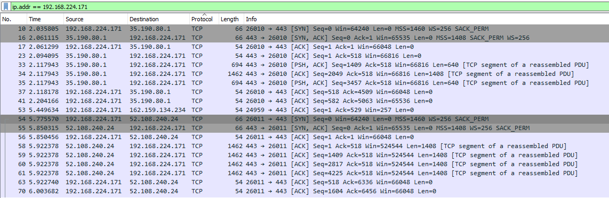

<h1>LABORATORIUM BEZPIECZEŃSTWO TECHNOLOGII INFORMATYCZNYCH</h1>

&nbsp;

&nbsp;

<centerer>
    <Ltext>Data wykonania ćwiczenia:</Ltext>
    

        <rectangle>
            <Rtext>03.10.2023</Rtext>
        </rectangle>
    

</centerer>

<centerer>
    <Ltext>Rok studiów:</Ltext>
    

        <rectangle>
            <Rtext>3</Rtext>
        </rectangle>
    

</centerer>

<centerer>
    <Ltext>Semestr:</Ltext>
    

        <rectangle>
            <Rtext>5</Rtext>
        </rectangle>
    

</centerer>

<centerer>
    <Ltext>Grupa studencka:</Ltext>
    

        <rectangle>
            <Rtext>2</Rtext>
        </rectangle>
    

</centerer>

<centerer>
    <Ltext>Grupa laboratoryjna:</Ltext>
    

        <rectangle>
            <Rtext>2B</Rtext>
        </rectangle>
    

</centerer>

&nbsp;

&nbsp;

<row>
    <b>Ćwiczenie nr.</b>
    <rectangle>
        <Rtext>2</Rtext>
    </rectangle>
</row>

&nbsp;

&nbsp;

<b>Temat: </b> Skanowanie Sieci w Poszukiwaniu Otwartych Portów.

&nbsp;

&nbsp;

<b>Osoby wykonujące ćwiczenia: </b>

1. Igor Gawłowicz

&nbsp;

&nbsp;

<h1>Katedra Informatyki i Automatyki</h1>

# Skanowanie Sieci w Poszukiwaniu Otwartych Portów.

## Cel zadania:

### Celem tego laboratorium jest zapoznanie studentów z podstawami skanowania sieci w celu identyfikacji otwartych portów i działających usług, a także z umiejętnością korzystania z narzędzi do skanowania sieci, takich jak nmap i Wireshark.

## Część 1: Skanowanie przy użyciu nmap (Network Mapper)

Po zainstalowaniu narzędzia NMap postanowiłem wybrać swój własny komputer za cel i za pomocą polecenia

`nmap -p 1-65535 -T4 -A -v 192.168.224.171`

Przeprowadziłem skan mojej sieci za pomocą lokalnego IPv4.

Możemy zauważyć że większość otwartych portów pochodzi z serwisów microsoftu, oprócz tego możemy zauważyć jeszcze jedene niezidentyfikowany otwarty port.

## Część 2: Skanowanie przy użyciu Wireshark

Po zeskanowaniu właśnej sieci możemy przez do analizy, zwrócimy szczególną uwagę protokół TCP.

Pomimo natłoku informacji możemy zidentyfikować porty dla których wartość celowego portu DST wyniosi 443 oznacza to zazwyczaj otawrty port HTTPS, taka sama sytuacja jest dla portu 80 - HTTP, 22 - SSH, 25 - SMTP.

Możemy teraz przejśc przez takie rekordy i na podstawie adresu ip jesteśmy w stanie zindentyfikować z jakiego serwisu pochodzą dane rekordy.

Np.

`Frame 54: 66 bytes on wire (528 bits), 66 bytes captured (528 bits) on interface \Device\NPF_{32714C3E-D261-4C1B-B959-82F5192BA025}, id 0
Ethernet II, Src: IntelCor_08:8e:00 (a0:a8:cd:08:8e:00), Dst: 9e:a1:57:5a:e9:9c (9e:a1:57:5a:e9:9c)
Internet Protocol Version 4, Src: 192.168.224.171, Dst: 52.108.240.24
Transmission Control Protocol, Src Port: 26011, Dst Port: 443, Seq: 0, Len: 0
`

Z powyższego rekordu możemy zauważyć że adres IP prowadzi do platformy Office, co potwierdza nasze wnioski uzyskane w aplikacji NMap, gdzie widzieliśmy że część otwartych portów pochodzi z usług microsoftu.

## Część 3: Analiza i obrona przed skanowaniem sieci

### 1. Przeprowadź analizę wyników z części 1 i części 2, gdzie skanowaliście sieć. Zastanów się, jakie informacje można było uzyskać z wyników skanowania i jakie potencjalne zagrożenia mogą wynikać z tych informacji.

Podczas skanowania sieci mogliśmy uzyskać różne informacje, takie jak otwarte porty, dostępne usługi i konfiguracje sieciowe. Po przeanalizowaniu tych informacji możemy dojść do następujących zagrożeń:

- Potencjalne ataki hakerskie na znalezione otwarte porty i usługi.
- Nieautoryzowany dostęp do zasobów sieciowych.
- Możliwość uruchomienia ataków typu "man-in-the-middle" w celu przechwycenia danych.
- Eksploracja systemów pod kątem znalezienia luk w zabezpieczeniach.

### Na podstawie wyników skanowania sieci, przemyśl, jakie działania można podjąć w celu zabezpieczenia sieci przed atakami lub nieautoryzowanym dostępem.

Na podstawie wyników skanowania, musimy podjąć działania w celu zabezpieczenia sieci przed potencjalnymi atakami i nieautoryzowanym dostępem. Możemy rozważyć następujące działania:

- Zamknięcie zbędnych otwartych portów i usług: Wyłączamy usługi i porty, które nie są niezbędne do działania naszej sieci, aby zminimalizować potencjalne ataki.
- Aktualizacja oprogramowania i systemów: Zapewniamy, że wszystkie urządzenia i oprogramowanie w sieci są regularnie aktualizowane, aby zaktualizować zabezpieczenia i łaty.
- Wdrożenie silnego firewalla: Konfigurujemy firewalla w taki sposób, aby kontrolować ruch sieciowy i blokować nieautoryzowane połączenia.
- Monitorowanie ruchu sieciowego: Używamy narzędzi monitorujących, takich jak IDS (Systemy Wykrywania Włamań) i IPS (Systemy Zapobiegania Włamań), aby śledzić i reagować na podejrzane działania w sieci.

### Opracuj strategię obrony przed skanowaniem i testowaniem podatności sieci, takie jak odpowiednie konfiguracje firewalla, monitorowanie ruchu sieciowego lub aktualizacje oprogramowania.

- Regularne testy podatności: Planujemy regularne testy skanowania podatności w celu wykrywania i usuwania potencjalnych luk w zabezpieczeniach.

- Szkolenia dla personelu: Zapewniamy odpowiednie szkolenia dla pracowników w zakresie bezpieczeństwa sieci i świadomości zagrożeń.

- Zasady dostępu i kontroli dostępu: Wdrażamy restrykcyjne zasady dostępu oraz kontrolujemy dostęp do zasobów sieciowych w oparciu o zasady "zasad najmniejszego uprzywilejowania."

- Plan reagowania na incydenty: Opracowujemy plan reagowania na incydenty, aby efektywnie reagować na potencjalne ataki i naruszenia bezpieczeństwa.

Podsumowując, analiza wyników skanowania sieci powinna prowadzić do konkretnych działań w celu zabezpieczenia sieci przed potencjalnymi zagrożeniami. Regularna troska o bezpieczeństwo sieci i monitoring są kluczowe w utrzymaniu bezpiecznej i odporniej infrastruktury.
