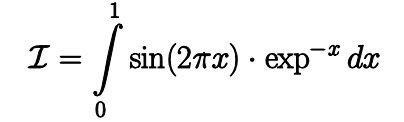
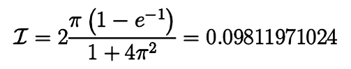
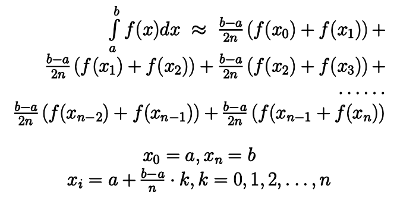

<style>
h1, h4, h2 {
    border-bottom: 0;
    display:flex;
    flex-direction: column;
    align-items: center;
    text-align: center;
      }
      
centerer{
    display: grid;
    grid-template-columns: 6fr 1fr 4fr;
    grid-template-rows: 1fr;

}
rectangle{
    border: 1px solid black;
    margin: 0px 50px 0px 50px;
    width: 200px;
    height: 4em;
    display: flex;
    flex-direction: column;
    align-items: center;
    justify-items: center;
}
Ltext{
    margin: auto auto auto 0;
    font-weight: bold;
    margin-left: 4em
}
Rtext{
    margin: auto;
}

row {
    display: flex;
    flex-direction: row;
    align-items: center;
    justify-content: center; 
}
 </style>
<h1>Akademia Techniczno-Humanistyczna w Bielsku-Białej </h1>

&nbsp;

&nbsp;

&nbsp;

&nbsp;

&nbsp;

&nbsp;

&nbsp;

&nbsp;

&nbsp;

<h1 style="text-align: center;"><b>LABORATORIUM</b></h1>
<h1 style="text-align:center"><b>Obliczeń Równoległych i Systemów Rozproszonych </b></h1>

&nbsp;

&nbsp;

<h2 style="text-align:center; border: none;"><b>Sprawozdanie nr 2</b></h3>
<h2 style="text-align:center; border: none;">Łącza nienazwane</h2>

&nbsp;

&nbsp;

&nbsp;

&nbsp;

&nbsp;

&nbsp;

&nbsp;

GRUPA: 2B / SEMESTR: 5 / ROK: 3

Igor Gawłowicz / 59096

<div style="page-break-after: always;"></div>

Rodzina systemów POSIX zaopatrzona została w mechanizm tworzenie międzyprocesowych łączy komunikacyjnych, zwanych potokami:

- *nienazwanymi* a więc istniejącymi wyłącznie w pamięci jądra obiektów tymczasowych, tworzonymi obok otwieranych w momencie inicjowania procesu standardowymi

- *nazwanymi* czyli posiadających dowiązanie w systemie plików, do których odwołania następując explicite przez nazwę a czas ich istnienia nie jest ograniczony czasem wykonania procesu.

Każdemu z tych strumieni system operacyjny przypisuje deskryptor pliku, który stanowi unikalną liczbą całkowitą 0, 1, 2, 3, itd. choć trzy pierwsze są przypisane standardowym strumieniom wejściowemu, wyjściowemu i błędu. 

*Procesy potomne dziedziczą deskryptory łączy po procesach macierzystych.*

Liczba możliwych do wykorzystania przez proces deskryptorów, a więc i ilość otwartych plików jest
ograniczona.

W gruncie rzeczy można byłoby się zawahać na ile w przypadku problematyki współbieżności, czy
– rozpatrywanej tu wieloprocesowości – potrzebne są takie rozwiązania. W końcu, każdy proces
potomny stanowi dokładną kopię procesu macierzystego, czy w takim razie nie łatwiej uzyskać
komunikację międzyprocesową poprzez zdefiniowane już w obrębie kodu zmiennej (chociażby
globalnej). Okazuje się jednak że całość nie przedstawia się aż tak prosto.

Rozważmy hipotetyczną sytuację, że w procesie głównym – z pewnego powodu – zaistniała potrzeba obliczania całek. 

Załóżmy, że w rozpatrywanym konkretnie przypadku jest to całka

<p align="center">
  
</p>

Gdyby obliczyć jej wartość na drodze analitycznej, to otrzymamy

<p align="center">
  
</p>

Równocześnie może pojawić się sytuacja, że wyrażenie podcałkowe stanowić będą także i inne
funkcje. W zawiązku z czym, logicznym rozwiązaniem byłoby uzupełniania kodu programu o
fragment umożliwiający obliczenie wartości całki, drogą kwadratury numerycznej. 

Istnieje wiele skutecznych metod obliczania kwadratur numerycznych, gdyby przyjąć tutaj
przykładowo metodę trapezów, to

<p align="center">
  
</p>

Samą funkcję kwadratury numerycznej możemy więc zdefiniować jak niżej.

```cpp
double quad( unsigned int n, double a, double b, double (*fun)(double) )
{
    unsigned int k;
    double xk, sum;
    sum = fun( a ) + fun( b );
    for( k=1;k<n;k++ )
    {
        xk = a+ (b-a)*k/n;
        sum += 2.0*fun( xk );
    }

    return ( (b-a)/(2.0*n)*sum );
}

```

Następnie wywołamy ją poprzez resztę kodu:

```cpp
#include <stdio.h>
#include <stdlib.h>
#include <unistd.h>
#include <sys/wait.h>
#include <math.h>
int main( void )
{
    int pid,status;
    double sine( double );
    double quad( unsigned int,double,double,double (*)(double));
    unsigned int n;
    double a,b,I;
    // Inicjujemy wartości początkowe zmiennych
    a=0.0; 
    b=1.0;
    I=0.0;
    // i jeszcze ilość węzłów kwadratury
    n=3200;
    switch( (int)fork() )
    {
        case -1:
        perror( "<!> błąd inicjacji potomka" ); exit( 1 ); break;
        case 0:
        // Obliczamy całkę, ale już w potomku
        I = quad( n,a,b,sine );
        // Dla pewności wyprowadzamy informację o tym co wyliczyliśmy
        printf( "[%d] wartość całki\t%16.6f\n",(int)getpid(),I );
        //... i kończymy działanie potomka
        exit( 0 );
        // Teraz kod dla procesu nadrzędnego
        default:
        // Powiedzmy, że coś tutaj ważnego się dzieje
        printf( "[%d] wykonuje ważne rzeczy...\n",(int)getpid() );
        // Oczekiwanie na wynik z potomka
        pid = (int)wait( &status );
        // ... i mamy gotowy rezultat
        printf( "[%d] zakończył z kodem %d\n",pid,status );
        printf( "[%d] otrzymał wartość\t%16.6f\n",(int)getpid(),I );
    }
    // Na tym program kończy działanie
    return 0;
}

```

musimy jeszcze dodać funkcjie sinusa

```cpp
double sine( double x ){ return sin( 2*M_PI*x )*exp(-x); }
```

a następnie uruchomimy propram z uwględnieniem biblioteki matematycznej za pomocą polecenia:

`$ gcc -Wall quad.c -o quad -lm`


Taki program zwróci nam wartość

```bash
[3083] wykonuje ważne rzeczy...
[3084] wartość całki            0.098120
[3084] zakończył z kodem 0
[3083] otrzymał wartość         0.000000
```

Możemy jednak zauważyć że wyniki wykonany przez podrzędny proces nie przekazał informacji do procesu macierzystego.

Stało się tak ponieważ gdy korzystamy z polecenia fork i rozdzielamy program, oba procesy inicjiują swoje zmienne od razu przy podziale i nie dzielą się nimi więc pomimo tego że w momencie inicjacji oba dostały zmienną `I` proces podrzędny ją zmodyfikował ale nie przekazał procesowi macierzystemu.

Aby rozwiązać ten problem musimy skorzystać z jednego z narzędzi systemów UNIX, jakim są "rury" (z ang `pipe`) 

```cpp
int main( void )
{
    int pid,status;
    double sine( double );
    double quad( unsigned int, double, double,double (*)(double) );
    unsigned int n;
    double a,b,I;
    int fd[2];
    a=0.0,b=1.0,I=0.0;
    n=3200;
    if(pipe(fd)<0)
    { 
        printf("...błąd otwarcia łącza\n"); exit(1); 
    }
    switch( fork() )
    {
        case -1:
        perror( "<!> błąd inicjacji potomka" ); exit( 1 ); break;
        case 0:
        close( fd[0] );
        I = quad( n,a,b,sine );
        printf( "[%d] wartość całki %19.6f\n",(int)getpid(),I );
        write( fd[1],(void*)&I,sizeof( double ) );
        exit( 0 );
        default:
        close( fd[1] );
        printf( "[%d] wykonuje, ważne rzeczy...\n",(int)getpid() );
        read( fd[0],(void*)&I,sizeof( double ) );
        printf( "[%d] zakończył z kodem %d\n",pid,status );
        printf( "[%d] otrzymał wartość %16.6f\n",(int)getpid(),I );
    }
    return 0;
}

```

Tym razem program zwróci nam:

```bash
[4257] wykonuje ważne rzeczy...
[4258] wartość całki            0.098120
[4258] zakończył z kodem 0
[4257] otrzymał wartość         0.098120
```

Ponieważ proces może utworzyć wiele potoków w postaci łączy nienazwanych, a z reguły w
większości implementacji, są one jednokierunkowe, bardzo użytecznymi mogą okazać się funkcje
*dup()* i *dup2()*.

Wywołanie obu funkcji utworzy kopie deskryptora old, z tą różnicą że w przypadku dup2()
mamy możliwość wskazania w sposób jawny na co skopiować.
Funkcja dup() zwraca natomiast najniższy, pierwszy wolny.


```cpp

#include <stdio.h>
#include <stdlib.h>
#include <sys/wait.h>
#include <unistd.h>
int main ()
{
    int fd[2];
    int pid,status;
    // Ta zmienna zostanie w przyszłości skojarzona z potokiem
    FILE* stream;
    if( pipe( fd )< 0 )
    {
        printf( "...błąd otwarcia łącza\n" ); exit( 1 );
    }
    switch( (pid=(int)fork()) )
    {
        case -1:
            perror( "<!> błąd inicjacji potomka" );
            exit( 1 ); break;
            // Kod dla potomka
        case 0:
        // Na początek powitanie
            printf( "<!>\tpotomek [%d] startuje\n",(int)getpid() );
            // Zamykamy fd[1] bo potomek nie będzie pisał do potoku
            close( fd[1] );
            // Kopjujemy potomkowi fd[0] potoku na jego stdin
            dup2( fd[0],STDIN_FILENO );
            // Zamykamy fd[0],bo już niepotrzebne–skopiowaliśmy na stdin
            close(fd[0]);
            // Teraz pozostaje już tylko wywołać program sort
            printf("------------------------------------------\n" );
            execl( "/usr/bin/sort","sort","--reverse",(char*)NULL );
        default:
            // Zamykamy od tej strony kanału odczyt, bo będziemy pisać.
            close( fd[0] );
            // Przypisanie strumienia (plikowego) istniejącemu deskryptorowi.
            stream = fdopen( fd[1], "w" );
            // Piszemy do kanału, na końcu którego jest potomek
            // (właściwie to jest tam już systemowe sort).
            fprintf( stream, "\tAaaaa\n" );
            fprintf( stream, "\tBbbbb\n" );
            fprintf( stream, "\tCcccc\n" );
            fprintf( stream, "\tDdddd\n" );
            // Na wszelki wypadek opróżniamy bufor plikowy
            fflush( stream );
            // Zamykamy deskryptor, ponieważ nie jest dłużej potrzebny
            close( fd[1] );
            // i czekamy na potomka, aż skończy
            wait( &status );
            // Po zakończeniu wyświetlamy komunikat
            printf("------------------------------------------\n" );
            printf("<!>\tpotomek [%d] zakończył działanie zwrócił [%d]\n",pid,status );
    }
    return 0;
}
```

Uruchomienie programu zwróci nam:

```bash
<!>     potomek [5528] startuje
------------------------------------------
        Ddddd
        Ccccc
        Bbbbb
        Aaaaa
------------------------------------------
<!>     potomek [5528] zakończył działanie i zwrócił [0]
```

Mechanizm łączy nienazwanych można z powodzeniem wykorzystać do komunikacji
dwukierunkowej, między procesem nadrzędnym a potomnym. Kolejny przykład pokazuje tego
rodzaju wariant komunikacji międzyprocesowej.

Złóżmy, że proces nadrzędny prześle do procesu potomnego pewną wartość x oczekując na
wykonanie na niej pewnej operacji f(x)=y a proces potomny zwróci wynik tej operacji, czyli y, do
procesu nadrzędnego

```cpp
#include <stdio.h>
#include <stdlib.h>
#include <unistd.h>
#include <sys/wait.h>
int main( void )
{
    int pid,status;
    int one[2],two[2];
    double x=1.0,y=1.0;
    printf( "\t[%d] nadrzędny, start\n\n",(int)getpid() );
    // Oczywiście, w przypadku komunikacji dwukierunkowej,
    // konieczne są dwa łącza pipe
    if( pipe( one )< 0 || pipe( two )<0 )
    { 
        printf( "<!> błąd otwarcia łączy\n" ); exit( 1 ); 
    }
    switch( pid=(int)fork() )
    {
        // Gdyby coś poszło nie tak
        case -1:
            perror( "<!> błąd inicjacji potomka" );
            exit( 1 );
            break;
        // Teraz kod dla potomka
        case 0:
            // Powitanie (jest to oczywiście czysta diagnostyka)
            printf( "\t[%d] potomek, start\n\n",(int)getpid() );
            // Zamykamy niepotrzebne deskryptory,
            // odpowiednio do kierunku przesyłu
            close( one[1] ); close( two[0] );
            // Nasłuchujemy tego co nadrzędny ma nam do powiedzenia
            read( one[0],(void*)&x,sizeof( double ) );
            printf( "\t[%d] otrzymał x=%f\n",(int)getpid(),x );
            // Wykonujemy właściwe operacje, na rzecz nadrzędnego
            y = x*M_PI;
            printf( "\t[%d] wykonał f(x)=y,wysyła y=%f\n",(int)getpid(),y );
            // no i w końcu wysyłamy wynik końcowy do nadrzędnego
            write( two[1],(void*)&y,sizeof( double ) );
            printf( "\t[%d] potomek, stop\n\n",(int)getpid() );
            exit( 0 );
            break;
        default:
            // Oczywiście zamykamy to co nie jest nam potrzebne
            close( one[0] ); close( two[1] );
            // Wysyłamy dane do potomka
            printf( "\t[%d] wysyła do potomka [%d]x=%f\n\n",(int)getpid(),pid,x );
            write( one[1],(void*)&x,sizeof( double ) );
            // no i czekamy na wynik do potomka
            read( two[0],(void*)&y,sizeof( double ) );
            wait( &status );
            printf( "\t[%d] kod powrotu potomka [%d]\n",pid,status );
            //informacja diagnostyczna
            printf( "\t[%d] otrzymał y=%f\n",(int)getpid(),y );
            printf( "\n\t[%d] nadrzędny, stop\n",(int)getpid() );
    }
    //Proces nadrzędny kończy ostatecznie działanie
    return 0;
}

```

Po kompilacji otrzymamy:

```bash
        [6341] nadrzędny, start

        [6341] wysyła do potomka [6342]x=1.000000

        [6342] potomek, start

        [6342] otrzymał x=1.000000
        [6342] wykonał f(x)=y,wysyła y=3.141593
        [6342] potomek, stop

        [6342] kod powrotu potomka [0]
        [6341] otrzymał y=3.141593

        [6341] nadrzędny, stop
```

### Wnioski

W ramach laboratorium dotyczącego łączy nienazwanych w systemach UNIX omówiliśmy, jak procesy komunikują się między sobą w sposób nienazwany, poprzez wykorzystanie potoków (pipe). Zrozumieliśmy, że potoki mogą służyć do przesyłania danych między procesami, zwłaszcza w przypadku komunikacji między procesem nadrzędnym a potomnym.

Przykłady programów wykorzystujących potoki zostały omówione w sprawozdaniu. Pierwszy przykład dotyczył przesyłania danych z procesu nadrzędnego do procesu potomnego, który dokonywał na tych danych obliczeń i przesyłał wynik z powrotem do procesu nadrzędnego. Dzięki temu zrozumieliśmy, jak przekazywać dane między procesami i jak zamykać odpowiednie deskryptory plików, aby uniknąć błędów.

Kolejny przykład przedstawiał komunikację dwustronną między procesem nadrzędnym a potomnym. Wskazano, że procesy mogą być komunikatywne w obie strony, co jest przydatne w bardziej zaawansowanych scenariuszach. Przykład ten pomógł zrozumieć, jak działa przesyłanie danych w dwie strony oraz jak zamykać odpowiednie deskryptory, aby uniknąć błędów.

Podczas laboratorium nabyliśmy umiejętności korzystania z funkcji takich jak pipe(), dup(), dup2(), read(), write(), a także obsługi błędów podczas komunikacji między procesami. Dzięki temu zdobyliśmy praktyczną wiedzę na temat wykorzystania potoków w programowaniu współbieżnym i komunikacji międzyprocesowej.