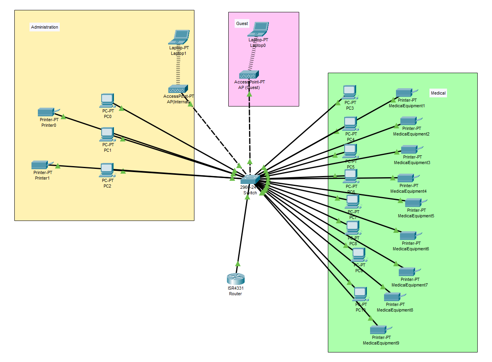

# Zrozumienie wymagań

1. Nazwa obiektu: Klinika medyczna "HealthCare Plus"
2. Liczba pracowników: 15
3. Liczba urządzeń: 25 (w tym komputery lekarzy i sprzęt medyczny)
4. Usługi sieciowe: Przechowywanie i udostępnianie historii medycznych pacjentów oraz wyników badań.

# Wybór topologii sieci

Rozważmy najpierw nasze możliwości

## Topologia Gwiazdy:
### Zalety:

- Wydajność: Topologia gwiazdy zapewnia dobre osiągi, ponieważ każde urządzenie ma osobne połączenie z głównym switchem. To oznacza, że pasmo komunikacyjne jest dostępne dla każdego urządzenia, co minimalizuje opóźnienia i zapewnia niskie czasy odpowiedzi.

- Łatwość zarządzania: Ze względu na centralny punkt (główny switch), zarządzanie siecią jest proste. Diagnostyka, monitorowanie i konserwacja stają się znacznie bardziej intuicyjne.

- Redundancja: Topologia gwiazdy umożliwia łatwe wprowadzenie redundancji. Poprzez dodanie dodatkowych łączy lub switchy o możliwościach High Availability, można zminimalizować ryzyko przestojów.

### Wady:

- Ilość kabli: Konieczność połączenia każdego urządzenia bezpośrednio z głównym switchem oznacza, że potrzebne jest więcej kabli niż w innych topologiach. To może wiązać się z kosztami i problemami z zarządzaniem przewodami.

## Topologia Magistrali:

### Zalety:

- Kosztoszczędność: Topologia magistrali jest kosztoszczędna, ponieważ wymaga tylko jednego wspólnego kabla i prostego switcha centralnego. To może być atrakcyjne dla budżetów o ograniczonych zasobach.

### Wady:

- Brak redundancji: Jest to topologia podatna na awarie, ponieważ jedna uszkodzona linia główna może unieruchomić całą sieć. Brak redundancji wpływa na niezawodność i dostępność.

## Topologia Pierścienia:

### Zalety:

- Redundancja: Topologia pierścienia ma wbudowaną redundancję. W przypadku awarii jednego odcinka, dane nadal mogą krążyć w drugim kierunku, co zwiększa niezawodność sieci.

- Wydajność: Podobnie jak w topologii gwiazdy, każde urządzenie ma oddzielne połączenia, co wpływa na wydajność i minimalizuje opóźnienia.

### Wady:

- Skomplikowane zarządzanie: Zarządzanie siecią pierścienia może być bardziej skomplikowane niż w przypadku topologii gwiazdy, zwłaszcza w większych sieciach. Diagnozowanie problemów w pierścieniu może być trudniejsze.

## Wnioski

Dla kliniki medycznej "HealthCare Plus", najlepszym wyborem może być topologia gwiazdy. Jest to stabilne rozwiązanie, które zapewnia prosty dostęp do zarządzania siecią oraz pozwala na łatwe rozszerzenie sieci w przyszłości. Ponadto, można rozważyć wykorzystanie switchy z funkcją redundancji (np. stosowane w technologii High Availability), aby zapewnić niezawodność w przypadku awarii.

# Wybór Sprzętu sieciowego

### *Główny switch:* 

Centralnym urządzeniem w topologii gwiazdy będzie główny switch. Musi być to switch o odpowiedniej pojemności, który może obsłużyć wszystkie urządzenia w sieci, w tym 25 urządzeń. Wybierzmy model switcha o co najmniej 24 portach Ethernet 1 Gb/s, aby mieć zapas na przyszłe rozbudowy.

Zdecydowaliśmy się na sprawdzony model cisco **WS-C2960X-24PS-L**

Jest to model, który jest jednym z bestsellerów firmy cisco przez swoją wszechstronność i zaawansowane możliwości:

- **Zaawansowane funkcje warstwy 2 i warstwy 3:** Switchy serii 2960-X oferują zaawansowane funkcje zarówno warstwy 2 (np. VLAN, STP, ACL) jak i warstwy 3 (np. routing IP statyczny, IP multicast). To pozwala na elastyczne zarządzanie ruchem sieciowym wewnątrz kliniki medycznej.

- **Power over Ethernet Plus (PoE+):** Model 2960X-24PS-L jest wyposażony w technologię PoE+, co oznacza, że może zasilać różnorodne urządzenia bez dodatkowych zewnętrznych zasilaczy. To sprawia, że jest idealny do zasilania urządzeń medycznych takich jak kamery IP, telefony VoIP czy punkty dostępu Wi-Fi, co jest kluczowe w środowisku medycznym.

- **Wysoka moc wyjściowa PoE na port:** Oferuje do 370W mocy na 24 porty gigabit Ethernet, co zapewnia elastyczność w zasilaniu urządzeń. Możliwość obsługi do 30W PoE na port umożliwia zasilanie nawet wymagających sprzętów, jednocześnie zapewniając wydajność.

- **Wsparcie dla różnych rodzajów interfejsów:** Oprócz 24 portów gigabit Ethernet, switch ten posiada 4 porty SFP uplink, co umożliwia rozbudowę sieci o interfejsy fiber lub inne modele połączeń. To elastyczność w obsłudze różnorodnych potrzeb sieciowych.

- **Zaawansowane zarządzanie siecią:** Dzięki pełnemu zarządzaniu, switch ten oferuje zaawansowane funkcje konfiguracyjne, zarządzanie przepustowością oraz monitoring ruchu sieciowego, co jest kluczowe dla stabilności i bezpieczeństwa sieci medycznej.

- **Wsparcie dla różnorodnych urządzeń:** Z możliwością zasilania różnych urządzeń przy różnych poziomach mocy PoE, switch ten umożliwia obsługę wielu typów urządzeń medycznych bez konieczności dodatkowych zasilaczy.

To wszystko za cenę około 1000zł.

### *Router:* 

Chociaż topologia gwiazdy nie wymaga routera do przesyłania danych między podsieciami (ponieważ wszystkie urządzenia są podłączone bezpośrednio do switcha), warto rozważyć urządzenie z funkcjami zabezpieczeń, takie jak firewall i VPN, aby chronić poufność danych medycznych.

Co do routera zdecydowaliśmy się na **ASUS RT-AX88U**

- **Standard Wi-Fi 6 (802.11ax):** Posiadanie standardu Wi-Fi 6 zapewnia wysoką przepustowość i efektywność sieci bezprzewodowej. To znacznie wyższe prędkości transmisji danych oraz lepsza wydajność w obszarach o dużej gęstości urządzeń.

- **Prędkość transmisji bezprzewodowej 6000 Mb/s:** Szybkość transmisji danych na poziomie 6 Gb/s oznacza, że router ten może obsłużyć duże ilości urządzeń jednocześnie, zapewniając wysoką wydajność sieci.

- **Zabezpieczenia bezprzewodowe:** Posiada różnorodne protokoły zabezpieczeń, takie jak WPA3-Personal, co przekłada się na wyższy poziom ochrony sieci bezprzewodowej przed potencjalnymi atakami.

- **Obsługa wielu trybów pracy:** Oprócz trybu routera, umożliwia pracę jako access point, bridge, co zapewnia elastyczność w zastosowaniach sieciowych.

- **Zarządzanie i konfiguracja:** Posiada intuicyjną stronę WWW do zarządzania siecią, co ułatwia konfigurację i dostosowanie ustawień sieciowych do potrzeb kliniki medycznej.

- **Obsługa VPN, QoS, serwery sieciowe:** Router oferuje funkcje takie jak obsługa VPN Pass-Through, serwer VPN, serwer dysku sieciowego, serwer wydruku, funkcja modemu USB, QoS (Quality of Service), co jest istotne w zapewnianiu bezpieczeństwa, wydajności i funkcjonalności sieci.

- **Obsługa IPv6:** Wspiera nowszy standard IP, co jest ważne w kontekście rozwoju technologicznego oraz zmian w sieciach.

- **Dodatkowe funkcje i zabezpieczenia:** Wsparcie dla modemów 3G/4G/LTE, kontrola diod, podwójna ochrona firewall (SPI i NAT), ochrona przed atakami DoS - wszystko to zapewnia dodatkowy poziom bezpieczeństwa i elastyczności.

Cena około 1200zł

### *Access Point (AP):*

Jeśli klinika potrzebuje dostępu do sieci bezprzewodowej dla swojego personelu lub pacjentów, należy uwzględnić access point. Wybierzmy model AP o dobrej przepustowości i obszarze działania, aby zapewnić odpowiednie pokrycie.

Naszym rekomendowanym access pointem będzie: **Ubiquiti UniFi AP-AC Pro**

- **Standard Wi-Fi ac i wysoka wydajność:** Wykorzystanie najnowszego standardu Wi-Fi ac zapewnia wydajność i szybkość transmisji danych na poziomie do 1300 Mb/s w paśmie 5 GHz oraz do 450 Mb/s w paśmie 2,4 GHz. To pozwala obsługiwać duże ilości użytkowników jednocześnie, zapewniając szybką i stabilną sieć.

- **Zastosowanie technologii 3x3 MIMO:** Trzy wbudowane anteny o zysku 3 dBi pracujące w technologii 3x3 MIMO poprawiają jakość sygnału i zasięg, co przekłada się na lepszą jakość połączenia dla użytkowników.

- **Dwa gigabitowe porty Ethernet:** Posiadanie dwóch portów Ethernet pozwala na elastyczne połączenie z siecią przewodową, umożliwiając zasilanie urządzenia oraz zapewnienie szybkiego przesyłu danych.

- **Odporność na warunki zewnętrzne:** Jako jedyny z serii UAP AC, jest przystosowany do pracy na zewnątrz budynków. Posiada wodoodporną obudowę, co czyni go idealnym rozwiązaniem do zastosowań zewnętrznych, takich jak punkt dostępowy dla ogólnodostępnej sieci bezprzewodowej w parkach, kampusach uniwersyteckich czy miejscach publicznych.

- **Produkt Ubiquiti i serwery UniFi:** Ubiquiti jest znanym producentem sprzętu sieciowego, a rozwiązania UniFi oferują zaawansowane funkcje zarządzania sieciami, w tym monitoring, zarządzanie przepustowością oraz w pełni konfigurowalne opcje.

- **Wysoka reputacja na rynku:** Model UniFi AC PRO cieszy się pozytywnymi opiniami na rynku, co świadczy o jego solidności, niezawodności oraz wydajności.

Cena około 700zł

### *Okablowanie:*

Do podłączenia całej konfiguracji będziemy potrzebować sporej ilości okablowania dokładnie będziemy potrzebować około 30 kabli ethernet o różnych długościach pomiędzy 10 a 30m.

Uwzględniamy tutaj podłączenie do urządzeń a także zapasowe kable, w razie takiej potrzeby.

Cena około 1200zł

### *Magazyn danych:*

Bardzo ważnym aspektem jest jakiś magazyn, może to być server lub chmura, dlatego rozważymy te dwie opcje:

1. Serwer lokalny:
    - Pełna kontrola: Posiadanie serwera lokalnego daje pełną kontrolę nad infrastrukturą i danymi. To może być istotne w sektorach, gdzie istnieją surowe regulacje dotyczące przechowywania danych.

    - Wydajność sieci: W niektórych przypadkach serwer lokalny może zapewnić szybszy dostęp do danych, zwłaszcza gdy wymagane są szybkie transferowanie plików w obrębie sieci wewnętrznej.

    - Koszty na dłuższą metę: W niektórych przypadkach inwestycja w serwer lokalny może być tańsza na dłuższą metę niż opłaty za korzystanie z usług chmurowych.

2. Rozwiązania w chmurze:
   - Elastyczność i skalowalność: Usługi chmurowe pozwalają na łatwą skalowalność zasobów w zależności od potrzeb. Można łatwo zwiększać lub zmniejszać moc obliczeniową lub przestrzeń dyskową.

   - Redundancja i dostępność: Wiele usług chmurowych oferuje wbudowane zabezpieczenia, takie jak backup danych, wysoka dostępność i redundancja, co często może być trudne do osiągnięcia przy lokalnym serwerze.

    - Niskie koszty początkowe: Często rozwiązania w chmurze wymagają mniejszej inwestycji początkowej, ponieważ nie trzeba zakupić i utrzymywać sprzętu.

Dlatego w naszym przypadku ostatecznie zdecydujemy się na chmurę ze względu na:

1. Bezpieczeństwo danych: Usługi chmurowe często oferują wysoki poziom zabezpieczeń, w tym szyfrowanie danych, kontrolę dostępu i systemy monitorowania.

2. Dostępność i skalowalność: Rozwiązania w chmurze mogą zapewnić wysoką dostępność danych oraz elastyczność w zakresie skalowania zasobów w zależności od potrzeb, co jest ważne w przypadku wzrostu liczby pacjentów i danych medycznych.

3. Redundancja i backup danych: Usługi chmurowe często zapewniają automatyczne tworzenie kopii zapasowych, co minimalizuje ryzyko utraty danych.

4. Koszty: Rozwiązania chmurowe często wymagają niższych kosztów początkowych niż zakup i utrzymanie własnej infrastruktury serwerowej.

Konkretnie skorzystamy z platformy AWS (Amazon Web Services)

Z opcją Amazon Athena, która zapewnia nam możliwość obszernej bazy danych, dość tanim kosztem wraz z możliwością opcji analitycznych naszyc informacji.

Cena: 40-200zł/miesięcznie w zależności od skali początkowej i rozwoju w przyszłości.

## Podsumowanie

Instalacja sieci może być kosztowna, jednak wybór najlepszego sprzętu rozwiązuje nam wiele problemów i jest dobrą inwestycją w przyszłość firmy. Ostatecznie koszty zakupu sprzętów potrzebnych do stworzenia naszej sieci wyglądają tak:

- Router - 1200zł
- Switch - 1000zł
- Access Point - 700zł
- Okablowanie - 1200zł
- Chmura - 40-200zł/miesięcznie
  
Całość daje nam **3900zł** + **40-200zł miesięcznie**.

# Projektowanie podsieci:

Aby zaprojektować odpowiednio model naszej sieci musimy wziąć pod uwagę kilka rzeczy.

- **Wymagania dotyczące zabezpieczeń:** Biorąc pod uwagę charakter danych medycznych, istotne jest stworzenie podsieci w taki sposób, aby zapewnić odpowiednie zabezpieczenia i izolację danych.

- **Zarządzanie dostępem do zasobów sieciowych:** Upewnij się, że pracownicy mają dostęp do zasobów sieciowych, takich jak bazy danych pacjentów, jednocześnie zachowując bezpieczeństwo.

- **Zwiększenie wydajności i efektywności:** Rozważenie podziału sieci na podsieci może pomóc w zwiększeniu wydajności i ograniczeniu ruchu sieciowego, co jest istotne w środowiskach medycznych.

Z takim właśnie podejście napisaliśmy poniższy przykład modelu sieci:

### Podsieć 1: Dla pracowników administracyjnych i biurowych

Adres IP: 172.17.10.0/24 \
Liczba adresów IP: 8 \
Przykładowe adresy IP: 
- Dla urządzeń: 172.17.10.1 - 172.17.10.4 
- Dla drukarek sieciowych, serwerów: 172.17.10.5 - 172.17.10.8

### Podsieć 2: Dla lekarzy i personelu medycznego

Adres IP: 172.17.20.0/24 \
Liczba adresów IP: 16 \
Przykładowe adresy IP: 
- Dla urządzeń: 172.17.20.1 - 172.17.20.8 
- Dla sprzętu medycznego: 172.17.20.9 - 172.17.20.16 

### Podsieć 3: Dla systemów diagnostyki obrazowej

Adres IP: 172.17.30.0/24 \
Liczba adresów IP: 6 \
Przykładowe adresy IP: 
- Dla systemów diagnostyki: 172.17.30 - 172.17.30.3
- Dla serwerów przetwarzania obrazów: 172.17.30.4 - 172.17.30.6 

### Podsieć bezprzewodowa 1: Dla pracowników kliniki

Nazwa sieci: HealthCare_Internal \
Adres IP: 172.17.40.0/24 \
Liczba adresów IP: 40 \
Przykładowe adresy IP: 
- Dla pracowników: 172.17.40.1 - 172.17.40.40 

### Podsieć bezprzewodowa 2: Dla pacjentów

Nazwa sieci: HealthCare_Guest \
Adres IP: 172.17.50.0/24 \
Liczba adresów IP: 40 \
Przykładowe adresy IP: 
- Dla pacjentów: 172.17.50.1 - 172.17.50.40 

## Uzasadnienie

- **Izolacja danych:** Każda podsieć jest dedykowana dla określonej grupy, co pomaga w zabezpieczeniu i izolacji danych.
- **Skalowalność i wydajność:** Podział na podsieci pozwala na efektywne zarządzanie ruchem sieciowym i zapobieganie przeciążeniu sieci.
- **Łatwość zarządzania:** Prosta struktura podsieci ułatwia zarządzanie i konserwację sieci, co jest istotne w środowiskach medycznych, gdzie stabilność i dostępność są kluczowe.
- **Oddzielenie sieci pracowników od sieci dla pacjentów:** Utworzenie dwóch oddzielnych sieci bezprzewodowych pozwala na segregację urządzeń i użytkowników, co zapewnia dodatkową warstwę zabezpieczeń między sieciami.

| Device          | Interface | IP Address    | Subnet Mask    | Default Gateway | VLAN / Description                              |
|-----------------|-----------|---------------|----------------|-----------------|-------------------------------------------------|
| Router          | G0/1      | 172.17.10.1   | 255.255.255.0  | N/A             | VLAN 10 (Administrative Staff)                    |
|                 | G0/2      | 172.17.20.1   | 255.255.255.0  | N/A             | VLAN 20 (Medical Staff)                           |
|                 | G0/3      | 172.17.30.1   | 255.255.255.0  | N/A             | VLAN 30 (Diagnostic Imaging Systems)              |
| Switch          | VLAN 10    | N/A           | N/A            | 172.17.10.1     | VLAN 10 (Administrative Staff)   |
|                 | VLAN 20    | N/A           | N/A            | 172.17.20.1     | VLAN 20 (Medical Staff)          |
|                 | VLAN 30    | N/A           | N/A            | 172.17.30.1     | VLAN 30 (Diagnostic Imaging Systems) - Default GW |
| Access Point 1  | HealthCare_Internal | 172.17.40.1  | 255.255.255.0  | 172.17.40.1     | HealthCare_Internal             |
| Access Point 2  | HealthCare_Guest    | 172.17.50.1  | 255.255.255.0  | 172.17.50.1     | HealthCare_Guest             |
| Workstations    | NIC       | 172.17.10.2-4 | 255.255.255.0  | 172.17.10.1     | VLAN 10 (Administrative Staff) - Workstations     |
|                 | NIC       | 172.17.10.5-8 | 255.255.255.0  | 172.17.10.1     | VLAN 10 (Administrative Staff) - Printers  |
|                 | NIC       | 172.17.20.2-9 | 255.255.255.0  | 172.17.20.1     | VLAN 20 (Medical Staff) - Workstations             |
|                 | NIC       | 172.17.20.10-16| 255.255.255.0 | 172.17.20.1     | VLAN 20 (Medical Staff) - Medical Equipment        |
|                 | NIC       | 172.17.30.2-6 | 255.255.255.0  | 172.17.30.1     | VLAN 30 (Diagnostic Imaging Systems) - Workstations|
| Mobile Devices  | HealthCare_Internal | 172.17.40.2-40| 255.255.255.0 | 172.17.40.1     | HealthCare_Internal    |
| Patients' Devices | HealthCare_Guest  | 172.17.50.2-40| 255.255.255.0 | 172.17.50.1     | HealthCare_Guest    |

## Protokoły używane w sieci

W naszej sieci będziemy stosować protokoły takie jak:

- VLAN (Virtual Local Area Network) może być dobrym rozwiązaniem w małej sieci. VLAN pozwala na logiczne podzielenie jednej fizycznej sieci na kilka odrębnych segmentów, co może przynieść kilka korzyści:
- Segmentacja ruchu: Możesz podzielić sieć na logiczne grupy, co pomaga w zarządzaniu i kontrolowaniu ruchu.
- Bezpieczeństwo: VLAN pozwala na izolowanie ruchu między segmentami, co zwiększa bezpieczeństwo.
- Łatwiejsze zarządzanie: Ułatwia zarządzanie siecią, zwłaszcza gdy urządzenia wymagają różnych ustawień sieciowych.
- Optymalizacja wydajności: Możesz zoptymalizować wydajność sieci, minimalizując niepotrzebny ruch między segmentami.
- DHCP ((Dynamic Host Configuration Protocol)) do przydzielania automatycznych adresów IP
- DNS (Domain Name System) do rozwiązywania nazw domen. Jest użyteczny w diagnostyce sieciowej i monitorowaniu ruchu sieciowego.

### Dla zabezpieczenia sieci, użyjemy protokołu
Dla Wi-Fi wykorzystamy
- WPA3 najnowsza wersja, wprowadzająca dodatkowe usprawnienia bezpieczeństwa, w tym bardziej zaawansowane protokoły szyfrowania, chroniące przed atakami typu "offline" i innymi nowoczesnymi technikami ataków.

oraz zaimplementujemy

Firewall na poziomie urządzeń i bramy sieciowej.
- Brama sieciowa pełni funkcję punktu kontrolnego między siecią wewnętrzną a zewnętrzną, więc firewall na tym poziomie może skutecznie filtrować ruch przed wejściem do sieci wewnętrznej.
- Urządzenia firewalle na każdym urządzeniu końcowym pozwolą kontrolować ruch na poziomie indywidualnych komputerów.

Do zarządzania urządzeniami można wykorzystamy protokoły SSH.

Ważne jest także monitorowanie ruchu sieciowego, który osiągniemy przy użyciu protokołu:

- SNMP (Simple Network Management Protocol): jest standardowym protokołem zarządzania siecią, który umożliwia zbieranie informacji oraz monitorowanie i kontrolę urządzeń sieciowych.
- Zbieranie informacji: SNMP pozwala administratorom na zbieranie danych z urządzeń sieciowych, takich jak routery, przełączniki, serwery, drukarki itp. Te informacje mogą obejmować stan urządzenia, zużycie zasobów itp.
- Monitoring sieci: SNMP umożliwia monitorowanie wydajności i dostępności urządzeń sieciowych. Administratorzy mogą śledzić zmiany w parametrach i identyfikować potencjalne problemy.
- Zdalne zarządzanie: SNMP pozwala na zdalne zarządzanie urządzeniami sieciowymi.

Dzięki niemu można modyfikować ustawienia urządzeń, restartować je, aktualizować oprogramowanie itp.

## Opracuj plan zabezpieczeń sieci 

1. Zabezpieczenie sieci 

firewall - administrator ma możliwość zdefiniowania wielu różnych zestawów reguł określających jaki ruch powinien być przez firewall przepuszczany a jaki blokowany. Pozwala także na ustalenie np.innych zasad filtrowania ruchu w godzinach pracy, innych w godzinach popołudniowych, a jeszcze innych w dni wolne od pracy. 

IPS – (ang. Intrusion Prevention System) system Intrusion Prevention wykorzystuje technologię wykrywania i blokowania ataków ASQ (Active Security Qualification). Analizie w poszukiwaniu zagrożeń i ataków poddawany jest cały ruch sieciowy od trzeciej (warstwa sieciowa) do siódmej (warstwa aplikacji) warstwy modelu OSI. Kontroli poddawane są nie tylko poszczególne pakiety ale także połączenia i sesje. 

serwer VPN (ang. Virtual Private Networks) - pozwala na tworzenie bezpiecznych połączeń, tzw. kanałów VPN. Kanały VPN mogą być tworzone pomiędzy użytkownikami pracującymi w terenie (tzw. zdalnymi użytkownikami) a siedzibą firmy lub pomiędzy centralą a oddziałami firmy. 

ochrona antywirusowa – na obecność wirusów sprawdzana jest poczta przychodząca, wychodząca, odwiedzane strony, pobierane pliki, 

filtrowanie URL - filtr URL może być ustawiany dla wszystkich lub wybranych grup użytkowników definiowanych przez administratora. Dodatkowo określone filtry mogą działać tylko w wyznaczonych godzinach, dzięki czemu użytkownicy mogą np. w godzinach popołudniowych mieć zapewniony szerszy dostęp do Internetu niż w czasie godzin pracy. 

oprogramowanie antyszpiegowskie i antyreklamowe - Oprogramowanie wykrywające i usuwające programy szpiegujące (antyspyware) również może być bezpośrednio wbudowane w system chroniony (np. w systemie Windows jest nim Microsoft Defender) lub stosowane jako zewnętrzne rozwiązanie. 

Technologia SFTP (Secure File Transfer Protocol) -
SFTP to protokół zapewniający bezpieczny transfer plików między urządzeniami w sieci. Wykorzystuje szyfrowane połączenie do przesyłania danych, co minimalizuje ryzyko przechwycenia informacji w trakcie transmisji. W kontekście kliniki medycznej, SFTP może być wykorzystywany do bezpiecznego udostępniania danych medycznych, wyników badań czy też raportów pacjentów między różnymi urządzeniami lub systemami w ramach sieci.

2. Bezpieczeństwo sieci bezprzewodowej 

W celu zapewnienia bezpieczeństwa sieci urządzenia dostępowe (Access Point, AP), z których korzysta eduroam muszą spełniać określone wymagania techniczne, przede wszystkim muszą wspierać standard 802.1X oraz odpowiednie technologie szyfrowania (WPA, WPA2). Urządzenia te powinny funkcjonować w chronionej, dedykowanej podsieci (VLAN-ie) i muszą być na nich wdrożone mechanizmy ochrony przed nieuprawnionym dostępem. 

Dostęp do sieci bezprzewodowej w usłudze eduroam wymaga uwierzytelnienia. Dzięki istnieniu zaufanej struktury serwerów RADIUS nie jest możliwe korzystanie z sieci przez nieuprawnione osoby.  

Stosowanie szyfrowania danych i korzystanie z aplikacji monitorujących i wykrywające włamania 

Szyfrowanie Dysków: Zastosowanie szyfrowania dysków na wszystkich istotnych urządzeniach w sieci, zwłaszcza tych przechowujących dane medyczne pacjentów, zapewnia dodatkową ochronę przed nieautoryzowanym dostępem do informacji.

Technologia SFTP: Korzystanie z SFTP zapewnia bezpieczny transfer plików, co jest kluczowe w środowisku medycznym, gdzie ochrona danych pacjentów jest priorytetem. Umożliwia ona bezpieczne udostępnianie, przesyłanie i przechowywanie poufnych informacji medycznych.

## Prototyp topologii sieci

Sugestie

- 3 switche zamiast jednego jako alternatywa dla WLANow 
- AP dołączyć do istniejących już VLANow ale rozłączyć je od drukarek 
- Skonfigurować całą sieć i dostosować tabelę adresowania 
- Dodać przykładowe urządzenia korzystające z sieci bezprzewodowej pochodzącej z AP
- Dodać połączenia trunk w koniecznych do tego urządzeniach 
- Skonfigurować statyczne adresy IP oraz bramę domyślną dla każdego urządzenia