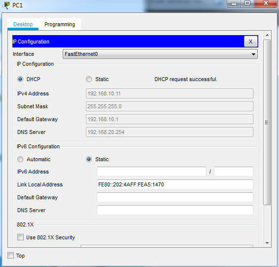
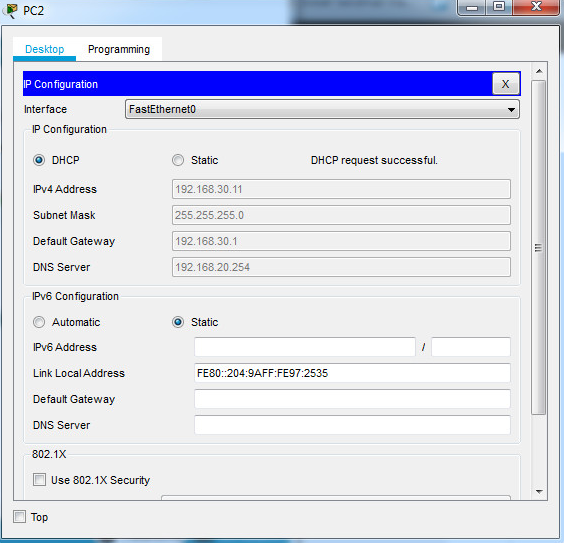

<style>
h1, h4 {
    border-bottom: 0;
    display:flex;
    flex-direction: column;
    align-items: center;
      }
      
centerer{
    display: grid;
    grid-template-columns: 6fr 1fr 4fr;
    grid-template-rows: 1fr;

}
rectangle{
    border: 1px solid black;
    margin: 0px 50px 0px 50px;
    width: 200px;
    height: 4em;
    display: flex;
    flex-direction: column;
    align-items: center;
    justify-items: center;
}
Ltext{
    margin: auto auto auto 0;
    font-weight: bold;
    margin-left: 4em
}
Rtext{
    margin: auto;
}

row {
    display: flex;
    flex-direction: row;
    align-items: center;
    justify-content: center; 
}
 </style>
<h1>LABORATORIUM PROJEKTOWANIE I OBSŁUGA SIECI KOMPUTEROWYCH I</h1>

&nbsp;

&nbsp;

<style>

</style>

<centerer>
    <Ltext>Data wykonania ćwiczenia:</Ltext>
    <div align="center">
        <rectangle>
            <Rtext>29.11.2023</Rtext>
        </rectangle>
    </div>
</centerer>

<centerer>
    <Ltext>Rok studiów:</Ltext>
    <div align="center">
        <rectangle>
            <Rtext>3</Rtext>
        </rectangle>
    </div>
</centerer>

<centerer>
    <Ltext>Semestr:</Ltext>
    <div align="center">
        <rectangle>
            <Rtext>5</Rtext>
        </rectangle>
    </div>
</centerer>

<centerer>
    <Ltext>Grupa studencka:</Ltext>
    <div align="center">
        <rectangle>
            <Rtext>2</Rtext>
        </rectangle>
    </div>
</centerer>

<centerer>
    <Ltext>Grupa laboratoryjna:</Ltext>
    <div align="center">
        <rectangle>
            <Rtext>2B</Rtext>
        </rectangle>
    </div>
</centerer>

&nbsp;

&nbsp;

<row>
    <b>Ćwiczenie nr.</b>
    <rectangle>
        <Rtext>8</Rtext>
    </rectangle>
</row>

&nbsp;

&nbsp;

<b>Temat: </b> Packet Tracer - Konfiguracja DHCPv4

&nbsp;

&nbsp;

<b>Osoby wykonujące ćwiczenia: </b>

1. Igor Gawłowicz

&nbsp;

&nbsp;

<h1>Katedra Informatyki i Automatyki</h1>

<div style="page-break-after: always;"></div>

# Packet Tracer - Konfiguracja DHCPv4

## Część 1: Konfiguracja routera jako serwera DHCP

*Adresy, które zostały statycznie przypisane do urządzeń w sieciach muszą być wyłączone z puli DHCP aby używać DHCP w tej sieci. Pozwala to uniknąć błędów związanych z duplikatami adresów IP. W takim przypadku adresy IP interfejsów LAN R1 i R3 muszą być wyłączone z DHCP. Ponadto dziewięć innych adresów jest wykluczonych do statycznego przypisywania innym urządzeniom, takich jak serwery i interfejsy zarządzania urządzeniami.*

Najpierw będziemy musieli skonfigurować R2 w taki sposób żeby wykluczyć pierwsze 10 adresów z sieci LAN R1 i R3:

```cmd
R2(config)# ip dhcp excluded-address 192.168.10.1 192.168.10.10
R2(config)# ip dhcp excluded-address 192.168.30.1 192.168.30.10
```

Teraz utworzymy pulę DHCP na R2 dla sieci LAN R1

```cmd
R2(config)# ip dhcp pool R1-LAN
```

Po czym skonfigurujemy naszą pulę

```cmd
R2(dhcp-config)# network 192.168.30.0 255.255.255.0
R2(dhcp-config)# default-router 192.168.30.1
R2(dhcp-config)# dns-server 192.168.20.254
```

## Część 2: Konfiguracja agenta przekazywania DHCP

*Aby klienci DHCP mogli uzyskać adres z serwera w innym segmencie sieci LAN, interfejs, do którego są dołączeni klienci, musi zawierać adres pomocniczy wskazujący na serwer DHCP. W takim przypadku hosty na sieciach LAN podłączonych do R1 i R3 będą uzyskiwać dostęp do serwera DHCP skonfigurowanego na R2. Adresy IP interfejsów szeregowych R2 dołączonych do R1 i R3 są używane jako adresy pomocnicze. Ruch DHCP z hostów na sieciach LAN R1 i R3 zostanie przekazany dalej na te adresy i przetwarzany przez serwer DHCP skonfigurowany na R2.*

Zaczniemy od konfiguracji adresu pomocniczego dla interfejsu LAN w R1

```cmd
R1(config)# interface g0/0
R1(config-if)# ip helper-address 10.1.1.2
```

Oraz zrobimy to samo dla interfejsu LAN w R3

```cmd
R3(config)# interface g0/0
R3(config-if)# ip helper-address 10.2.2.2
```

Po czym fizycznie ustawimy PC1 i PC2




    
## Część 3: Konfigurowanie routera jako klienta DHCP

*Podobnie jak komputer jest w stanie odbierać adres IPv4 z serwera, interfejs routera ma możliwość zrobienia tego samego. Router R2 musi być skonfigurowany tak, aby odbierać adresowanie od dostawcy usług internetowych.*

Musimy skonfigurować interfejs Gigabit Ethernet 0/1 na R2 tak aby otrzymywał adresację servera DHCP

```cmd
R2(config)# interface g0/1
R2(config-if)# ip address dhcp
R2(config-if)# no shutdown
```

Możemy teraz zweryfikować konfigurację

```cmd
R2#show ip int brief
Interface              IP-Address      OK? Method Status                Protocol 
GigabitEthernet0/0     192.168.20.1    YES manual up                    up 
GigabitEthernet0/1     209.165.200.231 YES DHCP   up                    up 
Serial0/0/0            10.1.1.2        YES manual up                    up 
Serial0/0/1            10.2.2.2        YES manual up                    up 
Serial0/1/0            unassigned      YES unset  down                  down 
Serial0/1/1            unassigned      YES unset  down                  down 
Vlan1                  unassigned      YES unset  administratively down down
R2#
```

## Część 4: Weryfikacja DHCP i łączności

```cmd
R2# show ip dhcp binding
IP address      Client-ID/          Lease expiration         Type
                Hardware address
192.168.10.11   0002.4AA5.1470      --                       Automatic
192.168.30.11   0004.9A97.2535      --                       Automatic
```

## Wnioski

- Poprzez skonfigurowanie routera jako serwera DHCP oraz agenta przekazywania DHCP, umożliwiono klientom w sieciach LAN R1 i R3 automatyczne uzyskiwanie adresów IP oraz innych informacji konfiguracyjnych od serwera DHCP na R2.
- Również skonfigurowano R2 jako klienta DHCP dla dostępu do usług internetowych, co umożliwiło mu otrzymywanie adresów IP od dostawcy usług internetowych.
- Cały proces zapewnia wydajną i zautomatyzowaną konfigurację sieci, ułatwiając zarządzanie adresacją IP i zapewniając klientom dostęp do sieci z minimalnymi problemami z konfiguracją.