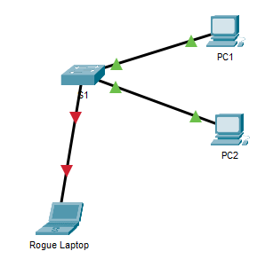

<style>
h1, h4 {
    border-bottom: 0;
    display:flex;
    flex-direction: column;
    align-items: center;
      }
      
centerer{
    display: grid;
    grid-template-columns: 6fr 1fr 4fr;
    grid-template-rows: 1fr;

}
rectangle{
    border: 1px solid black;
    margin: 0px 50px 0px 50px;
    width: 200px;
    height: 4em;
    display: flex;
    flex-direction: column;
    align-items: center;
    justify-items: center;
}
Ltext{
    margin: auto auto auto 0;
    font-weight: bold;
    margin-left: 4em
}
Rtext{
    margin: auto;
}

row {
    display: flex;
    flex-direction: row;
    align-items: center;
    justify-content: center; 
}
 </style>
<h1>LABORATORIUM PROJEKTOWANIE I OBSŁUGA SIECI KOMPUTEROWYCH I</h1>

&nbsp;

&nbsp;

<style>

</style>

<centerer>
    <Ltext>Data wykonania ćwiczenia:</Ltext>
    <div align="center">
        <rectangle>
            <Rtext>6.12.2023</Rtext>
        </rectangle>
    </div>
</centerer>

<centerer>
    <Ltext>Rok studiów:</Ltext>
    <div align="center">
        <rectangle>
            <Rtext>3</Rtext>
        </rectangle>
    </div>
</centerer>

<centerer>
    <Ltext>Semestr:</Ltext>
    <div align="center">
        <rectangle>
            <Rtext>5</Rtext>
        </rectangle>
    </div>
</centerer>

<centerer>
    <Ltext>Grupa studencka:</Ltext>
    <div align="center">
        <rectangle>
            <Rtext>2</Rtext>
        </rectangle>
    </div>
</centerer>

<centerer>
    <Ltext>Grupa laboratoryjna:</Ltext>
    <div align="center">
        <rectangle>
            <Rtext>2B</Rtext>
        </rectangle>
    </div>
</centerer>

&nbsp;

&nbsp;

<row>
    <b>Ćwiczenie nr.</b>
    <rectangle>
        <Rtext>9</Rtext>
    </rectangle>
</row>

&nbsp;

&nbsp;

<b>Temat: </b> Packet Tracer - Wdrożenie bezpieczeństwa portu

&nbsp;

&nbsp;

<b>Osoby wykonujące ćwiczenia: </b>

1. Igor Gawłowicz

&nbsp;

&nbsp;

<h1>Katedra Informatyki i Automatyki</h1>

<div style="page-break-after: always;"></div>

# Packet Tracer - Wdrożenie bezpieczeństwa portu

*W tym ćwiczeniu będziesz konfigurował i sprawdzał zabezpieczenia portów przełącznika. Funkcja zabezpieczeń portu umożliwia ograniczenie ruchu przychodzącego poprzez ograniczenie adresów MAC, które mogą wysyłać ruch do portu.*

## Krok 1: Skonfiguruj zabezpieczenia portu

Uzyskaj dostęp do wiersza poleceń dla S1 i włącz zabezpieczenia portu na portach Fast Ethernet 0/1 i 0/2

```
S1(config)# interface range f0/1 – 2
S1(config-if-range)# switchport port-security
```

Ustaw maksymalnie tylko jedno urządzenie mogące uzyskać dostęp do portów Fast Ethernet 0/1 i 0/2.

```
S1(config-if-range)# switchport port-security maximum 1
```

Zabezpiecz porty tak, aby dynamicznie uczyły się i dodawały adresy MAC do konfiguracji bieżącej.

```
S1(config-if-range)# switchport port-security mac-address sticky
```

Ustaw tryb naruszenia tak, aby porty Fast Ethernet 0/1 i 0/2 nie były wyłączane, gdy wystąpi naruszenie, ale generowane było powiadomienie o naruszeniu bezpieczeństwa, a pakiety z nieznanego źródła były odrzucane.

```
S1(config-if-range)# switchport port-security violation restrict
```

Wyłącz wszystkie pozostałe nieużywane porty. Użyj słowa kluczowego range aby zastosować tę konfigurację do wszystkich portów jednocześnie.

```
S1(config-if-range)# interface range f0/3 - 24 , g0/1 - 2
S1(config-if-range)# shutdown
```

## Krok 2: Zweryfikuj ustawienia zabezpieczenia portu

Sprawdzimy czy nasze ustawienia bezpieczeństwa portów są aktywne poprzez polecenie:

```
S1# show run | begin interface
```

Następnie sprawdzimy zabezpieczenia portów

```
S1#show port-security 
Secure Port MaxSecureAddr CurrentAddr SecurityViolation Security Action
               (Count)       (Count)        (Count)
--------------------------------------------------------------------
        Fa0/1        1          0                 0         Restrict
        Fa0/2        1          0                 0         Restrict
----------------------------------------------------------------------
S1#show port-security address
               Secure Mac Address Table
-----------------------------------------------------------------------------
Vlan    Mac Address       Type                          Ports   Remaining Age
                                                                   (mins)
----    -----------       ----                          -----   -------------
-----------------------------------------------------------------------------
Total Addresses in System (excluding one mac per port)     : 0
Max Addresses limit in System (excluding one mac per port) : 1024
```

Teraz po podłączeniu nieznanego laptopa zauważymy że kontrolki będą czerwone



Możemy teraz zauważyć że pomimo tego że komputery są podłączone do tej samej sieci, nie są w stanie się ze sobą połączyć.

```
ping 10.10.10.10

Pinging 10.10.10.10 with 32 bytes of data:

Request timed out.
Request timed out.
Request timed out.
Request timed out.
```

Po przepięciu kabla pomimo tego że korzystamy z tego samego kabla na tym samym porcie połączenie wciąż nie może zostać ustalone.

Następnie możemy sprawdzić liczbę naruszeń która wystąpiła przy naszych testach

W naszym przypadku wystąpiła 4 razy.

Po ponownym połączeniu PC2 odpowiednim kablem komputer znowu działa poprawnie w sieci, dzieje się tak ponieważ sieć zapamiętała adres MAC urządzenia i na podstawie niego wie komu przyznać dostęp.

## Wnioski

- Konfiguracja zabezpieczeń portu umożliwiła przełącznikowi ograniczenie liczby adresów MAC na portach, co zapobiegło nieuprawnionemu dostępowi do sieci przez nieznane urządzenia.
- Powiadomienia o naruszeniach bezpieczeństwa zostały wygenerowane, a zastosowane zabezpieczenia pozwoliły na utrzymanie integralności sieci, odrzucając nieautoryzowany ruch i nieznaną adresację MAC.