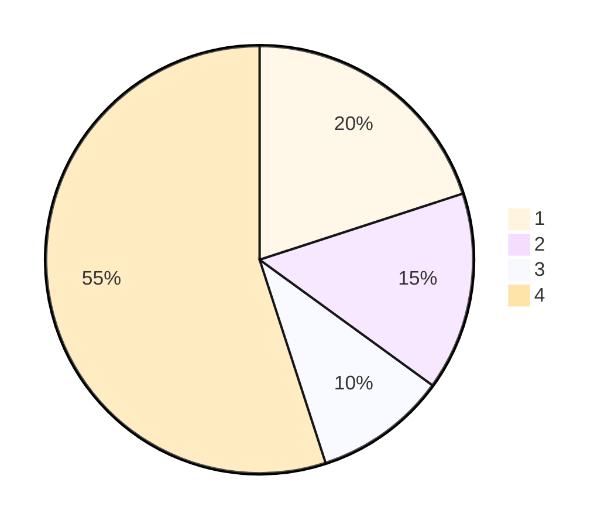
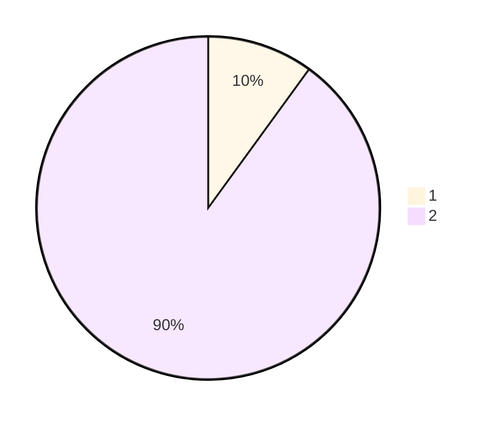
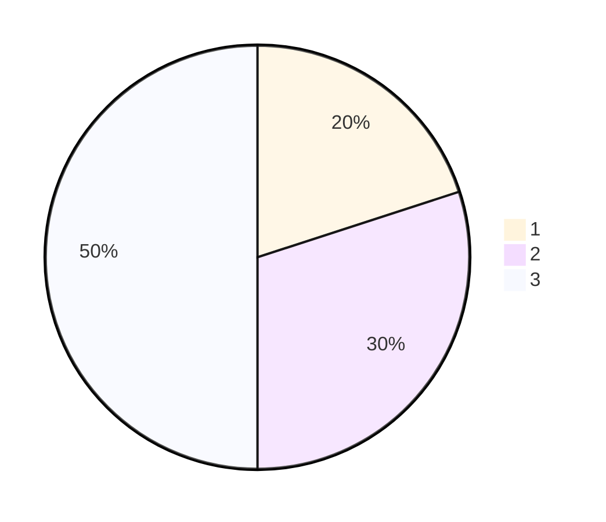
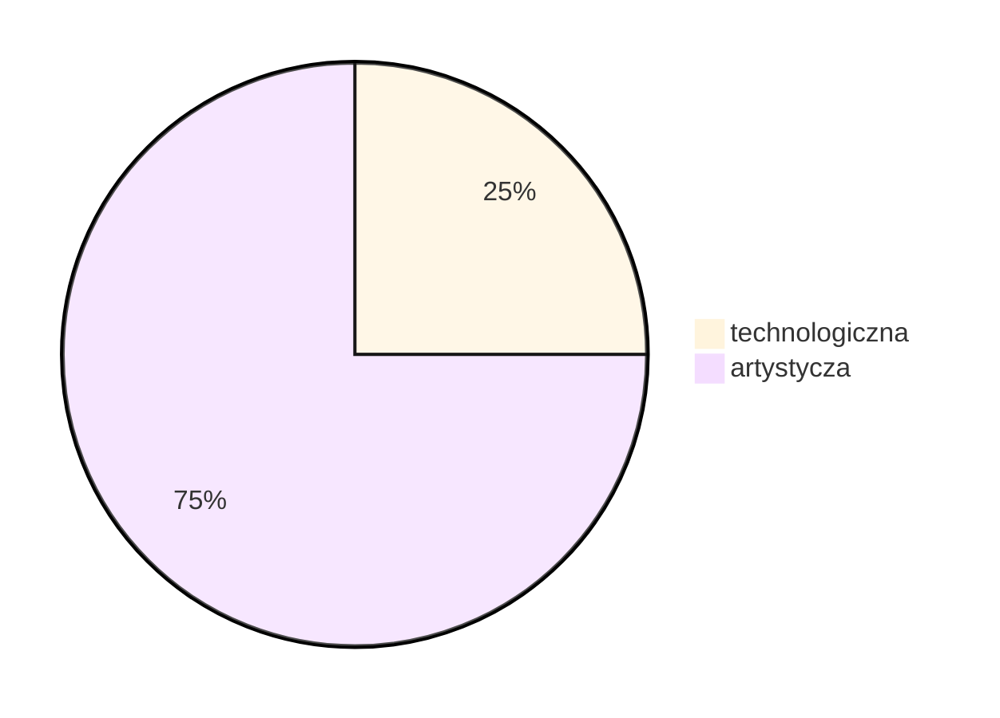

# Kluczowe elementy

## Gameplay

### Endless runner

Główną częścią zabawy w grze będzie faza endless runner, która będzie zawierała dość proste i powtarzalne elementy rozgryki, technicznie bardzo łatwa do zrobienia, jednak aby zapewnić graczą ciekawą i nienudzącom się rozgrywkę musimy zapewnić, że każda gra będzie się od siebie różnić dlatego musimy wziąć pod uwagę takie elementy jak:
1. Działanie gry
2. Proceduralnie generowane mapy
3. Ścieżka dźwiękowa
4. Unikatowe mapy/sceneria

### City builder

Drugą kluczową częścią dla naszej rozgrywki będzie faza, w której gracz będzie rozwijał swoje miasto, dzięki czemu będzie odblokowywał nowe elementy rozgrywki, w tym przypadku potrzebujemy:

1. Możliwość wchodzenia w interakcję z budynkami, rozwój i integracja z czasem rzeczywistym
2. Rysunki/modele budynków w różnych etapach rozwoju

## Story

Poza rozgrywką chcemy wprowdzić historie, bardzo głupią i prostą jednak powinna być na tyle absurdalna że musi być wcześniej dobrze przemyślana. Celem fabuły w takiej grze będzie sklejenie wszystkiego we wspólną całość, będzie się to wiązało także z obecnością tutoriala, który na bieżąco będzie wszystko graczowi tłumaczył.

1. Zarys fabuły
2. Aktywnie działający tutorial 
3. Dialogi, proste jednak powinny mieć poczucie humoru (95% graczy i tak je pomija)

Mając skończone powyższe elementy będziemy mieli stworzoną bazę gry, możliwą do wpuszczenia na rynek. Dopiero po sukcesie tej fazy będzie można zadecydować o późniejszym rozwoju gry poprzez prawdopodbne dodanie nowych trybów gry itd...

Skupmy się jednak na razie na podstawie. Podzielimy tą częśc projektu na część `technologiczną` i `artystyczną`. W tym przypadku podział wymaganego progressu będzie wyglądał mniej więcej tak:

Oznacza to że zdecydowanie większą część czasu poświęcimy na szukanie odpowiednich assetów i implementacje ich w grze.

Następnym krokiem będzie podsumowanie wszystkiego co powyżej i podsumowanie tego na etapy produkcyjne i podział obowiązków.

## Etap 1

Pierwszy etap rozpoczniemy od stworzenia szkieletu gry, czyli podzielimy się na:
- Szkielet city buildera(artystyczne)
- Szkielet endless runnera(technologiczne)
- Interakcje pomiędzy nimi(artystyczne/technologiczne)

Na ten etap poświęcimy **2 tygodnie**, aby mieć pewność że wszystko będzie działało dobrze u podstaw

## Etap 2 

Drugi etap zaczniemy od przygotowania wszystkich niezbędnych assetów i dopasowania ich do wcześniej utworzonych szkieletów, oraz na ewentualne zmiany, poprawki oraz wstępne testowanie efektów porpzedniego kroku.

- Testowanie szkieletu gry(-)
- Szukanie/tworzenie assetów city buildera(artystyczne)
- Szukanie/tworzenie assetów endless runnera(artystyczne)

Czas na ten etap: **minimum tydzień**

## Etap 3

W tym etapie skupimy się na rozbudowie szkieletu, czyli zaczniemy dodawać nowe scenerię do endless runnera oraz rozwijać możliwość rozbudowy city buildera, zaczniemy także implementować walute w grze i sposoby jej wydania, wraz z historią. Urozmaicimy także całość poprzez wprowadzenie ścieżki dźwiękowej i efektów dźwiękowych.

- Rozwój scenerii endless runnera i rozbudowy miasta
- ścieżka dźwiękowa i efekty audiowizualne
- fabuła wraz ze wstępnym tutorialem

Czas na ten etap: **minimum 2 tygodnie**

## Etap 4

Etap 4 będzie jednocześnie ostatnim etapem fazy prototypowej, w tym momencie zaczniemy dopinać bazę gry i łączyć ze sobą wszystkie konieczne elementy rozgrywki.

Czas na ten etap: **Tydzień do dwóch**