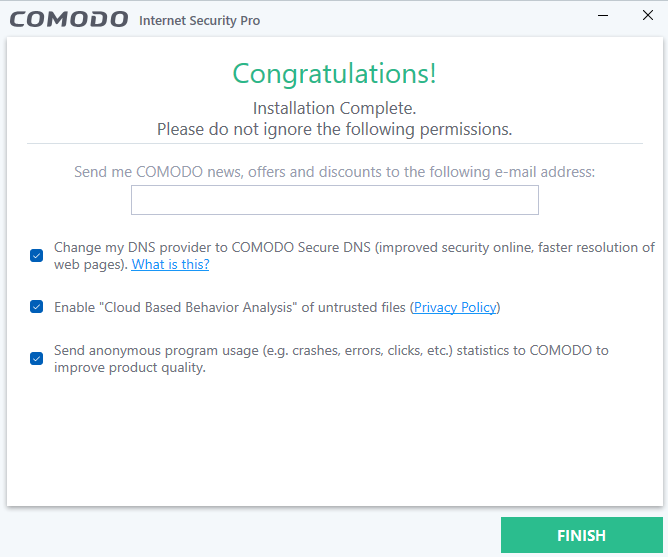
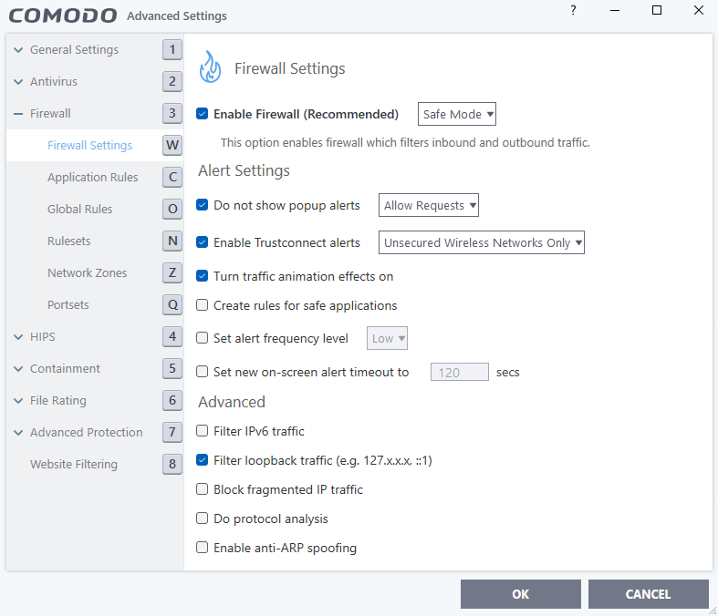
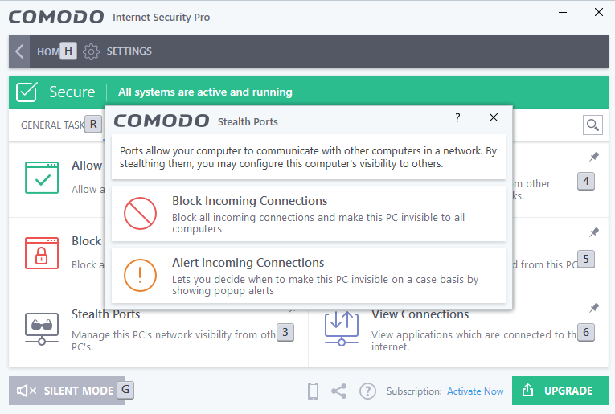
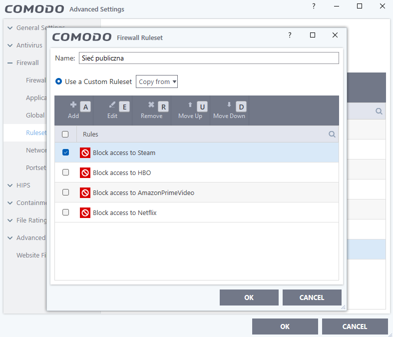
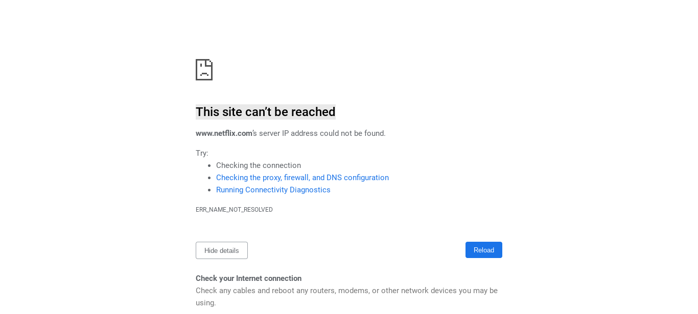

<h1>LABORATORIUM BEZPIECZEŃSTWO TECHNOLOGII INFORMATYCZNYCH</h1>

&nbsp;

&nbsp;

<centerer>
    <Ltext>Data wykonania ćwiczenia:</Ltext>
    

        <rectangle>
            <Rtext>03.10.2023</Rtext>
        </rectangle>
    

</centerer>

<centerer>
    <Ltext>Rok studiów:</Ltext>
    

        <rectangle>
            <Rtext>3</Rtext>
        </rectangle>
    

</centerer>

<centerer>
    <Ltext>Semestr:</Ltext>
    

        <rectangle>
            <Rtext>5</Rtext>
        </rectangle>
    

</centerer>

<centerer>
    <Ltext>Grupa studencka:</Ltext>
    

        <rectangle>
            <Rtext>2</Rtext>
        </rectangle>
    

</centerer>

<centerer>
    <Ltext>Grupa laboratoryjna:</Ltext>
    

        <rectangle>
            <Rtext>2B</Rtext>
        </rectangle>
    

</centerer>

&nbsp;

&nbsp;

<row>
    <b>Ćwiczenie nr.</b>
    <rectangle>
        <Rtext>1</Rtext>
    </rectangle>
</row>

&nbsp;

&nbsp;

<b>Temat: </b> Konfiguracja Fierwalla na komputerze z systemem Windows.

&nbsp;

&nbsp;

<b>Osoby wykonujące ćwiczenia: </b>

1. Igor Gawłowicz

&nbsp;

&nbsp;

<h1>Katedra Informatyki i Automatyki</h1>

## Zainstaluj oprogramowanie Comodo Firewall na komputerze z systemem Windows.

Przechodzimy przez instalację i bez problemów uruchamia się nam wstępna konfiguracja.

## Stwórz reguły zapory ogniowej przy użyciu Comodo Firewall, które zezwolą na dostęp do wybranych aplikacji lub portów, a także reguły, które zablokują dostęp do niektórych z nich.

### Opis scenariusza

Publiczna sieć wi-fi zlokalizowana na dworcu kolejowym.

### Zagrożenia

- Podejrzane strony
- Nadmiar zużycia sieci

### Konfiguracja sieci

Aby upewnić się że użytkownik nie zainfekuje naszej sieci poprzez podejrzane źródła możemy uruchomić tryb bezpieczny naszej zapory sieciowej, który zapewni dostęp tylko dla połączeń zweryfikowanych przez zaporę COMODO.

Następnie możemy zabezpieczyć wszystkie porty, dzięki czemu użytkownicy sieci będą bezpieczniejsi i nie będzie się ich dało tak łatwo zidentyfikować.

Następnie aby ograniczyć użycie sieci zablokujemy dostęp do platform streamingowych typu Netflix, Prime itp.

Po próbie wczytania dowolnej z tych stron otrzymamy komunikat o problemie z połączeniem do servera

# Wnioski

Podczas konfiguracji Firewalla dla naszej publicznej sieci na dworcu kolejowym zdecydowaliśmy się na COMODO Firewall ze względu na jego zdolność do tworzenia niestandardowych reguł, co jest niezbędne do skutecznej ochrony przed nieautoryzowanym dostępem oraz umożliwienie kontroli nad ruchem internetowym.
