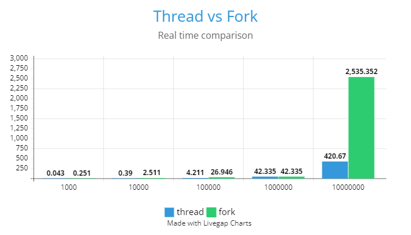

<style>
h1, h4, h2 {
    border-bottom: 0;
    display:flex;
    flex-direction: column;
    align-items: center;
    text-align: center;
      }
      
centerer{
    display: grid;
    grid-template-columns: 6fr 1fr 4fr;
    grid-template-rows: 1fr;

}
rectangle{
    border: 1px solid black;
    margin: 0px 50px 0px 50px;
    width: 200px;
    height: 4em;
    display: flex;
    flex-direction: column;
    align-items: center;
    justify-items: center;
}
Ltext{
    margin: auto auto auto 0;
    font-weight: bold;
    margin-left: 4em
}
Rtext{
    margin: auto;
}

row {
    display: flex;
    flex-direction: row;
    align-items: center;
    justify-content: center; 
}
 </style>
<h1>Uniwersytet Bielsko-Bialski </h1>

&nbsp;

&nbsp;

&nbsp;

&nbsp;

&nbsp;

&nbsp;

&nbsp;

&nbsp;

&nbsp;

<h1 style="text-align: center;"><b>LABORATORIUM</b></h1>
<h1 style="text-align:center"><b>Obliczeń Równoległych i Systemów Rozproszonych </b></h1>

&nbsp;

&nbsp;

<h2 style="text-align:center; border: none;"><b>Sprawozdanie nr 6</b></h3>
<h2 style="text-align:center; border: none;">Użycie i zarządzanie wątkami</h2>

&nbsp;

&nbsp;

&nbsp;

&nbsp;

&nbsp;

&nbsp;

&nbsp;

GRUPA: 2B / SEMESTR: 5 / ROK: 3

Igor Gawłowicz / 59096

<div style="page-break-after: always;"></div>

## Cel ćwiczenia

Eksperymentalna analiza wydajności i zachowania procesów oraz wątków w systemie operacyjnym. Celem jest zrozumienie różnic pomiędzy nimi, sposobu zarządzania nimi, komunikacji oraz ocena ich efektywności w kontekście współbieżności.

Porównanie procesów i wątków: Zbadanie różnic między procesami a wątkami, ich zarządzanie przez system operacyjny oraz wpływ na wydajność systemu.

Przeprowadzenie testów wydajnościowych: Ocena czasu wykonywania dla określonych zadań przez procesy i wątki w zależności od rozmiaru danych wejściowych.

## Przebieg ćwiczenia

Proces jako pewna instancja programu, w trakcie wykonania, ze swej natury w każdym
systemie operacyjnym wyróżniają:
- prawa własności zasobu a jednym z fundamentalnych zadań systemu jest ochrona przed jednoczesnym dostępem;
- szeregowanie i wykonanie procesów odbywa się z poziomu systemu operacyjnego.

W odróżnieniu od procesu, wątek stanowi podzbiór przestrzeni adresowej procesu,
współdzielący jego stan i zasoby (również deskryptory plików) – aczkolwiek nie dziedziczy
stosu procesu (stack).

Dzięki temu komunikacja między wątkowa nie wymaga użycia systemowych mechanizmów
inter-process communication a przełączanie kontekstu (context switch) jest niewspółmiernie
szybsze niż w przypadku procesu.

Ponieważ jest uzupełnieniem API systemowego, wymagana jest jawna konsolidacja z
libpthread.so (albo libpthread.a)

**gcc -Wall <source>.c -o <exec> -lpthread**

Podobnie jak każdemu procesowi w chili jego tworzenia przypisywane jest unikalne \
**pid_t id;**
tak też i wątkowi \
**pthread_t id;**

Wątek może pobrać swój identyfikator wywołaniem

**#include <pthread.h>**\
**pthrad_t pthread_self(void);**

Wątek tworzony jest wywołaniem funkcji **pthread_create()**

Zakończenie wątku może nastąpić z czterech przyczyn:
- zwrócenie sterowania z wątku (wywołanie return, exit(), _exit());
- wywołanie z wątku nadrzędnego (macierzystego);
- z innego wątku wywołaniem\
**#include <pthread.h>**\
**int pthread_cancel( pthread_t tid );**\
- jawne wywołanie funkcji **pthread_exit()** z kodem powrotu code.
**#include <pthread.h>**\
**void pthread_exit( void *code );**

Przedstawimy teraz prosty przykład tego co się stanie jeśli uruchomimy jednocześnie proces i wątek, żeby działały równocześnie

```cpp
#include<stdio.h>
#include<pthread.h>
#define LIMIT 1000

void* o( void* unused )
{
    (void)unused;
    while( LIMIT ){ putchar( 'o' ); }
    return 0;
}

int main( void )
{
    int current = 0;
    pthread_t tid;
    pthread_create( &tid,NULL,&o,NULL );
    while( current < LIMIT )
    { 
        putchar( 'x' ); 
        current += 1;    
    }
    return 0;
}
```

```bash
$ ./xox
xxxxxxxxxxxxxxxxxxxxxxxxxxxxxxxxxxxxxxxxxxxxxxxxxxxxxxxxxxxxxxxxxxxxxxxxxxxxxxxxxxxxxxxxxxxxxxxxxxxxxxxxxxxxxxxxxxxxxxxxxxxxxxxxxxxxxxxxxxxxxxxxxxxxxxxxxxxxxxxxxxxxxxxxxxxxxxxxxxxxxxxxxxxxxxxxxxxxxxxxxxxxxxxxxxxxxxxxxxxxxxxxxxxxxxxxxxxxxxxxxxxxxxxxxxxxxxxxxxxxxxxxxxxxxxxxxxxxxxxxxxxxxxxxxxxxxxxxxxxxxxxxxxxxxxxxxxxxxxxxxxxxxxxxxxxxxxxxxxxxxxxxxxxxxxxxxxxxxxxxxxxxxxxxxxxxxxxxxxxxxxxxxxxxxxxxxxxxxxxxxxxxxxxxxxxxxxxxxxxxxxxxxxxxxxxxxxxxxxxxxxxxxxxxxxxxxxxxxxxxxxxxxxxxxxxxxxxxxxxxxxxxxxxxxxxxxxxxxxxxxxxxxxxxxxxxxxxxxxxxxxxxxxxxxxxxxxxxxxxxxxxxxxxxxxxxxxxxxxxxxxxxxxxxxxxxxxxxxxxxxxxxxxxxxxxxxxxxxxxxxxxxxxxxxxxxxxxxxxxxxxxxxxxoxxxxxxxxxxxxxxxxxxxxxxxoooooooooooooooxxxxxxoxooooooxxxxoooooooooooooooxxxxxxxxxxxxxxxoooooxxxxxoooooxxxxxoooooxxxxxoooooooxxxxxoooooxxxxxoooooooooxxxxxoooooxxxxxxxxxxxooooooxxxxxxxxxxxxxoooooxxxxxxxxxxxxxxxxxooooooooooooxxxxxoooooxxxxxoooooooooooooxxxxxoooooooxxxxxxxxxxoooooooxxxxxxxxxxxxxoxxxxxxxxxxxxxxxxxxxxxxoooooxxxxxooooooooooxoxxxxxxxxxxxxxxxxxoooooooooooooooxxxxxxxoooooooooooxxxxxoooooooooooooooooooooooooooooooooooooooooooooooooooooooooooooooooooooooooooooooooooooooooooooooooooooooooooooooooooooooooooooooooooooooooooooooooooooooooooooooooooooooooooooooooooooooooooooooooooooooooooooooooooooooooooooooooooooooooooooooooooooooooooooooooooooooooooooooooooooooooooooooooooooooooooooooooooooooooooooooooooooooooooooooooooooooooooooooooooooooooooooooooooooooooooooooooooooooooooooooooooooooooooooooooooooooooooooooooooooooooooooooooooooooooooooooooooooooooooooooooooooooooooooooooooooooooooooooooooooooooooooooooooooooooooooooooooooooooooooooooooooooooooooooooooooooooooooooooooooooooooooooooooooooooooooooooooooooooooooooooooooooooooooooooooooooooooooooooooooooooooooooooooooooooooooooooooooooooooooooooooooooooooooooooooooooooooooooooooooooooooooooooooooooooooooooooooooooooooooooooooooooooooooooooooooooooxxxxxxxxxxxxxxxxxxxxxxxxxxxxxxxxxxxxxxxxxxxxxxxxxxxxxxxxxxxxxxxxxxxxxxxxxxxxxxxxxxxxxxxxxxxxxxxxxxxxxxxxxxxxxxxxxxxxxxxxxxxxxxxxxxxxxxxxxxxxxxxxxxxxxxxxxxxxxx
```

Po pierwszym uruchomieniu programu konsola zacięła się przez zbyt dużą ilość znaków pojawiających się w każdej chwili dlatego ustawiłem limit na 1000 iteracji, co przedstawiło już wystarczająco długi wynik. W każdym razie możemy zauważyć, że wątek pomimo tego że działa równocześnie działa w zupełnie innym i niekontrolowanym tempie, przez co wynik jest bardzo chaotyczny i losowy.

Przygotujemy teraz program, którego proces utworzy tyle wątków ile podanych będzie w linii
wywołania programu.

```cpp
#include <stdlib.h>
#include <stdio.h>
#include <unistd.h>
#include <pthread.h>

void* hello( void *n )
{
    printf("PID[%ld] ...jestem wątkiem #%ld! TID[%d]\n",
    (long)getpid(),(long)n,(int)pthread_self() );
    pthread_exit( NULL );
}

int main( int argc,char *argv[] )
{
    pthread_t tid;
    int rc;
    long i,n;
    void* hello( void*);
    if( argc>1 )
    {
        sscanf( argv[1],"%ld",&n );
        for( i=0;i<n;i++ )
        {
            printf( "PID[%ld] tworzy wątek,...#%ld...\n",
            (long)getpid(),(i+1));
            rc = pthread_create( &tid, NULL,hello,(void *)(i+1));
            if(rc)
            {
                perror( "!.!.!...błąd pthread_create()...");
                exit(rc);
            }
        }
    }
    else
    { 
        printf( "!.!.!... wywołanie powinno mieć postać: %s %s\n", argv[0],"<ilość_wątków>" ); 
    }

    pthread_exit( NULL );
}
```


Początkowo wywołałem program bez podania parametrów więc program zwrócił nam

```bash
$  ./hello
!.!.!... wywołanie powinno mieć postać: ./hello <ilość_wątków>
```

Jednak po podaniu parametru według instrukcji od razu otrzymamy

```bash
$  ./hello 5
PID[1131] tworzy wątek,...#1...
PID[1131] tworzy wątek,...#2...
PID[1131] tworzy wątek,...#3...
PID[1131] ...jestem wątkiem #1! TID[346195712]
PID[1131] ...jestem wątkiem #2! TID[337803008]
PID[1131] tworzy wątek,...#4...
PID[1131] ...jestem wątkiem #3! TID[329410304]
PID[1131] tworzy wątek,...#5...
PID[1131] ...jestem wątkiem #4! TID[321017600]
PID[1131] ...jestem wątkiem #5! TID[201324288]
```

Ponownie możemy zauważyć dość chaotyczną naturę wątków.

W kolejnym przykładzie prześlemy, z procesu głównego do wątku potomnego, tablicę liczbową
a tam zostanie wyznaczona wartość średnia jej elementów

```cpp
#include <stdio.h>
#include <stdlib.h>
#include <unistd.h>
#include <pthread.h>
#define n 10000 
void* thread( void* array )
{
    int i;
    double sum,avg;
    for( i=0,sum=0.0;i<n;i++ )
    { 
        sum += *( (double*)array+i );
    }
    avg = sum/n;
    printf( "wartość średnia: %16.10f\n",avg );
    return ( (void*)0 );
}

int main( void )
{
    int i;
    pthread_t tid;
    double x[n];
    // double *x;
    // x = (double*) calloc( size_t n, sizeof( double ) );
    // free( (void*)x );
    for( i=0;i<n;i++ )
    { 
        *(x+i) = ((double)rand())/(RAND_MAX); 
    }
    printf( "wysyłam dane do wątku...[%d]\n",(int)tid );
    pthread_create( &tid, NULL,thread,(void *)x );
    printf( "...czekam na wątek\n" );
    return 0;
}
```

Mamy tutaj dość ciekawy przypadek, gdyż program wykonuje się jednak wyniki nie są takie jakich się spodziewamy

```bash
$  ./table
wysyłam dane do wątku...[673161680]
...czekam na wątek
```

Możemy zauważyć, że dane zostały wysłane do wątku jednak nigdy nie zostały zwrócone ponieważ główny proces skończył się zanim doszło do finalizacji wątku.

Moglibyśmy rozwiązać ten problem poprzez użycie polecenia `sleep`, aczkolwiek nie jest to zalecane rozwiązanie, aby naprawić ten błąd powiniśmy użyć instrukcji `pthread_join()`, ale o tym już w następnym przykładzie.

```cpp
#include <stdio.h>
#include <stdlib.h>
#include <unistd.h>
#include <pthread.h>

void *thread( void *arg )
{
    int i;
    printf( "...w wątku\n" ); fflush( stdout );
    for ( i=0;i<5;i++ )
    { 
        printf("\t%3d s\n",(i+1) ); 
        fflush( stdout ); 
        sleep(1); 
    }
    printf( "...i już koniec, zwracam sterowanie\n" ); 
    fflush( stdout );
    pthread_exit( NULL );
}

int main( void )
{
    pthread_t tid;
    int rc;
    void* thread( void* );
    rc = pthread_create( &tid, NULL,thread,NULL );
    if( rc )
    { 
        perror( "!.!.!...pthread_create()..." ); 
        exit( 1 );
    }
    else
    {
        if( pthread_join ( tid, NULL ) )
        { 
            perror( "!.!.!...pthread_join()..." ); 
            exit( 2 ); 
        }
    }
    return 0;
}

```

Tym razem w odróżnieniu od poprzedniego przykładu, główny proces poczekał na działający wątek.

```bash
$  ./join
...w wątku
          1 s
          2 s
          3 s
          4 s
          5 s
...i już koniec, zwracam sterowanie
```

Funkcja pthread_join(), ze swej natury, służy przyłączeniu jednego wątku co może stanowić
pewnie problem jeżeli wątków będzie więcej.

```cpp
#include <stdio.h>
#include <stdlib.h>
#include <math.h>
#include <pthread.h>
#include <limits.h>
#define T 10
#define N 100000
//#define N INT_MAX ...dla chcących sprawdzić wentylator

void *thread( void *n )
{
    int i;
    double sum;
    printf("...wątek %3ld startuje...\n",(long)n ); 
    fflush( stdout );
    for( i=0,sum=0.0;i<N;i++ )
    {
        sum += sin((double)i)*sin((double)i) +
        cos((double)i)*cos((double)i) - 1.0;
    }
    printf("...wątek %3ld zakończył...suma = %e\n",(long)n,sum );
    fflush( stdout );
    pthread_exit( NULL );
}


int main( void )
{
    pthread_t threads[T];
    int rc;
    long t;
    for( t=0;t<T;t++)
    {
        rc = pthread_create( &threads[t],NULL,thread,(void *)(t+1) );
        if (rc) 
        { 
            perror( "!.!.!...pthread_create()..." ); 
            exit( 1 ); 
        }
    }
    for( t=0;t<T;t++)
    {
        rc = pthread_join( threads[t],NULL );
        if (rc){ 
            perror( "!.!.!...pthread_join()..." ); 
            exit( 2 ); 
        }
    }
    pthread_exit(NULL);
}
```

Widzimy że pomimo tego że oczekujemy na każdy z wątków wynik wciąż jest dość chaotyczny

```bash
$  ./joins
...wątek   2 startuje...
...wątek   1 startuje...
...wątek   3 startuje...
...wątek   7 startuje...
...wątek   8 startuje...
...wątek   9 startuje...
...wątek   5 startuje...
...wątek   6 startuje...
...wątek  10 startuje...
...wątek   4 startuje...
...wątek   2 zakończył...suma = -1.311840e-12
...wątek   1 zakończył...suma = -1.311840e-12
...wątek   7 zakończył...suma = -1.311840e-12
...wątek   3 zakończył...suma = -1.311840e-12
...wątek   8 zakończył...suma = -1.311840e-12
...wątek   4 zakończył...suma = -1.311840e-12
...wątek   9 zakończył...suma = -1.311840e-12
...wątek   5 zakończył...suma = -1.311840e-12
...wątek   6 zakończył...suma = -1.311840e-12
...wątek  10 zakończył...suma = -1.311840e-12
```

Dzieje się tak ponieważ nie jesteśmy w stanie kontrolować tego w jakiej kolejności każdy z wątków rozpocznie pracę przez co wszystko się w dość losowej kolejności.

Jednym z kluczowych względów zastosowania wątków na gruncie współbieżności, prócz
wymienionych na wstępnie, są kwestie efektywności.

Aby dokonać takiej oceny napiszemy dwa programy, które uruchomią identyczną ilość
procesów oraz wątków i porównamy czasy jakie zużyje na to system.

Cele określenia czasu wykonywania wykorzystamy komendę systemową \
time <command> \
podaje ona oszacowanie czasu dla procesu, z podziałem na składowe
- real, w przybliżeniu jest to
**real ≈ user + sys**\
jednak w przypadku systemów multi-tasking, dodatkowo pracujących przy dużym obciążeniu\
**real ≫ user + sys**
- user, jest to czas kiedy CPU pozostawał w trybie user mode, a więc wykonywane były
zakodowane instrukcje czy były wywołanie funkcji bibliotecznych typu printf(), malloc(),
strlen(), fopen(), i podobnych;
- sys , jest to czas kiedy CPU pozostawał w trybie kernel mode, a więc wystąpiły wywołania
funkcji systemowych w rodzaju open(), read(), write(), close(), wait(), exec(),
fork(), exit(), i podobnych.

Przykładowo:

```bash
$ time sleep 5
real 0m5.006s
user 0m0.000s
sys 0m0.004s
```

czyli uśpienie na 5 sekund zajęło de facto 5.006 sekundy, z czego na wywołania funkcji
użytkownika wypadło 0 (bo ich nie było) a systemowych 4 milisekundy. Zauważmy, że
pojawiły się też 2 milisekundy opóźnienia wynikła z faktu, że nie jest to w końcu jedyny proces
obsługiwany przez system.

Załóżmy że oba programy wywołają funkcję jak niżej

```cpp
void* task( void* arg )
{
    double x;
    x = 1.0 + 1.0;
    return NULL;
}

```

Typ dla funkcji i parametru formalnego, wybrano tak aby uzyskać zgodność z
pthread_create(), przy czym dla:
- procesów, będzie ona wykonywana przez potomka powołanego wywołaniem fork();
- wątków, będzie to po prostu funkcja wątku, zadana w wywołaniu pthread_create();

Dla pierwszego przykładu program będzie wyglądać następująco

```cpp
#include <stdio.h>
#include <stdlib.h>
#include <unistd.h>
#include <sys/wait.h>
#include <limits.h>

void* task( void* arg )
{
    double x;
    x = 1.0 + 1.0;
    return NULL;
}


int main( int argc,char** argv )
{
    unsigned long i,n;
    int status;
    pid_t pid;
    if( argc>1 )
    {
        if( sscanf( argv[1],"%lu",&n )==1 )
    {
    for( i=0;i<n;i++ )
    {
        switch( (int)(pid=fork()) )
        {
            case -1: perror( "!.!.!...fork()..." ); exit( 1 ); break;
            case 0: task( NULL ); exit( 0 ); break;
            default: waitpid( pid,&status,0 );
        }
    }
    }
    else{ printf( "!.!.!...błędny argument [%s] wywołania [%s]\n",argv[1],argv[0] ); }
    }
    else{ printf( "!.!.!... %s [ilość < ULONG_MAX=%lu]\n",argv[0],ULONG_MAX ); }
    return 0;
}   
```

A drugi program wykorzystujący wątki

```cpp
#include <stdio.h>
#include <stdlib.h>
#include <pthread.h>
#include <limits.h>

void* task( void* arg )
{
    double x;
    x = 1.0 + 1.0;
    return NULL;
}

int main( int argc,char** argv )
{
    unsigned long i,n;
    pthread_t tid;
    if( argc>1 )
    {
        if( sscanf( argv[1],"%lu",&n )==1 )
        {
        for( i=0;i<n;i++ )
        {
            if( pthread_create( &tid, NULL,task,NULL ) )
            { 
                perror( "!.!.!...fork()..." ); 
                exit( 1 ); 
            }
            else
            { 
                pthread_join ( tid, NULL ); 
            }
        }
        }
    else
    { 
        printf( "!.!.!...błędny argument [%s] wywołania [%s]\n",argv[1],argv[0] ); 
    }
    }
    else
    { 
        printf( "!.!.!... %s [ilość < ULONG_MAX=%lu]\n",argv[0],ULONG_MAX );
    }
    return 0;
}

```

<center>
</img>
</center>


## Wnioski

1. Wątki są lżejsze od procesów: Wątki współdzielą zasoby w ramach procesu, co prowadzi do mniejszego narzutu systemowego i szybszego przełączania kontekstu w porównaniu z procesami.

2. Komunikacja międzywątkowa bezpośrednia: Wątki mogą komunikować się bez konieczności używania mechanizmów inter-process communication, co przyspiesza ich współpracę w obrębie jednego procesu.

3. Wyższa wydajność wątków w przypadku wielu zadań: Testy wykazały, że wątki są szybsze od procesów, szczególnie przy wykonywaniu wielu zadań równocześnie. Jednak zarządzanie większą liczbą wątków wymaga ostrożności i może wpłynąć na wydajność systemu.

4. Synchronizacja jest kluczowa: Zarządzanie wieloma wątkami wymaga starannej synchronizacji, aby uniknąć problemów z dostępem do wspólnych zasobów, zakleszczeń czy błędów.

5. Optymalne zarządzanie wątkami: Przemyślane podejście do zarządzania i synchronizacji wątków może znacząco wpłynąć na wydajność, stabilność i zachowanie systemu w kontekście współbieżności.