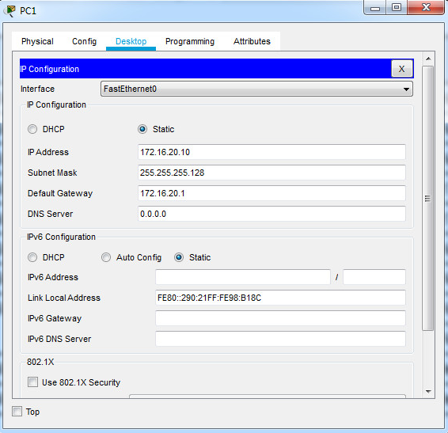
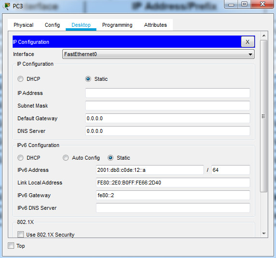
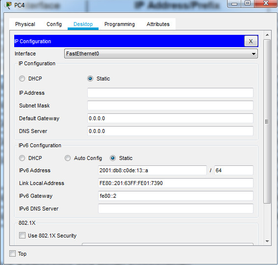
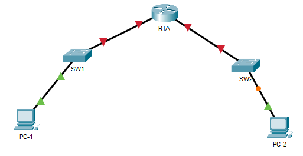

<style>
h1, h4 {
    border-bottom: 0;
    display:flex;
    flex-direction: column;
    align-items: center;
      }
      
centerer{
    display: grid;
    grid-template-columns: 6fr 1fr 4fr;
    grid-template-rows: 1fr;

}
rectangle{
    border: 1px solid black;
    margin: 0px 50px 0px 50px;
    width: 200px;
    height: 4em;
    display: flex;
    flex-direction: column;
    align-items: center;
    justify-items: center;
}
Ltext{
    margin: auto auto auto 0;
    font-weight: bold;
    margin-left: 4em
}
Rtext{
    margin: auto;
}

row {
    display: flex;
    flex-direction: row;
    align-items: center;
    justify-content: center; 
}
 </style>
<h1>LABORATORIUM PROJEKTOWANIE I OBSŁUGA SIECI KOMPUTEROWYCH I</h1>

&nbsp;

&nbsp;

<style>

</style>

<centerer>
    <Ltext>Data wykonania ćwiczenia:</Ltext>
    <div align="center">
        <rectangle>
            <Rtext>04.10.2023</Rtext>
        </rectangle>
    </div>
</centerer>

<centerer>
    <Ltext>Rok studiów:</Ltext>
    <div align="center">
        <rectangle>
            <Rtext>3</Rtext>
        </rectangle>
    </div>
</centerer>

<centerer>
    <Ltext>Semestr:</Ltext>
    <div align="center">
        <rectangle>
            <Rtext>5</Rtext>
        </rectangle>
    </div>
</centerer>

<centerer>
    <Ltext>Grupa studencka:</Ltext>
    <div align="center">
        <rectangle>
            <Rtext>2</Rtext>
        </rectangle>
    </div>
</centerer>

<centerer>
    <Ltext>Grupa laboratoryjna:</Ltext>
    <div align="center">
        <rectangle>
            <Rtext>2B</Rtext>
        </rectangle>
    </div>
</centerer>

&nbsp;

&nbsp;

<row>
    <b>Ćwiczenie nr.</b>
    <rectangle>
        <Rtext>1</Rtext>
    </rectangle>
</row>

&nbsp;

&nbsp;

<b>Temat: </b>

&nbsp;

&nbsp;

<b>Osoby wykonujące ćwiczenia: </b>

1. Igor Gawłowicz

&nbsp;

&nbsp;

<h1>Katedra Informatyki i Automatyki</h1>

<div style="page-break-after: always;"></div>

# Packet Tracer - Konfiguracja SSH

## Część 1: Zabezpieczanie haseł

### Używając linii komend na PC1, wykonaj Telnet do S1. Hasło do trybu EXEC użytkownika oraz trybu uprzywilejowanego EXEC to cisco.

```
C:\>TELNET 10.10.10.2
Trying 10.10.10.2 ...Open

User Access Verification

Password:
S1>enable
Password:
S1#copy running-config startup-config
Destination filename [startup-config]?
Building configuration...
[OK]
S1#

S1#disable
S1>exit

[Connection to 10.10.10.2 closed by foreign host]

C:\>TELNET 10.10.10.2
Trying 10.10.10.2 ...Open


User Access Verification

Password:
S1>enable
Password:

S1#show running-config
!
line con 0
!
line vty 0 4
 password cisco
 login
line vty 5 15
 password cisco
 login
!
!

S1(config)#service password-encryption
```

## Część 2: Szyfrowanie komunikacji

### Krok 1: Ustaw nazwę domeny IP i wygeneruj bezpieczne klucze.

```
S1(config)#ip domain-name netacad.pka
S1(config)#crypto key generate rsa
The name for the keys will be: S1.netacad.pka
Choose the size of the key modulus in the range of 360 to 4096 for your
  General Purpose Keys. Choosing a key modulus greater than 512 may take
  a few minutes.

How many bits in the modulus [512]: 1024
% Generating 1024 bit RSA keys, keys will be non-exportable...[OK]
```

### Krok 2: Stwórz użytkownika i zmień konfigurację linii VTY umożliwiając dostęp wyłącznie przez SSH.

```
S1(config)#ip domain-name netacad.pka
S1(config)#crypto key generate rsa
The name for the keys will be: S1.netacad.pka
Choose the size of the key modulus in the range of 360 to 4096 for your
  General Purpose Keys. Choosing a key modulus greater than 512 may take
  a few minutes.

How many bits in the modulus [512]: 1024
% Generating 1024 bit RSA keys, keys will be non-exportable...[OK]

S1(config)#username administrator secret cisco
*Mar 1 8:1:50.889: %SSH-5-ENABLED: SSH 1.99 has been enabled
S1(config)#line vty 0 4
S1(config-line)#transport input ssh
S1(config-line)#login local
S1(config-line)#exit
S1(config)#ip ssh version 2
```

### Krok 3: Sprawdź implementację SSH

```
C:\>telnet 10.10.10.2
Trying 10.10.10.2 ...Open

[Connection to 10.10.10.2 closed by foreign host]
```

<div style="page-break-after: always;"></div>

# Packet Tracer - Konfiguracja interfejsów routera

## Część 1: Konfigurowanie adresowania IPv4 i weryfikacja połączeń

### Krok 1: Przypisz adresy IPv4 do R1 i urządzeń w LAN.

```bash
R1>enable
Password:
R1#configure terminal
R1(config)#interface g0/0
R1(config-if)#ip address 172.16.20.1 255.255.255.128
R1(config-if)#no shutdown

R1(config-if)#interface g0/1
R1(config-if)#ip address 172.16.20.129 255.255.255.128
R1(config-if)#no shutdown
R1(config-if)#
```

<p align="center">
  
</p>

<p align="center">
  
</p>

### Krok 2: Sprawdź łączność.

```
C:\>PING 172.16.20.138

Pinging 172.16.20.138 with 32 bytes of data:

Request timed out.
Reply from 172.16.20.138: bytes=32 time<1ms TTL=127
Reply from 172.16.20.138: bytes=32 time<1ms TTL=127 Reply from 172.16.20.138: bytes=32 time=13ms TTL=127 Ping statistics for 172.16.20.138: Packets: Sent = 4, Received = 3, Lost = 1 (25% loss), Approximate round trip times in milli-seconds: Minimum = 0ms, Maximum = 13ms, Average = 4ms C:\>ping 64.100.1.10

Pinging 64.100.1.10 with 32 bytes of data:

Request timed out.
Reply from 64.100.1.10: bytes=32 time=2ms TTL=126
Reply from 64.100.1.10: bytes=32 time=13ms TTL=126
Reply from 64.100.1.10: bytes=32 time=1ms TTL=126

Ping statistics for 64.100.1.10:
    Packets: Sent = 4, Received = 3, Lost = 1 (25% loss),
Approximate round trip times in milli-seconds:
    Minimum = 1ms, Maximum = 13ms, Average = 5ms
```

## Część 2: Konfigurowanie adresowania IPv6 i weryfikacji łączności

### Krok 1: Przypisz adresy IPv6 do R2 i urządzeń LAN.

```
R2>enable
Password:
R2#configure terminal

R2(config)#interface g0/0
R2(config-if)#ipv6 address 2001:db8:c0de:12::1/64
R2(config-if)#no shutdown
R2(config-if)#exit

R2(config)#interface g0/1
R2(config-if)#ipv6 address 2001:db8:c0de:13::1/64
R2(config-if)#no shutdown
```

<p align="center">
  
</p>

<p align="center">
  
</p>

### Krok 2: Sprawdź łączność.

```
C:\>ping 2001:db8:c0de:12::a

Pinging 2001:db8:c0de:12::a with 32 bytes of data:

Reply from 2001:DB8:C0DE:12::A: bytes=32 time=13ms TTL=127
Reply from 2001:DB8:C0DE:12::A: bytes=32 time<1ms TTL=127
Reply from 2001:DB8:C0DE:12::A: bytes=32 time<1ms TTL=127
Reply from 2001:DB8:C0DE:12::A: bytes=32 time<1ms TTL=127 Ping statistics for 2001:DB8:C0DE:12::A: Packets: Sent = 4, Received = 4, Lost = 0 (0% loss), Approximate round trip times in milli-seconds: Minimum = 0ms, Maximum = 13ms, Average = 3ms C:\>ping 2001:db8:100:1::a

Pinging 2001:db8:100:1::a with 32 bytes of data:

Reply from 2001:DB8:100:1::A: bytes=32 time=15ms TTL=126
Reply from 2001:DB8:100:1::A: bytes=32 time=7ms TTL=126
Reply from 2001:DB8:100:1::A: bytes=32 time=13ms TTL=126
Reply from 2001:DB8:100:1::A: bytes=32 time=4ms TTL=126

Ping statistics for 2001:DB8:100:1::A:
    Packets: Sent = 4, Received = 4, Lost = 0 (0% loss),
Approximate round trip times in milli-seconds:
    Minimum = 4ms, Maximum = 15ms, Average = 9ms
```

<div style="page-break-after: always;"></div>

# Packet Tracer - Implementacja małej sieci

## Część 1: Utworzenie topologii sieci

<p align="center">
  
</p>

## Część 2: Konfiguracja urządzeń

### Krok 1: Skonfiguruj router.

```
Router>enable
Router#config terminal
Enter configuration commands, one per line.  End with CNTL/Z.
Router(config)#hostname RTA
RTA(config)#enable secret Ciscoenpa55
RTA(config)#line console 0
RTA(config-line)#password Ciscolinepa55
RTA(config-line)#login
RTA(config-line)#exit
RTA(config)#line vty 0 4
RTA(config-line)#password Ciscolinepa55
RTA(config-line)#login
RTA(config-line)#exit
RTA(config)#service password-encryption
RTA(config)#banner motd $Message of the day$
RTA(config)#
```

```
RTA(config)#interface g0/0
RTA(config-if)#ip address 10.10.10.1 255.255.255.0
RTA(config-if)#description Link to SW1
RTA(config-if)#no shutdown

RTA(config-if)#
%LINK-5-CHANGED: Interface GigabitEthernet0/0, changed state to up

%LINEPROTO-5-UPDOWN: Line protocol on Interface GigabitEthernet0/0, changed state to up

RTA(config-if)#exit
RTA(config)#interface g0/1

RTA(config-if)#ip address 10.10.20.1 255.255.255.0
RTA(config-if)#description Link to SW2
RTA(config-if)#no shutdown

RTA(config-if)#
%LINK-5-CHANGED: Interface GigabitEthernet0/1, changed state to up

%LINEPROTO-5-UPDOWN: Line protocol on Interface GigabitEthernet0/1, changed state to up

RTA(config-if)#end
RTA#
%SYS-5-CONFIG_I: Configured from console by console

RTA#copy running-config startup-config
Destination filename [startup-config]?
Building configuration...
[OK]
RTA#
```

### Krok 2: Skonfiguruj przełączniki SW1 i SW2.

SW1

```
Switch>enable
Switch#config terminal
Switch(config)#hostname SW1

SW1(config)#enable secret Ciscoenpa55

SW1(config)#line console 0
SW1(config-line)#password Ciscolinepa55
SW1(config-line)#login
SW1(config-line)#exit

SW1(config)#line vty 0 4
SW1(config-line)#password Ciscolinepa55
SW1(config-line)#login
SW1(config-line)#exit

SW1(config)#service password-encryption

SW1(config)#interface vlan 1
SW1(config-if)#ip address 10.10.10.2 255.255.255.0
SW1(config-if)#no shutdown
SW1(config-if)#exit

SW1(config)#ip default-gateway 10.10.10.1
SW1(config)#end

SW1#copy running-config startup-config

```

SW2

```
Switch>enable
Switch#config terminal
Switch(config)#hostname SW2

SW2(config)#enable secret Ciscoenpa55

SW2(config)#line console 0
SW2(config-line)#password Ciscolinepa55
SW2(config-line)#login
SW2(config-line)#exit

SW2(config)#line vty 0 4
SW2(config-line)#password Ciscolinepa55
SW2(config-line)#login
SW2(config-line)#exit

SW2(config)#service password-encryption

SW2(config)#interface vlan 1
SW2(config-if)#ip address 10.10.20.2 255.255.255.0
SW2(config-if)#no shutdown
SW2(config-if)#exit

SW2(config)#ip default-gateway 10.10.20.1
SW2(config)#end

SW2#copy running-config startup-config
```
