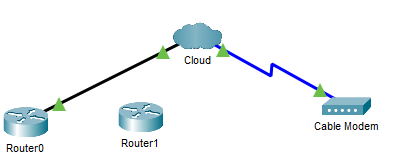
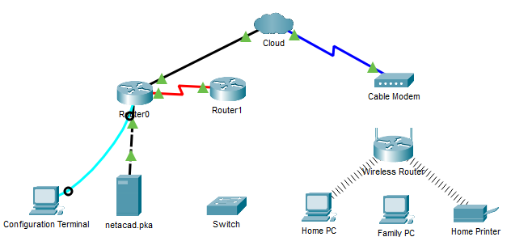
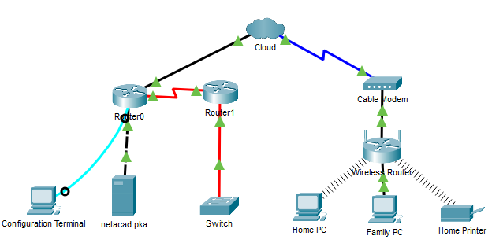
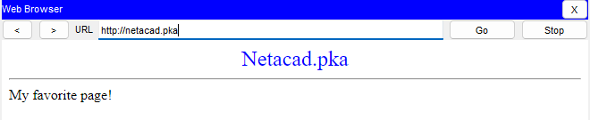
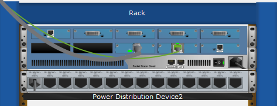

<style>
h1,h2,h3,h4 {
    border-bottom: 0;
    display:flex;
    flex-direction: column;
    align-items: center;
      }
      
centerer{
    display: grid;
    grid-template-columns: 6fr 1fr 4fr;
    grid-template-rows: 1fr;

}
rectangle{
    border: 1px solid black;
    margin: 0px 50px 0px 50px;
    width: 200px;
    height: 4em;
    display: flex;
    flex-direction: column;
    align-items: center;
    justify-items: center;
}
Ltext{
    margin: auto auto auto 0;
    font-weight: bold;
    margin-left: 4em
}
Rtext{
    margin: auto;
}

row {
    display: flex;
    flex-direction: row;
    align-items: center;
    justify-content: center; 
}
 </style>
<h1>LABORATORIUM SIECI KOMPUTEROWYCH</h1>

&nbsp;

&nbsp;

<style>

</style>

<centerer>
    <Ltext>Data wykonania ćwiczenia:</Ltext>
    <div align="center">
        <rectangle>
            <Rtext>04.05.2023</Rtext>
        </rectangle>
    </div>
</centerer>

<centerer>
    <Ltext>Rok studiów:</Ltext>
    <div align="center">
        <rectangle>
            <Rtext>2</Rtext>
        </rectangle>
    </div>
</centerer>

<centerer>
    <Ltext>Semestr:</Ltext>
    <div align="center">
        <rectangle>
            <Rtext>4</Rtext>
        </rectangle>
    </div>
</centerer>

<centerer>
    <Ltext>Grupa studencka:</Ltext>
    <div align="center">
        <rectangle>
            <Rtext>2</Rtext>
        </rectangle>
    </div>
</centerer>

<centerer>
    <Ltext>Grupa laboratoryjna:</Ltext>
    <div align="center">
        <rectangle>
            <Rtext>2B</Rtext>
        </rectangle>
    </div>
</centerer>

&nbsp;

&nbsp;

<row>
    <b>Ćwiczenie nr.</b>
    <rectangle>
        <Rtext>10</Rtext>
    </rectangle>
</row>

&nbsp;

&nbsp;

<b>Temat: </b> Łączenie przewodowych oraz bezprzewodowych sieci LAN

&nbsp;

&nbsp;

<b>Osoby wykonujące ćwiczenia: </b>

1. Igor Gawłowicz

&nbsp;

&nbsp;

<h2 >Katedra Informatyki i Automatyki</h1>

<div style="page-break-after: always;"></div>

1. Podłączenie do chmury \
   Aby połączyć chmurę z naszą siecią musimy zacząć od podłączenia chmury z routerem za pomocą miedzianego kabla oraz chmury z modemem za pomocą kabla koncentrycznego. Po wykonaniu przedstawionego procesu nasza symulacja w packet tracerze powinna wyglądać w sposób następujący.

<div align="center">

</div>

2. Połączenie z Router0 \
   Następnym krokiem będzie połączenie ze sobą Routerow, zrobimy to za pomocą kabla Serial. Po podłączeniu zobaczymy zielone symbole i możemy przejść do podłączania terminala konfiguracyjnego. Zrobimy to za pomocą kabla konsolowego. Poprawna konfiguracja na tym etapie będzie wyglądać następująco

<div align="center">

</div>

3. Podłączenie pozostałych urządzeń \
   Musimy teraz podłączyć Router1 do naszego przełącznika, zrobimy to za pomocą kabla światłowodowego. Proces ten chwilę trwa dlatego najpierw zobaczymy bursztynową kropkę która po parunastu sekundach zmieni się na zieloną potwierdzając, że nasza konfiguracja jest prawidłowa. \
   Po odczekaniu chwili i potwierdzeniu poprzedniego kroku, następnie podłączymy modem z naszym bezprzewodowym routerem kablem miedzianym. Po wykonaniu wszystkich poprzednich kroków nasza konfiguracja jest już prawie gotowa, teraz wystarczy już tylko podłączyć naszą sieć bezprzewodową do komputera za pomocą kabla miedzianego. Gotowa konfiguracja powinna wyglądać w taki sposób.

<div align="center">

</div>

4. Zweryfikuj połączenie \
   Najpierw sprawdźimy je poprzez ping na sieć netacad.pka

   ```
   Cisco Packet Tracer PC Command Line 1.0
   C:\>ping netacad.pka

   Pinging 10.0.0.254 with 32 bytes of data:

   Reply from 10.0.0.254: bytes=32 time=56ms TTL=126
   Reply from 10.0.0.254: bytes=32 time=1ms TTL=126
   Reply from 10.0.0.254: bytes=32 time=12ms TTL=126
   Reply from 10.0.0.254: bytes=32 time=2ms TTL=126

   Ping statistics for 10.0.0.254:
       Packets: Sent = 4, Received = 4, Lost = 0 (0% loss),
   Approximate round trip times in milli-seconds:
       Minimum = 1ms, Maximum = 56ms, Average = 17ms
   ```

   Oraz w przeglądarce wpisując adres strony ręcznie i sprawdzając odpowiedź.

   <div align="center">
   
   </div>

   Następnym co możemy sprawdzić jest ping na adres ip naszego przełącznika.

   ```
   Cisco Packet Tracer PC Command Line 1.0
   C:\>ping
   C:\>ping 172.16.0.2

   Pinging 172.16.0.2 with 32 bytes of data:

   Request timed out.
   Request timed out.
   Reply from 172.16.0.2: bytes=32 time=25ms TTL=252
   Reply from 172.16.0.2: bytes=32 time=29ms TTL=252

   Ping statistics for 172.16.0.2:
       Packets: Sent = 4, Received = 2, Lost = 2 (50% loss),
   Approximate round trip times in milli-seconds:
   Minimum = 25ms, Maximum = 29ms, Average = 27ms
   ```

   Ostatecznie możemy jescze sprawdzić stan interfacow z poziomu konsoli konfiguracyjnej

   ```
   Router0>show ip interface brief
   Interface              IP-Address      OK? Method Status                Protocol
   FastEthernet0/0        192.168.2.1     YES manual up                    up
   FastEthernet0/1        10.0.0.1        YES manual up                    up
   Serial0/0/0            172.31.0.1      YES manual up                    up
   Serial0/0/1            unassigned      YES unset  administratively down down
   Vlan1                  unassigned      YES unset  administratively down down
   Router0>
   ```

5. Sprawdzenie topologii fizycznej \
   Po przejściu w postać fizyczną sieci i przekierowaniu się do chmury możemy zobaczyć dwa przewody podłączone do urządzenia

   <div align="center">
   
   </div>

   Po przełączeniu na primary network możemy zobaczyć komputer na stole obok szafki. \
   Możemy także sprawdzić sieć drugiego rzędu oraz sieć domową gdzie zobaczymy w fizycznej postaci zbudowaną przez nas sieć.

6. Wnioski \
   Dzięki możliwością symulowania rzeczywistych sieci w programie cisco packet tracer możemy w bardzo rzeczywisty sposób odzwierciedlić rzeczywiste możliwość sieci.
