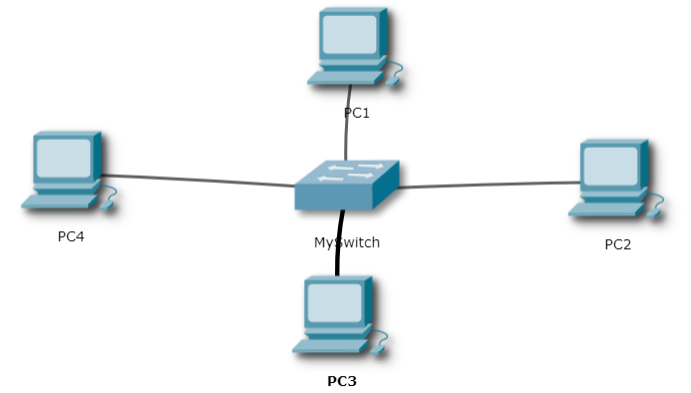
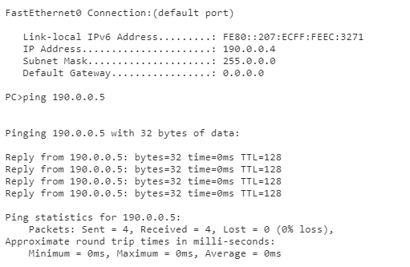

<h1>LABORATORIUM SIECI KOMPUTEROWYCH</h1>

&nbsp;

&nbsp;

<centerer>
    <Ltext>Data wykonania ćwiczenia:</Ltext>
    

        <rectangle>
            <Rtext>30.04.2023</Rtext>
        </rectangle>
    

</centerer>

<centerer>
    <Ltext>Rok studiów:</Ltext>
    

        <rectangle>
            <Rtext>2</Rtext>
        </rectangle>
    

</centerer>

<centerer>
    <Ltext>Semestr:</Ltext>
    

        <rectangle>
            <Rtext>4</Rtext>
        </rectangle>
    

</centerer>

<centerer>
    <Ltext>Grupa studencka:</Ltext>
    

        <rectangle>
            <Rtext>2</Rtext>
        </rectangle>
    

</centerer>

<centerer>
    <Ltext>Grupa laboratoryjna:</Ltext>
    

        <rectangle>
            <Rtext>2B</Rtext>
        </rectangle>
    

</centerer>

&nbsp;

&nbsp;

<row>
    <b>Ćwiczenie nr.</b>
    <rectangle>
        <Rtext>6</Rtext>
    </rectangle>
</row>

&nbsp;

&nbsp;

<b>Temat: </b> Tworzenie podsieci IPv4

&nbsp;

&nbsp;

<b>Osoby wykonujące ćwiczenia: </b>

1. Igor Gawłowicz

&nbsp;

&nbsp;

<h2 >Katedra Informatyki i Automatyki</h1>

1. Zgodnie z wariantem (tabela 1.) na podstawie podanego adresu IPv4 i maski podsieci wyznacz następujące parametry:

   - adresy sieci A i B;
   - adresy rozgłoszeniowe sieci A i B;
   - maksymalną liczbę węzłów w sieciach A i B;
   - zakres dostępnych adresów węzłów w sieciach A i B.
   - liczbę możliwych podsieci B w sieci A.

   | **No** | **Adres IP** | **Maska sieci A** | **Maska sieci B** |
   | ------ | ------------ | ----------------- | ----------------- |
   | 5      | 190.15.157.6 | 255.0.0.0         | 255.255.192.0     |

   10111110.00001111.10011101.00000110 \
   AND \
   11111111.00000000.00000000.00000000 \
   = \
   10111110.00000000.00000000.00000000 \
    Adres sieci A: 190.0.0.0 \

   10111110.00001111.10011101.00000110 \
   AND \
   11111111.11111111.11000000.00000000 \
   = \
   10111110.00001111.10000000.00000000 \
   Adres sieci B: 190.15.128.0

   Adres rozgłoszeniowy sieci A: 190.0.0.255 \
   Adres rozgłoszeniowy sieci B: 190.15.128.255

   2^24 - 2 = 16777214 \
   Maksymalna liczba węzłów w sieci A: 16777214 \
   2^14 - 2 = 16382 \
   Maksymalna liczba węzłów w sieci B: 16382

   Zakres adresów sieci A: 190.0.0.1 - 191.255.255.254 \
   Zakres adresów sieci B: 190.15.128.1 - 191.15.128.254

2. Tabela wynikowa:
   | Parametry | Sieć A | Sieć B |
   | --- | --- | ---|
   | Maska sieciowa | 8 | 18 |
   | Adres sieciowy |190.0.0.0 | 192.15.128.0 |
   | Adres rozgłoszeniowy | 190.0.0.255 | 190.15.128.255 |
   | Adres IPv4 pierwszego hosta w sieci | 190.0.0.1 | 190.15.128.1 |
   | Adres IPv4 ostatniego hosta w sieci | 191.255.255.254 | 191.15.128.254 |
   | Liczba hostow w sieci | 16777214 | 16382 |
   | Liczba możliwych podsieci B w sieci A | 1024 | Nie można 14-24 = -10 |

3. Utwórz sieć A w środowisku forge.kmi.open.ac.uk składającą się z czterech stacjonarnych komputerów PC i jednego przełącznika.

4. Ustaw wszystkie hosty docelowe w sieci A na adresy IP:

   - PC1 to trzeci adres sieci A;
   - PC2 to czwarty adres sieci A;
   - PC3 jest piątym adresem sieci A.
   - PC4 jest ostatnim adresem sieci A.

   Jeśli adres sieci A to 190.0.0.0:

   - PC1 - 190.0.0.3
   - PC2 - 190.0.0.4
   - PC3 - 190.0.0.5
   - PC4 - 190.255.255.254

5. Maski sieciowe zostały ustawione zgodnie z maską sieci A
6. Polecenie ipconfig:

      
      

7. Na powyższym zdjęciu widać zarówno polecenie ipconfig dla jednego z komputerów oraz ping dla innego po sprawdzeniu każdej z kombinacji można zaobserwować że wszystkie wyniki są takie jak były spodziewane.

8. Wnioski: \
   Za pomocą obliczeń jesteśmy w stanie otrzymać wszystkie parametry sieci co wskazuje na to że sama idea sieci jest bardzo dobrze przemyślana i zrobiona w taki sposób żeby nie dochodziło do niechcianych indydentów.
   Narzędzie do symulacji bardzo prosto, a jednak dokładnie prezentuje działanie wielu komputerów w sieci i możemy go wykorzystać żeby inicjować różne scenariusze.
