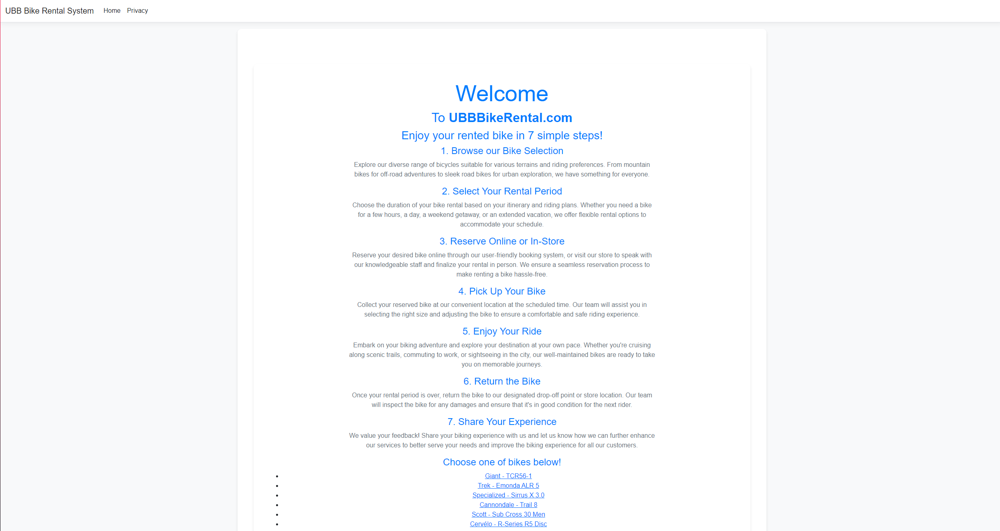
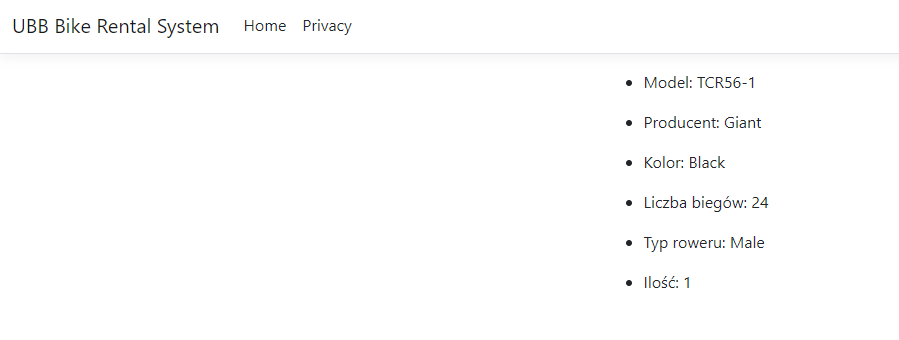
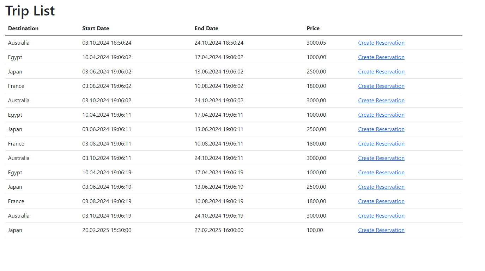
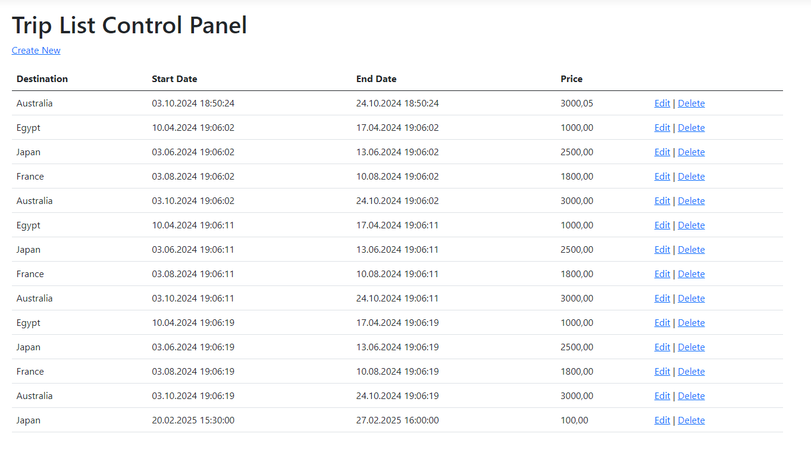
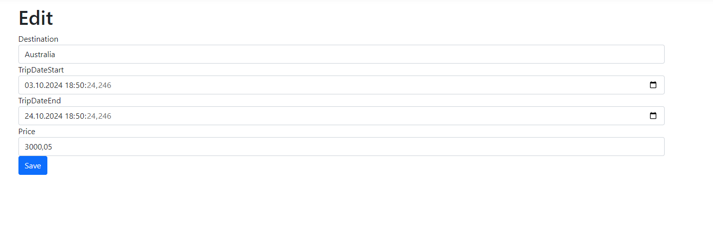
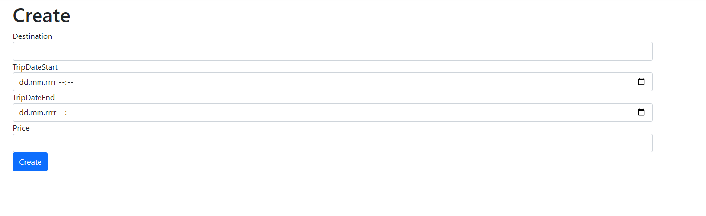
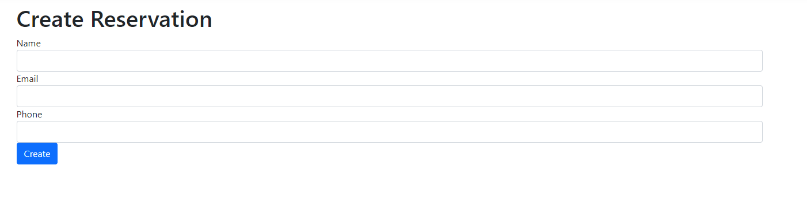
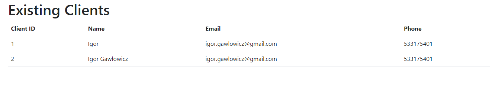
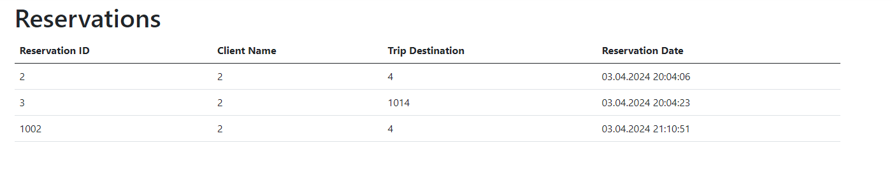

<style>
h1, h4, h2 {
    border-bottom: 0;
    display:flex;
    flex-direction: column;
    align-items: center;
    text-align: center;
      }
      
centerer{
    display: grid;
    grid-template-columns: 6fr 1fr 4fr;
    grid-template-rows: 1fr;

}
rectangle{
    border: 1px solid black;
    margin: 0px 50px 0px 50px;
    width: 200px;
    height: 4em;
    display: flex;
    flex-direction: column;
    align-items: center;
    justify-items: center;
}
Ltext{
    margin: auto auto auto 0;
    font-weight: bold;
    margin-left: 4em
}
Rtext{
    margin: auto;
}

row {
    display: flex;
    flex-direction: row;
    align-items: center;
    justify-content: center; 
}
 </style>
<h1>Uniwersytet Bielsko-Bialski</h1>

&nbsp;

&nbsp;

&nbsp;

&nbsp;

&nbsp;

&nbsp;

&nbsp;

&nbsp;

&nbsp;

<h1 style="text-align: center;"><b>LABORATORIUM</b></h1>
<h1 style="text-align:center"><b>Programowanie dla Internetu w technologii ASP.NET</b></h1>

&nbsp;

&nbsp;

<h2 style="text-align:center; border: none;"><b>Sprawozdanie nr 1</b></h3>
<h2 style="text-align:center; border: none;">Layout, lista, szczegóły</h2>

&nbsp;

&nbsp;

&nbsp;

&nbsp;

&nbsp;

&nbsp;

&nbsp;

GRUPA: 2B / SEMESTR: 6 / ROK: 3

Igor Gawłowicz / 59096

<div style="page-break-after: always;"></div>

### Tworzenie Aplikacji ASP.NET:

1. **Stworzenie nowego projektu**: W ramach procesu tworzenia aplikacji ASP.NET wybierana jest odpowiednia szablonowa struktura projektu, w tym przypadku jest to "ASP.NET Core Web Application" dla najnowszej wersji ASP.NET Core.

2. **Struktura folderów**:

   - **Controllers**: W folderze tym znajdują się kontrolery, które obsługują żądania HTTP i decydują, które widoki mają zostać wyrenderowane.

   - **Models**: Folder ten zawiera modele danych aplikacji, reprezentujące encje lub obiekty używane przez aplikację.

   - **ViewModels**: Tutaj umieszcza się widoki modeli, które są używane do przekazywania danych z kontrolerów do widoków, co pomaga w separacji logiki biznesowej od warstwy prezentacji.

   - **Views**: W tym folderze znajdują się pliki widoków, które renderują interfejs użytkownika. Mogą one być napisane w języku HTML z dodatkami ASP.NET, takimi jak Razor.

### Struktura Bazowej Strony (Layout):

1. **Nagłówek (Header)**:

   - Logo: Logo aplikacji umieszczone jest w lewym górnym rogu nagłówka.

   - Nawigacja: Tworzony jest pasek nawigacyjny z linkami do różnych części aplikacji, przyjmujący formę menu pionowego lub poziomego w zależności od preferencji i stylu projektu.

2. **Główna Sekcja (Main Section)**:

   - Treść główna: W tej części layoutu umieszczana jest główna treść strony, takie jak lista artykułów, formularz wyszukiwania czy inne dane aplikacji.

3. **Stopka Strony (Footer)**:

   - Informacje o aplikacji: W stopce strony umieszcza się informacje o autorze, wersji aplikacji, latach działalności itp.

   - Linki pomocnicze: Stopka może zawierać linki do stron informacyjnych, regulaminu, polityki prywatności itp.

   - Dane kontaktowe: Można również umieścić dane kontaktowe, takie jak adres e-mail lub numer telefonu do wsparcia technicznego.

### Przebieg ćwiczenia

W ramach ćwiczenia napisaliśmy prostą stronę główną prezentującą wypożyczalnie rowerów, wykorzystaliśmy do tego prosty html i style napisane w css.

Z racji że korzystamy z technologii ASP.NET nie będziemy ograniczać się htmlem i cssem, dlatego następnym krokiem było stworzenie dynamicznej listy obiektów, gdzie każdy z nich ma swój odnośnik do dedykowanej strony przedstawiającej informacje na temat każdego z rowerów.

```cs
        <ul>
            @foreach (var item in Model)
            {
                <li>
                    <a asp-controller="Home" asp-action="Detail" asp-route-id="@item.Id">@item.Producer - @item.Model</a>
                </li>
            }
        </ul>
```

Przedstawiona została lista jednak, nie mamy jeszcze żadnej funkcji, która obsłuży te odnośniki.

Aby rozwiązać ten problem przejdziemy do pliku `HomeController.cs` i napiszemy kontroler obsługujący operacje `Detail`

```cs
        public IActionResult Detail(int id)
        {
            var bike = _bikes.FirstOrDefault(x => x.Id == id);
            return View(bike);

        }
```

Poza tym potrzebujemy także widoku, który będzie wyświetlany przy wywołaniu tego kontrolera, dlatego w folderze `Views/Home` stworzymy sobie nowy plik `Detail.cshtml`

```cs
@using BikeRentalSystemWeb.ViewModels;
@model BikeDetailViewModel


<ul>
    <li>
        <p>Model: @Model.Model</p>
    </li>
    <li>
        <p>Producent: @Model.Producer</p>
    </li>
    <li>
        <p>Kolor: @Model.Color</p>
    </li>
    <li>
        <p>Liczba biegów: @Model.NumberofGears</p>
    </li>
    <li>
        <p>Typ roweru: @Model.BikeType</p>
    </li>
    <li>
        <p>Ilość: @Model.NumberofBikes</p>
    </li>
</ul>

```

W ten sposób wszystko zacznie nam działać w oczekiwany sposób:

- Strona główna wygląda tak jak ją napisaliśmy



- Szczegóły także wyświetlają się poprawnie



<div style="page-break-after: always;"></div>

## Baza danych i modele danych

Aby zademonstrować działanie bazy danych w aplikacji ASP.NET, stworzyłem aplikacje do zarządzania biurem podróży umożliwiającą klientom rezerwacje wycieczek, a także administracji dodawanie nowych wycieczek lub ich modyfikacja za pomocą prostego CRUDa.

Zaczynając od połączenia z bazą danych musiałem zdobyć connection stringa, aby ustawić odpowiednio połączenie do bazy w której będą znajdować się moje tabelę

Następnie musiałem dodać go do pliku `appsettings.json`

```json
  "ConnectionStrings": {
    "DefaultContext": "Data Source=(localdb)\\mssqllocaldb;Initial Catalog=master;Integrated Security=True;Multiple Active Result Sets=True"
  },
```

Teraz aby wykorzystać tą opcję w `program.cs` dodajemy do buildera polecenie które utworzy nam połączenie na podstawie przekazanego connection string

```cs
            builder.Services.AddDbContext<TripContext>(options =>
            options.UseSqlServer(builder.Configuration.GetConnectionString("DefaultContext")));
```

Teraz przeszedłem do tworzenia struktury mojej bazy.

Uznałem, że aby projekt działał potrzebuje co najmniej 3 tabel

Client

```cs
    public class Client
    {
        public int ClientId { get; set; }
        public string Name { get; set; }
        public string Email { get; set; }
        public string Phone { get; set; }

    }
```

Reservation

```cs
    public class Reservation
    {
        public int ReservationId { get; set; }
        public int ClientId { get; set; }
        public Client Client { get; set; }
        public DateTime ReservationDate { get; set; }
        public int TripId { get; set; }
        public Trip Trip { get; set; }
    }
```

Trip

```cs
    public class Trip
    {
        public int TripId { get; set; }
        public string Destination { get; set; }
        public DateTime TripDateStart { get; set; }
        public DateTime TripDateEnd { get; set; }
        public decimal Price { get; set; }
    }
```

Gdzie `Trip` oznaczał zaprojektowane wycieczki, `Client` klientów istniejących w bazie oraz `Reservation` służył do zapisywania wybranych przez klientów wycieczkę.

Następnie do utworzonych struktur musiałem stworzyć kontekst

```cs
using Microsoft.EntityFrameworkCore;
using TripApp.Models;

namespace TripApp.Data
{
    public class TripContext : DbContext
    {
        public TripContext(DbContextOptions<TripContext> options) : base(options)
        {
        }
        public DbSet<Trip> Trips { get; set; }
        public DbSet<Client> Clients { get; set; }
        public DbSet<Reservation> Reservations { get; set; }
        protected override void OnModelCreating(ModelBuilder modelBuilder)
        {
            modelBuilder.Entity<Trip>().ToTable("Trip");
            modelBuilder.Entity<Client>().ToTable("Client");
            modelBuilder.Entity<Reservation>().ToTable("Reservation");
        }

    }
}

```

Za pomocą niego program przygotowuje sobie listę na zawartość tabel w bazie, a także przy pierwszym uruchomieniu tworzy tabelę w bazie jeśli jeszcze ich tam nie było.

Teraz aby aplikacja pełniła swoją rolę utworzyłem kilka widoków a także kontrolery do nich, gdzie najistotniejszym elementem był kontroler wycieczek gdzie napisałem całego CRUDa

Create

```cs
        // POST: Trip/Create
        [HttpPost]
        [ValidateAntiForgeryToken]
        public async Task<IActionResult> Create([Bind("Destination,TripDateStart,TripDateEnd,Price")] Trip trip)
        {
            if (ModelState.IsValid)
            {
                _context.Add(trip);
                await _context.SaveChangesAsync();
                return RedirectToAction(nameof(Index));
            }
            return View(trip);
        }
```

Edit

```cs
        [HttpPost]
        [ValidateAntiForgeryToken]
        public async Task<IActionResult> Edit(int id, [Bind("TripId,Destination,TripDateStart,TripDateEnd,Price")] Trip trip)
        {
            if (id != trip.TripId)
            {
                return NotFound();
            }

            if (ModelState.IsValid)
            {
                try
                {
                    _context.Update(trip);
                    await _context.SaveChangesAsync();
                }
                catch (DbUpdateConcurrencyException)
                {
                    if (!TripExists(trip.TripId))
                    {
                        return NotFound();
                    }
                    else
                    {
                        throw;
                    }
                }
                return RedirectToAction(nameof(Index));
            }
            return View(trip);
        }
```

Delete

```cs
        // POST: Trip/Delete/5
        [HttpPost, ActionName("Delete")]
        [ValidateAntiForgeryToken]
        public async Task<IActionResult> DeleteConfirmed(int id)
        {
            var trip = await _context.Trips.FindAsync(id);
            _context.Trips.Remove(trip);
            await _context.SaveChangesAsync();
            return RedirectToAction(nameof(Index));
        }
```

Oraz oczywiście wyświetlanie w głównym widoku

```cs
        @foreach (var item in Model)
        {
            <tr>
                <td>
                    @Html.DisplayFor(modelItem => item.Destination)
                </td>
                <td>
                    @Html.DisplayFor(modelItem => item.TripDateStart)
                </td>
                <td>
                    @Html.DisplayFor(modelItem => item.TripDateEnd)
                </td>
                <td>
                    @Html.DisplayFor(modelItem => item.Price)
                </td>
                <td>
                    <a href="@Url.Action("Create", "ClientReservation", new { tripId = item.TripId })">Create Reservation</a>
                </td>
            </tr>
        }
```

Homepage z możliwością wyświetlenia wszystkich możliwych wycieczek a także zarezerwowania wybranej



Widok zarządzania wycieczkami



Panel edycji danych wycieczki



Panel tworzenia nowej wycieczki



Panel rezerwacji



Tutaj klient podaje swoje dane, system jest trochę uproszczony i nie mam żadnej rejestracji ale program sprawdza czy istnieje już podany klient i czy przypadkiem nie zarezerwował już tej wycieczki

Panel wyświetlania istniejących klientów



Panel wyświetlania istniejących już rezerwacji


