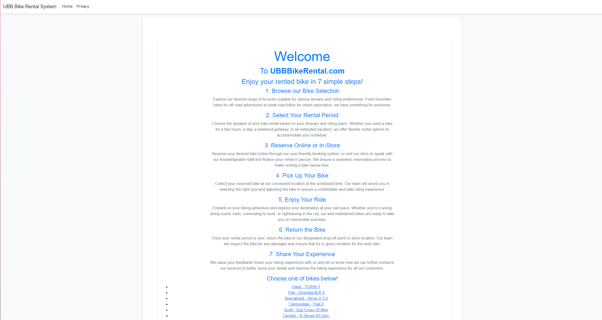
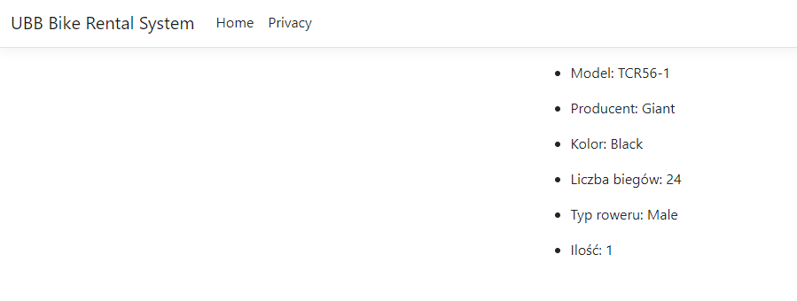
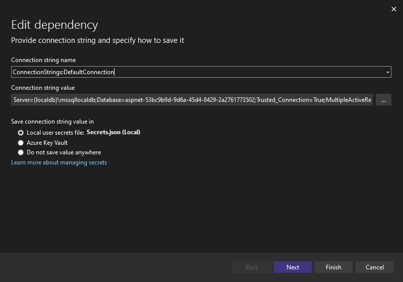

<style>
h1, h4, h2 {
    border-bottom: 0;
    display:flex;
    flex-direction: column;
    align-items: center;
    text-align: center;
      }
      
centerer{
    display: grid;
    grid-template-columns: 6fr 1fr 4fr;
    grid-template-rows: 1fr;

}
rectangle{
    border: 1px solid black;
    margin: 0px 50px 0px 50px;
    width: 200px;
    height: 4em;
    display: flex;
    flex-direction: column;
    align-items: center;
    justify-items: center;
}
Ltext{
    margin: auto auto auto 0;
    font-weight: bold;
    margin-left: 4em
}
Rtext{
    margin: auto;
}

row {
    display: flex;
    flex-direction: row;
    align-items: center;
    justify-content: center; 
}
 </style>
<h1>Uniwersytet Bielsko-Bialski</h1>

&nbsp;

&nbsp;

&nbsp;

&nbsp;

&nbsp;

&nbsp;

&nbsp;

&nbsp;

&nbsp;

<h1 style="text-align: center;"><b>LABORATORIUM</b></h1>
<h1 style="text-align:center"><b>Programowanie dla Internetu w technologii ASP.NET</b></h1>

&nbsp;

&nbsp;

<h2 style="text-align:center; border: none;"><b>Sprawozdanie nr 1</b></h3>
<h2 style="text-align:center; border: none;">Layout, lista, szczegóły</h2>

&nbsp;

&nbsp;

&nbsp;

&nbsp;

&nbsp;

&nbsp;

&nbsp;

GRUPA: 2B / SEMESTR: 6 / ROK: 3

Igor Gawłowicz / 59096

<div style="page-break-after: always;"></div>

### Tworzenie Aplikacji ASP.NET:

1. **Stworzenie nowego projektu**: W ramach procesu tworzenia aplikacji ASP.NET wybierana jest odpowiednia szablonowa struktura projektu, w tym przypadku jest to "ASP.NET Core Web Application" dla najnowszej wersji ASP.NET Core.

2. **Struktura folderów**:

   - **Controllers**: W folderze tym znajdują się kontrolery, które obsługują żądania HTTP i decydują, które widoki mają zostać wyrenderowane.

   - **Models**: Folder ten zawiera modele danych aplikacji, reprezentujące encje lub obiekty używane przez aplikację.

   - **ViewModels**: Tutaj umieszcza się widoki modeli, które są używane do przekazywania danych z kontrolerów do widoków, co pomaga w separacji logiki biznesowej od warstwy prezentacji.

   - **Views**: W tym folderze znajdują się pliki widoków, które renderują interfejs użytkownika. Mogą one być napisane w języku HTML z dodatkami ASP.NET, takimi jak Razor.

### Struktura Bazowej Strony (Layout):

1. **Nagłówek (Header)**:

   - Logo: Logo aplikacji umieszczone jest w lewym górnym rogu nagłówka.

   - Nawigacja: Tworzony jest pasek nawigacyjny z linkami do różnych części aplikacji, przyjmujący formę menu pionowego lub poziomego w zależności od preferencji i stylu projektu.

2. **Główna Sekcja (Main Section)**:

   - Treść główna: W tej części layoutu umieszczana jest główna treść strony, takie jak lista artykułów, formularz wyszukiwania czy inne dane aplikacji.

3. **Stopka Strony (Footer)**:

   - Informacje o aplikacji: W stopce strony umieszcza się informacje o autorze, wersji aplikacji, latach działalności itp.

   - Linki pomocnicze: Stopka może zawierać linki do stron informacyjnych, regulaminu, polityki prywatności itp.

   - Dane kontaktowe: Można również umieścić dane kontaktowe, takie jak adres e-mail lub numer telefonu do wsparcia technicznego.

### Przebieg ćwiczenia

W ramach ćwiczenia napisaliśmy prostą stronę główną prezentującą wypożyczalnie rowerów, wykorzystaliśmy do tego prosty html i style napisane w css.

Z racji że korzystamy z technologii ASP.NET nie będziemy ograniczać się htmlem i cssem, dlatego następnym krokiem było stworzenie dynamicznej listy obiektów, gdzie każdy z nich ma swój odnośnik do dedykowanej strony przedstawiającej informacje na temat każdego z rowerów.

```cs
        <ul>
            @foreach (var item in Model)
            {
                <li>
                    <a asp-controller="Home" asp-action="Detail" asp-route-id="@item.Id">@item.Producer - @item.Model</a>
                </li>
            }
        </ul>
```

Przedstawiona została lista jednak, nie mamy jeszcze żadnej funkcji, która obsłuży te odnośniki.

Aby rozwiązać ten problem przejdziemy do pliku `HomeController.cs` i napiszemy kontroler obsługujący operacje `Detail`

```cs
        public IActionResult Detail(int id)
        {
            var bike = _bikes.FirstOrDefault(x => x.Id == id);
            return View(bike);

        }
```

Poza tym potrzebujemy także widoku, który będzie wyświetlany przy wywołaniu tego kontrolera, dlatego w folderze `Views/Home` stworzymy sobie nowy plik `Detail.cshtml`

```cs
@using BikeRentalSystemWeb.ViewModels;
@model BikeDetailViewModel


<ul>
    <li>
        <p>Model: @Model.Model</p>
    </li>
    <li>
        <p>Producent: @Model.Producer</p>
    </li>
    <li>
        <p>Kolor: @Model.Color</p>
    </li>
    <li>
        <p>Liczba biegów: @Model.NumberofGears</p>
    </li>
    <li>
        <p>Typ roweru: @Model.BikeType</p>
    </li>
    <li>
        <p>Ilość: @Model.NumberofBikes</p>
    </li>
</ul>

```

W ten sposób wszystko zacznie nam działać w oczekiwany sposób:

- Strona główna wygląda tak jak ją napisaliśmy



- Szczegóły także wyświetlają się poprawnie



<div style="page-break-after: always;"></div>

## Baza danych i modele danych

Aby połączyć naszą aplikacje z bazą danych zaczniemy od zainstalowania potrzebnych pakietów NuGet

```bash
Install-Package Microsoft.AspNetCore.Diagnostics.EntityFrameworkCore
Install-Package Microsoft.EntityFrameworkCore.SqlServer
```

Po zainstalowaniu, musimy zdobyć connection stringa koniecznego do połączenia się z naszą bazą danych, możemy go uzyskać z poziomu Visual Studia poprzez naciśnięcie na instancje naszego servera prawym


A następnie wybranie edit



Skopiowany connection string będzie trzeba wkleić w pliku appsettings.json w strukturze naszego projektu

```json
  "ConnectionStrings": {
    "BikeContext": "Server=(localdb)\\mssqllocaldb;Database=aspnet-53bc9b9d-9d6a-45d4-8429-2a2761773502;Trusted_Connection=True;MultipleActiveResultSets=true"
  },
```

W swoim przypadku nazwałem go BikeContext ponieważ tak będę się do niego odnosił w programie.

Następnym krokiem jest stworzenie modelu naszej bazy w postaci klasy w folderze `Models`

```cs
namespace BikeRentalSystemWeb.Models
{
    public enum BikeTypeModel { Male, Female, Kids }
    public class Bike
    {

        public int BikeID { get; set; }
        public string Producer { get; set; }
        public string Model { get; set; }
        public int NumberofGears { get; set; }
        public BikeTypeModel BikeType { get; set; }
        public string Color { get; set; }
        public int NumberofBikes { get; set; }
    }
}
```

Aby wykorzystać ten model w bazie danych musimy stworzyć kontekst dla tej tabeli

```cs
namespace BikeRentalSystemWeb.Data
{
    public class BikeContext : DbContext
    {
        public BikeContext(DbContextOptions<BikeContext> options) : base(options)
        {
        }

        public DbSet<Bike> Bikes { get; set; }


        protected override void OnModelCreating(ModelBuilder modelBuilder)
        {
            modelBuilder.Entity<Bike>().ToTable("Bike");
        }
    }
}
```

Teraz aby połączyć się z bazą musimy zmodyfikować Program uruchamiający naszą aplikację, czyli `Program.cs`

```cs
builder.Services.AddDbContext<BikeContext>(options =>
    options.UseSqlServer(builder.Configuration.GetConnectionString("BikeContext")));
```

dodanie tych dwóch linijek kodu, powiąże naszą bazę na podstawie connection stringa, który wcześniej nazwaliśmy `BikeContext`

Połączenie zostało już nawiązane teraz musimy tylko wykorzystać to połączenie, dlatego następną rzeczą którą zrobimy będzie dodanie klasy inicjalizującej bazę danych, czyli w sytuacji w której nie będzie w niej żadnych rekordów zostanie wywołana funkcja wprowadzająca nowe rekordy.

```cs
using BikeRentalSystemWeb.Models;
using System;
using System.Linq;


namespace BikeRentalSystemWeb.Data
{
    public class DbInitializer_
    {
        public static void Initialize(BikeContext context)
        {
            context.Database.EnsureCreated();


            if (context.Bikes.Any())
            {
                return;
            }

            var bikes = new Bike[]
            {
                new Bike { Producer = "Giant", Model = "TCR56-1", Color = "Black", BikeType = BikeTypeModel.Male, NumberofBikes = 1, NumberofGears = 24 },
                new Bike { Producer = "Trek", Model = "FX3", Color = "Blue", BikeType = BikeTypeModel.Male, NumberofBikes = 1, NumberofGears = 21 },
                new Bike { Producer = "Specialized", Model = "Sirrus X 4.0", Color = "Red", BikeType = BikeTypeModel.Kids, NumberofBikes = 1, NumberofGears = 18 },
                new Bike { Producer = "Cannondale", Model = "Synapse", Color = "White", BikeType = BikeTypeModel.Male, NumberofBikes = 1, NumberofGears = 22 },
                new Bike { Producer = "Giant", Model = "Reign 29", Color = "Green", BikeType = BikeTypeModel.Male, NumberofBikes = 1, NumberofGears = 20 },
                new Bike { Producer = "Trek", Model = "Marlin 7", Color = "Orange", BikeType = BikeTypeModel.Male, NumberofBikes = 1, NumberofGears = 18 },
                new Bike { Producer = "Specialized", Model = "Rockhopper", Color = "Yellow", BikeType = BikeTypeModel.Male, NumberofBikes = 1, NumberofGears = 24 },
                new Bike { Producer = "Cannondale", Model = "Trail 5", Color = "Purple", BikeType = BikeTypeModel.Female, NumberofBikes = 1, NumberofGears = 21 },
                new Bike { Producer = "Giant", Model = "Trance X 29", Color = "Blue", BikeType = BikeTypeModel.Male, NumberofBikes = 1, NumberofGears = 22 },
                new Bike { Producer = "Trek", Model = "Domane", Color = "Black", BikeType = BikeTypeModel.Female, NumberofBikes = 1, NumberofGears = 20 }


            };
            foreach (Bike b in bikes)
            {
                context.Bikes.Add(b);
            }
            context.SaveChanges();
        }
    }
}
```

Teraz w naszym kontrolerze musimy zmodyfikować jego inicjalizację

```cs
        public HomeController(ILogger<HomeController> logger, BikeContext context)
        {
            _logger = logger;
            _context = context;
            _context.Database.EnsureCreated();
            DbInitializer_.Initialize(context);
        }
```

W ten sposób powiążemy sobie kontekst naszej tabeli z kontekstem w programie, w między czasie sprawdzimy też czy tabela jest już utworzona w bazie danych i zostanie przeprowadzona jej inicjalizacja.

Teraz możemy przypisać rowery z bazy do rowerów używanych na stronie

```cs
        public async Task<IActionResult> Index()
        {
            var bikes = await _context.Bikes.ToListAsync();
            return View(bikes);
        }
```

Teraz możemy korzystać ze strony w taki sam sposób jak wcześniej wystarczy tylko zmienić importy w plikach `.cshtml`

```cs
@using BikeRentalSystemWeb.Models;
@model Bike
```
