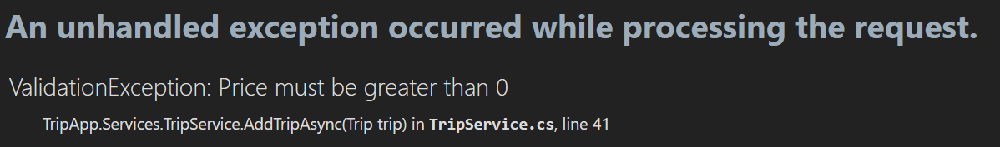

<style>
h1, h4, h2 {
    border-bottom: 0;
    display:flex;
    flex-direction: column;
    align-items: center;
    text-align: center;
      }
      
centerer{
    display: grid;
    grid-template-columns: 6fr 1fr 4fr;
    grid-template-rows: 1fr;

}
rectangle{
    border: 1px solid black;
    margin: 0px 50px 0px 50px;
    width: 200px;
    height: 4em;
    display: flex;
    flex-direction: column;
    align-items: center;
    justify-items: center;
}
Ltext{
    margin: auto auto auto 0;
    font-weight: bold;
    margin-left: 4em
}
Rtext{
    margin: auto;
}

row {
    display: flex;
    flex-direction: row;
    align-items: center;
    justify-content: center; 
}
 </style>
<h1>Uniwersytet Bielsko-Bialski</h1>

&nbsp;

&nbsp;

&nbsp;

&nbsp;

&nbsp;

&nbsp;

&nbsp;

&nbsp;

&nbsp;

<h1 style="text-align: center;"><b>LABORATORIUM</b></h1>
<h1 style="text-align:center"><b>Programowanie dla Internetu w technologii ASP.NET</b></h1>

&nbsp;

&nbsp;

<h2 style="text-align:center; border: none;"><b>Sprawozdanie nr 6</b></h3>
<h2 style="text-align:center; border: none;">Validator / AutoMapping</h2>

&nbsp;

&nbsp;

&nbsp;

&nbsp;

&nbsp;

&nbsp;

&nbsp;

GRUPA: 2B / SEMESTR: 6 / ROK: 3

Igor Gawłowicz / 59096

<div style="page-break-after: always;"></div>

### Validator

Aby upewnić się, że dane które docierają do naszej bazy danych są w pełni poprawne dodamy warstwę walidatora, który przy operacjach wpływających na stan kolumn w bazie danych będzie sprawdzał czy dane które mają być wprowadzone są na pewno prawidłowe.

Zaczniemy od utworzenia klasy walidatora za pomocą biblioteki `FluentValidation` dla każdej z tabel

ClientValidator

```cs
namespace TripApp.Validator
{
    public class ClientValidator : AbstractValidator<Client>
    {
        public ClientValidator()
        {
            RuleFor(x => x.Name).NotEmpty().WithMessage("Client name cannot be empty");
            RuleFor(x => x.Email).NotEmpty().WithMessage("Email is required");
            RuleFor(x => x.Email).EmailAddress().WithMessage("Email is not valid");
            RuleFor(x => x.Phone).NotEmpty().WithMessage("Phone is required");
            RuleFor(x => x.Phone).Length(9).WithMessage("Phone must have 9 digits");
        }
    }
}
```

ReservationValidator

```cs
namespace TripApp.Validator
{
    public class ReservationValidator : AbstractValidator<Reservation>
    {
        public ReservationValidator()
        {
            RuleFor(x => x.ClientId).NotEmpty().WithMessage("Client ID cannot be empty");
            RuleFor(x => x.ReservationDate).GreaterThan(DateTime.Now).WithMessage("Reservation Start Date must be greater than current date");
            RuleFor(x => x.TripId).NotEmpty().WithMessage("Trip ID cannot be empty");
        }
    }
}
```

TripValidator

```cs
namespace TripApp.Validator
{
    public class TripValidator : AbstractValidator<Trip>
    {
        public TripValidator()
        {
            RuleFor(x => x.TripDateStart).GreaterThan(DateTime.Now).WithMessage("Reservation Start Date must be greater than current date");
            RuleFor(x => x.TripDateEnd).GreaterThan((x => x.TripDateStart)).WithMessage("Reservation End Date must be greater than reservation start date");
            RuleFor(x => x.Price).NotEmpty().WithMessage("Price can't be empty");
            RuleFor(x => x.Price).GreaterThan(0).WithMessage("Price must be greater than 0");
            RuleFor(x => x.Destination).NotEmpty().WithMessage("Phone is required");
        }
    }
}
```

Aby omówić proces tworzenia walidacji spojrzymy dokładniej na `TripValidator`.

Po utworzeniu klasy walidatora przejdziemy do serwisu odpowiedzialnego za wycieczki i zastanowimy się, które metody wymagają walidacji.

```cs
using FluentValidation;
using System.Collections.Generic;
using System.Threading.Tasks;
using TripApp.Models;
using TripApp.Repositories;
using TripApp.ViewModels;

namespace TripApp.Services
{
    public class TripService : ITripService
    {
        private readonly ITripRepository _tripRepository;
        private readonly IValidator<Trip> _validator;

        public TripService(ITripRepository tripRepository, IValidator<Trip> validator)
        {
            _tripRepository = tripRepository;
            _validator = validator;
        }

        public async Task<IEnumerable<Trip>> GetAllTripsAsync()
        {
            return await _tripRepository.GetAllAsync();
        }

        public async Task<Trip> GetTripByIdAsync(int id)
        {
            return await _tripRepository.GetByIdAsync(id);
        }

        public async Task AddTripAsync(Trip trip)
        {
            await _tripRepository.AddAsync(trip);
        }

        public async Task UpdateTripAsync(Trip trip)
        {
            await _tripRepository.UpdateAsync(trip);
        }

        public async Task DeleteTripAsync(int id)
        {
            await _tripRepository.DeleteAsync(id);
        }
    }
}

```

W tym przypadku na przekazane do tabeli dane wpływają tylko funkcje `AddTripAsync` oraz `UpdateTripAsync` dlatego to w nich właśnie dodamy etap walidacji

```cs
    public async Task AddTripAsync(Trip trip)
    {
        var validationResult = await _validator.ValidateAsync(trip);

        if (validationResult.IsValid)
        {
            await _tripRepository.AddAsync(trip);
        }
        else
        {
            throw new ValidationException(string.Join(",", validationResult.Errors.Select(e => e.ErrorMessage)));
        }
    }

    public async Task UpdateTripAsync(Trip trip)
    {
        var validationResult = await _validator.ValidateAsync(trip);

        if (validationResult.IsValid)
        {
            await _tripRepository.UpdateAsync(trip);
        }
        else
        {
            throw new ValidationException(string.Join(",", validationResult.Errors.Select(e => e.ErrorMessage)));
        }
    }
```

Czyli za każdym razem gdy skorzystamy z tych funkcji program sprawdzi czy dane są poprawne, jeśli nie to zamiast wyświetlić stronę pokażę nam komunikat z określoną w walidatorze wiadomością.

Na przykład jeśli spróbujemy stworzyć wycieczkę o cenie mniejszej od 0:



Od razu wiemy gdzie jest problem i jak go zwalczyć.

Oprócz dodania etapu walidacji do serwisów musiałem także jak w poprzednich etapach dodać `serwisy` do buildera

```cs
builder.Services.AddScoped<IValidator<Client>, ClientValidator>();
builder.Services.AddScoped<IValidator<Trip>, TripValidator>();
builder.Services.AddScoped<IValidator<Reservation>, ReservationValidator>();
```

### AutoMapper

Za pomocą `AutoMappera` możemy bardzo łatwo rzutować dane z modelu na viewmodel bez potrzeby tworzenia nowej struktury danych manualnie.

Aby go zastosować, zacząłem od utworzenia profilu mappera

```cs
namespace TripApp.AutoMapper
{
    public class MappingProfile : Profile
    {
        public MappingProfile()
        {
            CreateMap<Trip, TripSummaryViewModel>();
            CreateMap<Client, ClientListViewModel>();
        }
    }
}
```

Następnie do konfiguracji musimy dodać nowy element do buildera

```cs
builder.Services.AddAutoMapper(options =>
{
    options.AddProfile<MappingProfile>();
});
```

Kolejnym krokiem jest przepisanie fragmentów kodu w których musieliśmy rzutować dane ręcznie

Przed

```cs
public async Task<IActionResult> Index()
{
    // Get trips using the TripService
    var trips = await _tripService.GetAllTripsAsync();

    // Convert to TripSummaryViewModel if needed
    var tripSummaries = trips.Select(trip => new TripSummaryViewModel
    {
        TripId = trip.TripId,
        Destination = trip.Destination,
        TripDateStart = trip.TripDateStart,
        TripDateEnd = trip.TripDateEnd,
        Price = trip.Price
    }).ToList();

    return View(tripSummaries);
}
```

Po

```cs
public async Task<IActionResult> Index()
{
    var trips = await _tripService.GetAllTripsAsync();

    var tripSummaries = _mapper.Map<List<TripSummaryViewModel>>(trips);

    return View(tripSummaries);
}
```

To samo musimy zrobić dla pozostałych modeli

Przed

```cs
public async Task<IEnumerable<ClientListViewModel>> GetAllClientsAsync()
{
    var clients = await _clientRepository.GetAllAsync();

    var clientViewModels = clients.Select(client => new ClientListViewModel
    {
        Name = client.Name,
        Email = client.Email,
        Phone = client.Phone
    });

    return clientViewModels;
}
```

```cs
public async Task<IEnumerable<ClientListViewModel>> GetAllClientsAsync()
{
    var clients = await _clientRepository.GetAllAsync();
    return _mapper.Map<IEnumerable<ClientListViewModel>>(clients);
}
```

Po zaimplementowaniu tych zmian program działa identycznie a kod wygląda lepiej.
