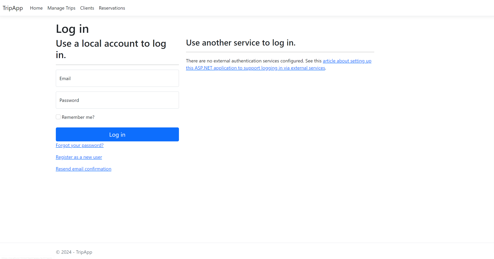

<style>
h1, h4, h2 {
    border-bottom: 0;
    display:flex;
    flex-direction: column;
    align-items: center;
    text-align: center;
      }
      
centerer{
    display: grid;
    grid-template-columns: 6fr 1fr 4fr;
    grid-template-rows: 1fr;

}
rectangle{
    border: 1px solid black;
    margin: 0px 50px 0px 50px;
    width: 200px;
    height: 4em;
    display: flex;
    flex-direction: column;
    align-items: center;
    justify-items: center;
}
Ltext{
    margin: auto auto auto 0;
    font-weight: bold;
    margin-left: 4em
}
Rtext{
    margin: auto;
}

row {
    display: flex;
    flex-direction: row;
    align-items: center;
    justify-content: center; 
}
 </style>
<h1>Uniwersytet Bielsko-Bialski</h1>

&nbsp;

&nbsp;

&nbsp;

&nbsp;

&nbsp;

&nbsp;

&nbsp;

&nbsp;

&nbsp;

<h1 style="text-align: center;"><b>LABORATORIUM</b></h1>
<h1 style="text-align:center"><b>Programowanie dla Internetu w technologii ASP.NET</b></h1>

&nbsp;

&nbsp;

<h2 style="text-align:center; border: none;"><b>Sprawozdanie nr 7</b></h3>
<h2 style="text-align:center; border: none;">Uproszczona autoryzacja</h2>

&nbsp;

&nbsp;

&nbsp;

&nbsp;

&nbsp;

&nbsp;

&nbsp;

GRUPA: 2B / SEMESTR: 6 / ROK: 3

Igor Gawłowicz / 59096

<div style="page-break-after: always;"></div>

## Wprowadzenie

Celem tego ćwiczenia jest konfiguracja uwierzytelniania i autoryzacji w aplikacji ASP.NET Core z wykorzystaniem Microsoft.AspNetCore.Identity oraz Razor Pages. Uwierzytelnianie pozwala na identyfikację użytkowników, a autoryzacja decyduje o dostępie do poszczególnych części aplikacji w zależności od uprawnień użytkownika.

## Przebieg ćwiczenia

### Modyfikacja klasy kontekstu

Pierwszym krokiem jest modyfikacja klasy kontekstu, która dziedziczy po `IdentityDbContext`. Poniżej przedstawiono zmodyfikowaną klasę `TripContext`:

```cs
using Microsoft.AspNetCore.Identity;
using Microsoft.AspNetCore.Identity.EntityFrameworkCore;
using Microsoft.EntityFrameworkCore;
using TripApp.Models;

namespace TripApp.Data
{
    public class TripContext : IdentityDbContext<IdentityUser>
    {
        public TripContext(DbContextOptions<TripContext> options) : base(options)
        {
        }

        public DbSet<Trip> Trips { get; set; }
        public DbSet<Client> Clients { get; set; }
        public DbSet<Reservation> Reservations { get; set; }

        protected override void OnModelCreating(ModelBuilder modelBuilder)
        {
            base.OnModelCreating(modelBuilder);

            modelBuilder.Entity<Trip>().ToTable("Trip");
            modelBuilder.Entity<Client>().ToTable("Client");
            modelBuilder.Entity<Reservation>().ToTable("Reservation");
        }
    }
}
```

Kluczowe jest, aby w metodzie `OnModelCreating` wywołać `base.OnModelCreating(modelBuilder);`. Dzięki temu framework Identity poprawnie skonfiguruje encje, takie jak `IdentityUserLogin<string>`.

### Dodanie stron Razor Pages

Aby uniknąć konieczności ręcznego tworzenia wszystkich widoków, skorzystamy z gotowych stron Razor Pages, które oferują podstawowe funkcje uwierzytelniania takie jak:

- Logowanie
- Rejestracja
- Przypomnienie hasła
- Wylogowanie
- Potwierdzenie adresu email

### Konfiguracja aplikacji

Następnym krokiem jest dodanie middleware do obsługi uwierzytelniania i autoryzacji oraz mapowanie stron Razor Pages w metodzie `Configure` w pliku `Startup.cs`:

```cs
app.UseAuthentication();
app.UseAuthorization();
app.MapRazorPages();

```

### Dodawanie autoryzacji do kontrolerów

Możemy teraz dodać autoryzację do naszych kontrolerów za pomocą dekoratorów. Na przykład:

- `[AllowAnonymous]` – Pozwala na dostęp do kontrolera każdemu użytkownikowi.
- `[Authorize]` – Wymaga zalogowania się przez użytkownika.

Przykładowy kod kontrolera:

```cs
[Authorize]
public class ClientController : Controller
{
    // ...
}

[AllowAnonymous]
public class HomeController : Controller
{
    // ...
}
```

Widok dla niezalogowanego użytkownika przy dekoratorze `[Authorize]` może wyglądać tak:



## Wnioski

Konfiguracja uwierzytelniania i autoryzacji w ASP.NET Core za pomocą Microsoft.AspNetCore.Identity oraz Razor Pages znacząco upraszcza zarządzanie użytkownikami i ich uprawnieniami. Poprzez odpowiednie dziedziczenie po `IdentityDbContext` i zastosowanie właściwych migracji, możemy zapewnić poprawne działanie mechanizmów logowania i rejestracji. Dodatkowo, dekoratory `[Authorize]` i `[AllowAnonymous]` pozwalają na precyzyjne określenie, które części aplikacji są dostępne dla poszczególnych użytkowników, co zwiększa bezpieczeństwo i kontrolę nad dostępem do zasobów.
