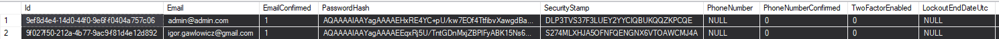

<style>
h1, h4, h2 {
    border-bottom: 0;
    display:flex;
    flex-direction: column;
    align-items: center;
    text-align: center;
}
centerer {
    display: grid;
    grid-template-columns: 6fr 1fr 4fr;
    grid-template-rows: 1fr;
}
rectangle {
    border: 1px solid black;
    margin: 0px 50px 0px 50px;
    width: 200px;
    height: 4em;
    display: flex;
    flex-direction: column;
    align-items: center;
    justify-items: center;
}
Ltext {
    margin: auto auto auto 0;
    font-weight: bold;
    margin-left: 4em;
}
Rtext {
    margin: auto;
}
row {
    display: flex;
    flex-direction: row;
    align-items: center;
    justify-content: center; 
}
</style>

<h1>Uniwersytet Bielsko-Bialski</h1>

&nbsp;

&nbsp;

&nbsp;

&nbsp;

&nbsp;

&nbsp;

&nbsp;

&nbsp;

&nbsp;

<h1 style="text-align: center;"><b>LABORATORIUM</b></h1>
<h1 style="text-align:center"><b>Programowanie dla Internetu w technologii ASP.NET</b></h1>

&nbsp;

&nbsp;

<h2 style="text-align:center; border: none;"><b>Sprawozdanie nr 8</b></h3>
<h2 style="text-align:center; border: none;">Wprowadzenie ról</h2>

&nbsp;

&nbsp;

&nbsp;

&nbsp;

&nbsp;

&nbsp;

&nbsp;

GRUPA: 2B / SEMESTR: 6 / ROK: 3

Igor Gawłowicz / 59096

<div style="page-break-after: always;"></div>

## Wprowadzenie

Celem ćwiczenia było dodanie i zarządzanie rolami w aplikacji ASP.NET Core w celu kontrolowania dostępu do różnych funkcjonalności w aplikacji. Dzięki rolom możliwe jest przypisanie użytkownikom odpowiednich uprawnień, co zwiększa bezpieczeństwo oraz umożliwia łatwiejsze zarządzanie dostępem do zasobów.

## Przebieg ćwiczenia

W poprzednim kroku w naszej bazie danych powinny były się utworzyć tabelę odpowiedzialne za obsługę użytkowników, a także ról. Jeśli z jakiegoś powodu się nie utworzyły, trzeba odnaleźć ich strukturę w dokumentacji lub w inny sposób zmusić program do ich migracji.

Pierwszym krokiem, aby dodać nasze role, było utworzenie inicjalizacji ról. W tym celu musieliśmy zmodyfikować nasz kod dotyczący inicjalizatora bazy danych:

```cs
using TripApp.Models;
using Microsoft.AspNetCore.Authentication;
using System;
using System.Linq;
using TripApp.Data;
using Microsoft.AspNetCore.Identity;

namespace BikeRentalSystemWeb.Data
{
    public class DbInitializer
    {
        public static void AddRoles(TripContext context)
        {
            if (context.Roles.Any())
            {
                return;
            }

            var Roles = new IdentityRole[]
            {
                new IdentityRole { Name = "Admin", NormalizedName = "ADMIN", Id = "1" },
                new IdentityRole { Name = "Employee", NormalizedName = "EMPLOYEE", Id = "2" },
                new IdentityRole { Name = "Client", NormalizedName = "CLIENT", Id = "3" }
            };

            foreach (IdentityRole r in Roles)
            {
                context.Roles.Add(r);
            }
        }

        public static void AddInitialDestinations(TripContext context)
        {
            if (context.Trips.Any())
            {
                return;
            }

            var trips = new Trip[]
            {
                new Trip { Destination = "Egypt", TripDateStart = DateTime.Now.AddDays(7), TripDateEnd = DateTime.Now.AddDays(14), Price = 1000.00m },
                new Trip { Destination = "Japan", TripDateStart = DateTime.Now.AddMonths(2), TripDateEnd = DateTime.Now.AddMonths(2).AddDays(10), Price = 2500.00m },
                new Trip { Destination = "France", TripDateStart = DateTime.Now.AddMonths(4), TripDateEnd = DateTime.Now.AddMonths(4).AddDays(7), Price = 1800.00m },
                new Trip { Destination = "Australia", TripDateStart = DateTime.Now.AddMonths(6), TripDateEnd = DateTime.Now.AddMonths(6).AddDays(21), Price = 3000.00m }
            };

            foreach (Trip t in trips)
            {
                context.Trips.Add(t);
            }
        }

        public static void Initialize(TripContext context)
        {
            AddInitialDestinations(context);
            AddRoles(context);
            context.SaveChanges();
        }
    }
}
```

Po uruchomieniu programu możemy zauważyć, że w bazie danych utworzyły się nasze role:


A także po zarejestrowaniu użytkowników widzimy ich w odpowiedniej tabeli:



Na potrzeby tego zadania nie budowałem interfejsu administratora, a wykorzystałem nasz dostęp do bazy danych, manualnie dodając role do naszego użytkownika:

```sql
INSERT INTO dbo.AspNetUserRoles
VALUES
(
    (SELECT Id FROM dbo.AspNetUsers WHERE Email = 'admin@admin.com'),
    (SELECT Id FROM dbo.AspNetRoles WHERE Name = 'Admin')
);
```

Możemy teraz zauważyć w tabeli `AspNetUserRoles` naszych utworzonych użytkowników wraz z ich rolami:


Skoro mamy już działających użytkowników z podziałem na role, możemy stworzyć ograniczenia na poziomie kontrolerów. Teraz podgląd do danych klientów będą mieli tylko Administrator i Pracownik:

```cs
[Authorize(Roles = "Employee, Admin")]
public class ClientController : Controller
{
    ...
}
```

Następnie dostęp do tworzenia rezerwacji będzie miał dowolny zalogowany użytkownik. W ten sposób będziemy mieli pewność, że użytkownik ma już swoje dane w naszym systemie, więc łatwiej będzie go przypisać do rezerwacji:

```cs
[Authorize]
public class ClientReservationController : Controller
{
    ...
}
```

Do strony głównej powinien mieć dostęp każdy:

```cs
[AllowAnonymous]
public class HomeController : Controller
{
    ...
}
```

Podgląd do istniejących rezerwacji oraz danych wycieczek nie powinien być dostępny dla zwykłych klientów, więc został ograniczony:

```cs
[Authorize(Roles = "Employee, Admin")]
public class ReservationController : Controller
{
    ...
}
```

```cs
[Authorize(Roles = "Employee, Admin")]
public class TripController : Controller
{
    ...
}
```

W przypadku, w którym ktoś nieautoryzowany będzie próbował dostać się na stronę, otrzyma odpowiedni komunikat, czyli informację o braku dostępu lub odnośnik do strony z logowaniem/rejestracją.

## Wnioski

Dodanie ról w aplikacji ASP.NET Core jest kluczowym elementem zarządzania dostępem użytkowników do różnych funkcji systemu. Dzięki rolom możemy precyzyjnie kontrolować, kto ma dostęp do poszczególnych części aplikacji, co znacznie poprawia jej bezpieczeństwo i zarządzalność. W trakcie ćwiczenia nauczyliśmy się, jak inicjalizować role, przypisywać je użytkownikom oraz jak ograniczać dostęp do kontrolerów na podstawie ról. Manualne dodawanie ról do użytkowników poprzez SQL było przydatne w testach, ale w rzeczywistej aplikacji warto zaimplementować bardziej zautomatyzowane podejście do zarządzania rolami.
