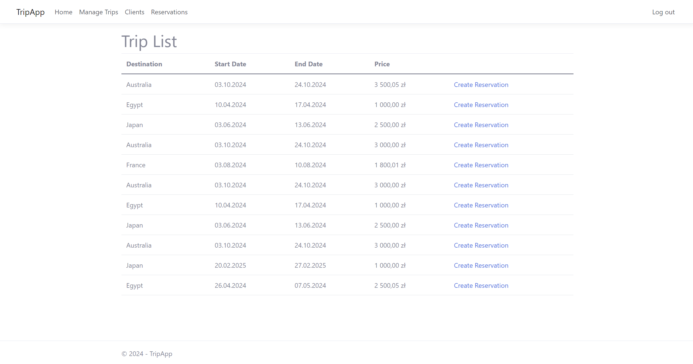
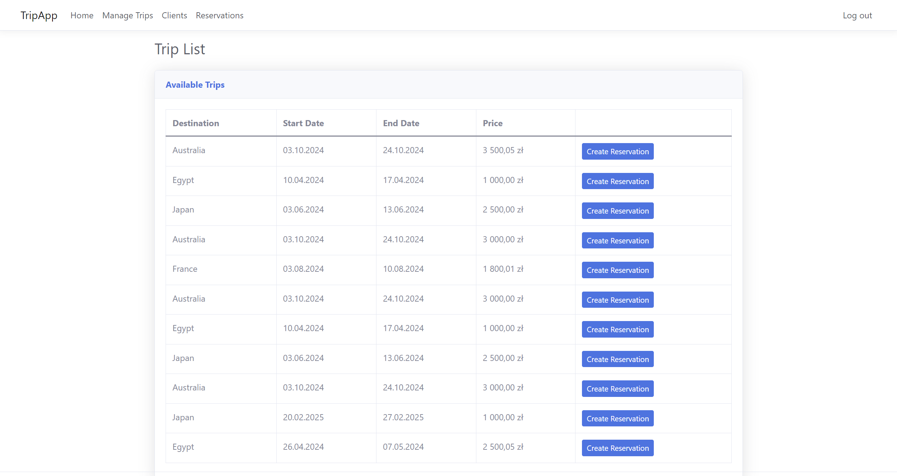
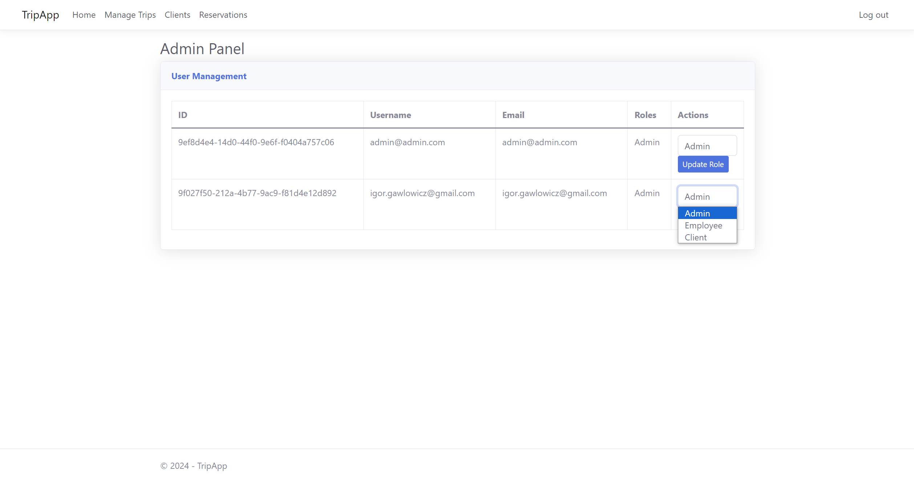

<style>
h1, h4, h2 {
    border-bottom: 0;
    display:flex;
    flex-direction: column;
    align-items: center;
    text-align: center;
}
centerer {
    display: grid;
    grid-template-columns: 6fr 1fr 4fr;
    grid-template-rows: 1fr;
}
rectangle {
    border: 1px solid black;
    margin: 0px 50px 0px 50px;
    width: 200px;
    height: 4em;
    display: flex;
    flex-direction: column;
    align-items: center;
    justify-items: center;
}
Ltext {
    margin: auto auto auto 0;
    font-weight: bold;
    margin-left: 4em;
}
Rtext {
    margin: auto;
}
row {
    display: flex;
    flex-direction: row;
    align-items: center;
    justify-content: center; 
}
</style>

<h1>Uniwersytet Bielsko-Bialski</h1>

&nbsp;

&nbsp;

&nbsp;

&nbsp;

&nbsp;

&nbsp;

&nbsp;

&nbsp;

&nbsp;

<h1 style="text-align: center;"><b>LABORATORIUM</b></h1>
<h1 style="text-align:center"><b>Programowanie dla Internetu w technologii ASP.NET</b></h1>

&nbsp;

&nbsp;

<h2 style="text-align:center; border: none;"><b>Sprawozdanie nr 9</b></h3>
<h2 style="text-align:center; border: none;">Wprowadzenie styli sb-admin-2/Panel administratora</h2>

&nbsp;

&nbsp;

&nbsp;

&nbsp;

&nbsp;

&nbsp;

&nbsp;

GRUPA: 2B / SEMESTR: 6 / ROK: 3

Igor Gawłowicz / 59096

<div style="page-break-after: always;"></div>

### Wprowadzenie

W naszym projekcie postanowiliśmy wzbogacić wygląd i funkcjonalność aplikacji poprzez dodanie pakietu styli SB Admin 2. Ten popularny zestaw stylów oparty na Bootstrapie pozwoli nam stworzyć nowoczesny interfejs użytkownika, a także zaimplementować prosty panel administracyjny dostępny tylko dla użytkowników o roli administratora.

Aby rozpocząć, pobraliśmy pakiet styli SB Admin 2 i umieściliśmy go w naszym projekcie, zazwyczaj w folderze **wwwroot** lub **Areas**. Następnie zaktualizowaliśmy nasz plik layoutu (**\_Layout.cshtml**), dodając odnośniki do plików CSS z pakietu SB Admin 2.

Następnie do wspólnej części naszego programu czyli pliku **\_Layout.cshtml** w repozytorium **Shared** musimy dodać odnośniki do naszych plików

W moim projekcie wygląda to następująco

```html
<link
  href="~/sbadmin/vendor/bootstrap/css/bootstrap.min.css"
  rel="stylesheet"
/>
<link href="~/sbadmin/css/sb-admin-2.min.css" rel="stylesheet" />
<link
  href="~/sbadmin/vendor/fontawesome-free/css/all.min.css"
  rel="stylesheet"
  type="text/css"
/>
```

Po dodaniu tych linijek, wszystkie nasze podstrony będą teraz prioretyzować tagi napisane w podanych plikach css, teraz wystarczy że zaaplikujemy ja na naszej stronie.

Mój projekt przed wykorzystaniem styli sb-admin-2



Po zastosowaniu nowych styli



Dodatkowo wykorzystując tą bibliotekę utworzymy prosty panel administratora dostępny tylko przez użytkownika o takiej właśnie roli

Zaczniemy klasycznie od utworzenia kontrolera

```cs
using Microsoft.AspNetCore.Authorization;
using Microsoft.AspNetCore.Identity;
using Microsoft.AspNetCore.Mvc;
using System.Threading.Tasks;
using TripApp.Services;

namespace TripApp.Controllers
{
    [Authorize(Roles = "Admin")]
    public class AdminController : Controller
    {
        private readonly IAdminService _adminService;

        public AdminController(IAdminService adminService)
        {
            _adminService = adminService;
        }

        public async Task<IActionResult> Index()
        {
            ViewData["Roles"] = await _adminService.GetAllRolesAsync();
            var users = await _adminService.GetAllUsersAsync();
            return View(users);
        }

        [HttpPost]
        public async Task<IActionResult> UpdateUserRole(string userId, string newRole)
        {
            if (string.IsNullOrEmpty(userId) || string.IsNullOrEmpty(newRole))
            {
                return RedirectToAction("Index");
            }

            await _adminService.UpdateUserRoleAsync(userId, newRole);
            return RedirectToAction("Index");
        }
    }
}

```

A także serwisu który go obsłuży

```cs
using Microsoft.AspNetCore.Identity;
using System.Collections.Generic;
using System.Linq;
using System.Threading.Tasks;
using Microsoft.EntityFrameworkCore;

namespace TripApp.Services
{
    public class AdminService : IAdminService
    {
        private readonly UserManager<IdentityUser> _userManager;
        private readonly RoleManager<IdentityRole> _roleManager;

        public AdminService(UserManager<IdentityUser> userManager, RoleManager<IdentityRole> roleManager)
        {
            _userManager = userManager;
            _roleManager = roleManager;
        }

        public async Task<List<IdentityUser>> GetAllUsersAsync()
        {
            return await _userManager.Users.ToListAsync();
        }

        public async Task<List<string>> GetAllRolesAsync()
        {
            return await _roleManager.Roles.Select(r => r.Name).ToListAsync();
        }

        public async Task UpdateUserRoleAsync(string userId, string newRole)
        {
            var user = await _userManager.FindByIdAsync(userId);
            if (user != null)
            {
                var currentRoles = await _userManager.GetRolesAsync(user);
                await _userManager.RemoveFromRolesAsync(user, currentRoles);
                await _userManager.AddToRoleAsync(user, newRole);
            }
        }
    }
}

```

Z racji że korzystamy z tabel wygenerowanych przez AspNetCore nie mamy struktury tych tabel w naszych modelach więc nie stworzymy tutaj repozytoriów, jednak możemy wykorzystać wbudowane w tą bibliotekę klasy **UserManager** i **RoleManager**, które pozwolą nam na zaczytanie oraz modyfikacje odpowiednich danych

Ostatnim już krokiem jest utworzenie pliku **index.cshtml** dla naszego panelu



Widzimy tutaj listę wszystkich użytkowników w bazie a także ich rolę oraz możliwość jej zmiany na jedną z istniejących w bazie.

### Podsumowanie

Dodanie pakietu styli SB Admin 2 do naszej aplikacji było krokiem w kierunku poprawy wyglądu i funkcjonalności. Dzięki nowym stylom nasza aplikacja zyskała nowoczesny interfejs użytkownika, co przyczyniło się do lepszej czytelności i atrakcyjności dla użytkowników.

Dodatkowo, wykorzystując SB Admin 2, udało nam się również stworzyć prosty panel administracyjny, dostępny tylko dla administratorów. Panel ten umożliwia zarządzanie użytkownikami, w tym zmianę ich ról, co może być przydatne w przypadku aplikacji wieloosobowej.

Wprowadzenie tych zmian pozwoliło nam nie tylko poprawić wygląd aplikacji, ale także zwiększyć jej funkcjonalność i użyteczność dla użytkowników.
