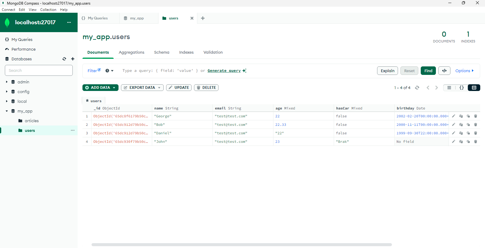

<style>
h1, h4 {
    border-bottom: 0;
    display:flex;
    flex-direction: column;
    align-items: center;
      }
      
centerer{
    display: grid;
    grid-template-columns: 6fr 1fr 4fr;
    grid-template-rows: 1fr;

}
rectangle{
    border: 1px solid black;
    margin: 0px 50px 0px 50px;
    width: 200px;
    height: 4em;
    display: flex;
    flex-direction: column;
    align-items: center;
    justify-items: center;
}
Ltext{
    margin: auto auto auto 0;
    font-weight: bold;
    margin-left: 4em
}
Rtext{
    margin: auto;
}

row {
    display: flex;
    flex-direction: row;
    align-items: center;
    justify-content: center; 
}
 </style>
<h1>LABORATORIUM NIERELACYJNE BAZY DANYCH</h1>

&nbsp;

&nbsp;

<style>

</style>

<centerer>
    <Ltext>Data wykonania ćwiczenia:</Ltext>
    <div align="center">
        <rectangle>
            <Rtext>26.02.2023</Rtext>
        </rectangle>
    </div>
</centerer>

<centerer>
    <Ltext>Rok studiów:</Ltext>
    <div align="center">
        <rectangle>
            <Rtext>3</Rtext>
        </rectangle>
    </div>
</centerer>

<centerer>
    <Ltext>Semestr:</Ltext>
    <div align="center">
        <rectangle>
            <Rtext>6</Rtext>
        </rectangle>
    </div>
</centerer>

<centerer>
    <Ltext>Grupa studencka:</Ltext>
    <div align="center">
        <rectangle>
            <Rtext>2</Rtext>
        </rectangle>
    </div>
</centerer>

<centerer>
    <Ltext>Grupa laboratoryjna:</Ltext>
    <div align="center">
        <rectangle>
            <Rtext>2B</Rtext>
        </rectangle>
    </div>
</centerer>

&nbsp;

&nbsp;

<row>
    <b>Ćwiczenie nr.</b>
    <rectangle>
        <Rtext>1</Rtext>
    </rectangle>
</row>

&nbsp;

&nbsp;

<b>Temat: </b> MongoDB Tworzenie nowej bazy danych, dodawanie danych

&nbsp;

&nbsp;

<b>Osoby wykonujące ćwiczenia: </b>

1. Igor Gawłowicz

&nbsp;

&nbsp;

<h1>Katedra Informatyki i Automatyki</h1>

<div style="page-break-after: always;"></div>

## Instalacja MongoDB

Ze strony `https://www.mongodb.com` pobieramy:

- MongoDB community server
- Mongo Shell

Przechodzimy przez proces instalacji przy bazowych opcjach, przy okazji instaluje nam się także `MongoDB Compass`, które służy jako narzędzie do konfiguracji bazy danych w Mongo w rozwiązaniu no-code. Możemy je wykorzystać do profilaktyki bazy a także do wykonania wszystkich zapytań.

## Tworzenie bazy danych

Bazę możemy zrobić na dwa sposoby

- Ręcznie za pomocą kompasu
- Poprzez wpisanie w konsoli odpowiednich poleceń

Tutaj skupimy się na tym drugim rozwiązaniu.

### Tworzenie bazy danych i kolekcji poprzez MongoDB shell

Uruchamiamy je poprzez command prompta

```shell
C:\szkola\Szkola\SEMESTR6\NBD>mongosh
Current Mongosh Log ID: 65dc8c2e79b50c60d0a30ac7
Connecting to:          mongodb://127.0.0.1:27017/?directConnection=true&serverSelectionTimeoutMS=2000&appName=mongosh+2.1.5
Using MongoDB:          7.0.5
Using Mongosh:          2.1.5

For mongosh info see: https://docs.mongodb.com/mongodb-shell/

------
   The server generated these startup warnings when booting
   2024-02-26T14:01:03.518+01:00: Access control is not enabled for the database. Read and write access to data and configuration is unrestricted
------

test>
```

Następnie używają polecenia `use my_app` wskazujemy konsoli, że chcemy aby nasza baza była nazwana `my_app`, 

```shell
test> use my_app
switched to db my_app
```

następnie możemy dodać kolekcję `users`, co automatycznie doda naszą nową bazę i jej pierwszą kolekcje na server, możemy to podejrzeć za pomocą kompasu.

```shell
my_app> db.createCollection("users")
{ ok: 1 }
```

Dodamy następne potrzebne kolekcje

```shell
my_app> db.createCollection("articles")
{ ok: 1 }
my_app> db.createCollection("apps")
{ ok: 1 }
```

Teraz opuścimy jedną z kolekcji aby zademonstrować funkcjonalność

```shell
my_app> db.apps.drop()
true
```

## Dodawanie danych

Możemy dodawać to tabeli pojedyńcze rekordy za pomocą polecenia `insertOne` 

```shell
my_app> db.users.insertOne(
... {
... "name":"George",
... "email":"test@test.com",
... "age":22,
... "hasCar":false,
... "birthday": new Date('2002-02-20')
... }
... )
{
  acknowledged: true,
  insertedId: ObjectId('65dc8f6179b50c60d0a30ac8')
}
```

lub np.

```shell
my_app> db.users.insertOne(
... {
... "name":"John",
... "email":"test@test.com",
... "age":23,
... "hasCar":"Brak",
... "favColors":["Zielony","Czerwony","Niebieski"]
... }
... )
{
  acknowledged: true,
  insertedId: ObjectId('65dc930f79b50c60d0a30acb')
}
```

Możemy tutaj zauważyć że typy wprowadzonych danych kompletnie nie zgadzają się z poprzednimi co daje nam w Mongo ciekawe wyniki, do czego wrócę później.

albo wielokrotnie za pomocą `insertMany`

```shell
my_app> db.users.insertMany([
... {
... "name":"Bob",
... "email":"test@test.com",
... "age":22.33,
... "hasCar":false,
... "birthday": new Date('2000-11-11')
... },
... {
... "name":"Daniel",
... "email":"test@test.com",
... "age":"22",
... "hasCar":false,
... "birthday": new Date('1999-10-1')
... }
... ]
... )
{
  acknowledged: true,
  insertedIds: {
    '0': ObjectId('65dc912d79b50c60d0a30ac9'),
    '1': ObjectId('65dc912d79b50c60d0a30aca')
  }
}
```

Wpisywanie tego ręcznie jest bardzo nieefektywne, więc zazwyczaj wykonywanie takich operacji wykonuje się właśnie manualnie z poziomu kompasu, albo pisze się kod w jakimś języku programowania, który łączy się z naszą bazą i z poziomu kodu wykonuje zapytania pobierając dane z jakiegoś innego miejsca.

## Wnioski

Po tym wszystkim możemy podejrzeć, że w kompasie wszystkie nasze dane wyświetlają się poprawnie.



Możemy teraz zauważyć że nasza tabela, łączy ze sobą różne typy danych część kolumn nie posiada w ogóle danych a całość jest dość chaotyczna, ale jest to główna cecha, która odróżnia nierelacyjne od relacyjnych baz danych. Dzięki takiemu rozwiązaniu nasze bazy mogą być bardzo elastyczne, przy odpowiednim wykorzystaniu możemy zgromadzić bardzo dużą ilość różnych danych i wyświetlać je w zależności od potrzeb użytkownika.

Nie jest to niestety perfekcyjne rozwiązania i wraz z wieloma zaletami niesie mnóstwo wad jednak w zależności od naszych potrzeb możemy je bardzo dobrze wykorzystać.


