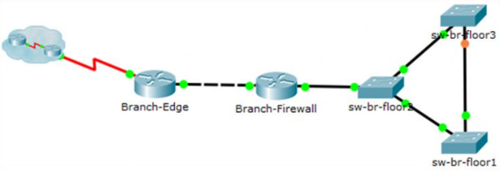
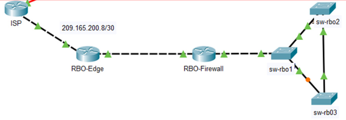

<style>
h1, h4 {
    border-bottom: 0;
    display:flex;
    flex-direction: column;
    align-items: center;
      }
      
centerer{
    display: grid;
    grid-template-columns: 6fr 1fr 4fr;
    grid-template-rows: 1fr;

}
rectangle{
    border: 1px solid black;
    margin: 0px 50px 0px 50px;
    width: 200px;
    height: 4em;
    display: flex;
    flex-direction: column;
    align-items: center;
    justify-items: center;
}
Ltext{
    margin: auto auto auto 0;
    font-weight: bold;
    margin-left: 4em
}
Rtext{
    margin: auto;
}

row {
    display: flex;
    flex-direction: row;
    align-items: center;
    justify-content: center; 
}
 </style>
<h1>LABORATORIUM PROJEKTOWANIE I OBSŁUGA SIECI KOMPUTEROWYCH II</h1>

&nbsp;

&nbsp;

<style>

</style>

<centerer>
    <Ltext>Data wykonania ćwiczenia:</Ltext>
    <div align="center">
        <rectangle>
            <Rtext>27.04.2023</Rtext>
        </rectangle>
    </div>
</centerer>

<centerer>
    <Ltext>Rok studiów:</Ltext>
    <div align="center">
        <rectangle>
            <Rtext>3</Rtext>
        </rectangle>
    </div>
</centerer>

<centerer>
    <Ltext>Semestr:</Ltext>
    <div align="center">
        <rectangle>
            <Rtext>6</Rtext>
        </rectangle>
    </div>
</centerer>

<centerer>
    <Ltext>Grupa studencka:</Ltext>
    <div align="center">
        <rectangle>
            <Rtext>2</Rtext>
        </rectangle>
    </div>
</centerer>

<centerer>
    <Ltext>Grupa laboratoryjna:</Ltext>
    <div align="center">
        <rectangle>
            <Rtext>2B</Rtext>
        </rectangle>
    </div>
</centerer>

&nbsp;

&nbsp;

<row>
    <b>Ćwiczenie nr.</b>
    <rectangle>
        <Rtext>11</Rtext>
    </rectangle>
</row>

&nbsp;

&nbsp;

<b>Temat: </b> Packet Tracer - Użyj CDP do mapowania sieci / Packet Tracer - Użyj LLDP do mapowania sieci

&nbsp;

&nbsp;

<b>Osoby wykonujące ćwiczenia: </b>

1. Igor Gawłowicz

&nbsp;

&nbsp;

<h1>Katedra Informatyki i Automatyki</h1>

<div style="page-break-after: always;"></div>

# Packet Tracer - Użyj CDP do mapowania sieci

Starszy administrator sieci wymaga zmapowania sieci Remote Branch Office i odkrycia nazwy ostatnio zainstalowanego przełącznika, który nadal wymaga skonfigurowania adresu IP. Twoim zadaniem jest stworzenie mapy sieci oddziałów. Należy zarejestrować wszystkie nazwy urządzeń sieciowych, adresy IP i maski podsieci oraz fizyczne interfejsy łączące urządzenia sieciowe, a także nazwę przełącznika, który nie ma adresu IP.

Aby zmapować sieć, użyjesz protokołu SSH do zdalnego dostępu i protokołu Cisco Discovery Protocol (CDP) do wykrywania informacji o sąsiednich urządzeniach sieciowych. Ponieważ protokół CDP jest protokołem warstwy 2, może służyć do odnajdywania informacji o urządzeniach, które nie mają adresów IP. Zarejestrujesz zebrane informacje, aby uzupełnić tabelę adresowania i dostarczyć diagram topologii sieci zdalnych oddziałów.

Lokalne i zdalne administracyjne nazwy użytkowników i hasła to:

Sieć lokalna

    Nazwa użytkownika: admin01

    Hasło: S3cre7P@55

Remote Branch Office Network (Zdalna sieć oddziałów)

    Nazwa użytkownika: branchadmin

    Hasło: S3cre7P@55

Sure, here's the translation along with the commands in nice edited Markdown format:

## Część 1: Użycie SSH do zdalnego dostępu do urządzeń sieciowych

W Części 1, użyj komputera Admin-PC, aby zdalnie uzyskać dostęp do routera bramy Edge1. Następnie, z routera Edge1, użyj SSH, aby połączyć się z Oddziałem Zdalnym.

a. Na komputerze Admin-PC otwórz wiersz poleceń.

b. Zaloguj się przez SSH do routera bramy pod adresem 192.168.1.1, używając nazwy użytkownika admin01 i hasła S3cre7P@55.

```bash
PC> ssh -l admin01 192.168.1.1
Open
Password:

Edge1#
```

Uwaga: Zauważ, że jesteś od razu umieszczony w trybie privileged EXEC. Wynika to z tego, że konto użytkownika admin01 jest ustawione na poziom uprzywilejowania 15.

c. Użyj polecenia `show ip interface brief` i `show interfaces`, aby udokumentować fizyczne interfejsy routera Edge1, adresy IP i maski podsieci w Tabeli Adresacji.

d. Z routera Edge1 użyj SSH, aby uzyskać dostęp do Oddziału Zdalnego pod adresem 209.165.200.10 z nazwą użytkownika branchadmin i tym samym hasłem jak powyżej:

```bash
Edge1# ssh -l branchadmin 209.165.200.10
Open
Password:

Branch-Edge#
```

Po połączeniu się z Oddziałem Zdalnym, jaką wcześniej brakującą informację można teraz dodać do powyższej Tabeli Adresacji?

Nazwa routera Branch-Edge

## Część 2: Użycie CDP do Odkrywania Sąsiednich Urządzeń

Jesteś teraz zdalnie połączony z routerem Branch-Edge. Używając CDP, zacznij szukać połączonych urządzeń sieciowych.

a. Wydaj polecenia `show ip interface brief` i `show interfaces`, aby udokumentować interfejsy sieciowe routera Branch-Edge, adresy IP i maski podsieci. Dodaj brakujące informacje do Tabeli Adresacji, aby zmapować sieć.

```bash
Branch-Edge# show ip interface brief
Branch-Edge# show interfaces
```

b. Bezpieczna praktyka zaleca uruchamianie CDP tylko wtedy, gdy jest to potrzebne, więc CDP może wymagać włączenia. Użyj polecenia `show cdp`, aby wyświetlić jego status.

```bash
Branch-Edge# show cdp
% CDP is not enabled
```

c. Musisz włączyć CDP, ale dobrym pomysłem jest nadawanie informacji o CDP tylko wewnętrznym urządzeniom sieciowym, a nie zewnętrznym sieciom. Aby to zrobić, włącz protokół CDP, a następnie wyłącz CDP na interfejsie S0/0/1.

```bash
Branch-Edge# configure terminal
Branch-Edge(config)# cdp run
Branch-Edge(config)# interface s0/0/1
Branch-Edge(config-if)# no cdp enable
Branch-Edge(config-if)# exit
```

d. Wydaj polecenie `show cdp neighbors`, aby znaleźć sąsiednie urządzenia sieciowe.

Uwaga: CDP pokaże tylko podłączone urządzenia Cisco, które również używają CDP.

```bash
Branch-Edge# show cdp neighbors
```

Czy istnieje sąsiednie urządzenie sieciowe? Jaki jest to rodzaj urządzenia? Jak się nazywa? Do jakiego interfejsu jest podłączone? Czy adres IP urządzenia jest podany? Zapisz te informacje w Tabeli Adresacji.

Uwaga: Może potrwać chwilę, zanim aktualizacje CDP zostaną odebrane. Jeśli nie zobaczysz żadnego wyniku polecenia, kilkakrotnie naciśnij przycisk Fast Forward Time.

Jest to router. Nazywa się Branch-Firewall i jest podłączony do interfejsu G0/0. Adres IP urządzenia nie jest podany.

e. Aby znaleźć adres IP sąsiedniego urządzenia, użyj polecenia `show cdp neighbors detail` i zapisz adres IP:

```bash
Branch-Edge# show cdp neighbors detail
```

Oprócz adresu IP sąsiedniego urządzenia, jakie inne potencjalnie wrażliwe informacje są wymienione?

Wersja oprogramowania IOS sąsiedniego urządzenia. Może to być potencjalna podatność na zagrożenia, jeśli jest znana przez atakującego.

f. Teraz, gdy znasz adres IP sąsiedniego urządzenia, połącz się z nim za pomocą SSH, aby odkryć inne urządzenia, które mogą być jego sąsiadami.

Uwaga: Aby połączyć się za pomocą SSH, użyj tego samego nazwy użytkownika i hasła jak dla Oddziału Zdalnego.

```bash
Branch-Edge# ssh -l branchadmin <adres_ip_urządzenia_sąsiedniego>
Branch-Edge# ssh -l branchadmin 192.168.3.253
```

Po pomyślnym połączeniu się za pomocą SSH, jak wygląda znak zachęty?

```bash
Branch-Firewall#
```

g. Jesteś zdalnie połączony z kolejnym sąsiadem. Użyj polecenia `show cdp neighbors` i `show cdp neighbors detail`, aby odkryć inne podłączone urządzenia sąsiednie.

Jakie rodzaje urządzeń sieciowych sąsiadują z tym urządzeniem? Zapisz nowo odkryte urządzenia w Tabeli Adresacji. Włącz ich nazwę hosta, interfejsy i adresy IP.

Router (Branch-Edge) i przełącznik (sw-br-floor2). Przełą

cznik sw-br-floor2 to nowo odkryte urządzenie znajdujące się pod adresem 192.168.4.132 na interfejsie G0/1.

h. Kontynuuj odkrywanie nowych urządzeń sieciowych za pomocą SSH i polecenia `show CDP`. Ostatecznie dotrzesz do końca sieci i nie będzie więcej urządzeń do odkrycia.

Jaka jest nazwa przełącznika, który nie ma adresu IP w sieci?

sw-br-floor1

i. Narysuj topologię sieci Oddziału Zdalnego, korzystając z informacji, które udało ci się zdobyć za pomocą CDP.



| Device          | Interface | IP Address     | Subnet Mask     | Local Interface and Connected Neighbor |
| --------------- | --------- | -------------- | --------------- | -------------------------------------- |
| Edge1           | G0/0      | 192.168.1.1    | 255.255.255.0   | G0/1 – S1                              |
|                 | S0/0/0    | 209.165.200.5  | 255.255.255.252 | S0/0/0 – ISP                           |
| Branch-Edge     | S0/0/1    | 209.165.200.10 | 255.255.255.252 | S0/0/1 – ISP                           |
|                 | G0/0      | 192.168.3.249  | 255.255.255.248 | G0/0 – Branch-Firewall                 |
| Branch-Firewall | G0/0      | 192.168.3.253  | 255.255.255.248 | G0/0 – Branch-Edge                     |
|                 | G0/1      | 192.168.4.129  | 255.255.255.128 | G0/1 – sw-br-floor2                    |
| sw-br-floor1    | G0/1      |                |                 | G0/1 – sw-br-floor3                    |
|                 | G0/2      |                |                 | G0/2 – sw-br-floor2                    |
| sw-br-floor2    | G0/1      |                |                 | G0/1 – Branch-Firewall                 |
|                 | G0/2      |                |                 | G0/2 – sw-br-floor1                    |
|                 | F0/24     |                |                 | F0/24 – sw-br-floor3                   |
|                 | SVI       | 192.168.4.132  | 255.255.255.128 |                                        |
| sw-br-floor3    | F0/24     |                |                 | F0/24 – sw-br-floor2                   |
|                 | G0/1      |                |                 | G0/1 – sw-br-floor1                    |
|                 | SVI       | 192.168.4.133  | 255.255.255.128 |                                        |

# Packet Tracer - Użyj LLDP do mapowania sieci

Starszy administrator sieci wymaga zmapowania sieci zdalnego oddziału i odnalezienia informacji o wszystkich urządzeniach w sieci. Należy zarejestrować wszystkie nazwy urządzeń sieciowych, adresy IP i maski podsieci oraz fizyczne interfejsy łączące urządzenia sieciowe.

Aby zmapować sieć, użyjesz protokołu SSH do zdalnego dostępu i protokołu Link Layer Discovery Protocol (LLDP) do wykrywania informacji o sąsiednich urządzeniach sieciowych. Ponieważ LLDP jest protokołem warstwy 2, można go używać do wykrywania informacji o urządzeniach, które nie mają łączności w warstwie 3. Zarejestrujesz informacje, które zgromadzisz w celu uzupełnienia tabeli adresowania i dostarczenia diagramu topologii sieci zdalnych oddziałów.

Będziesz potrzebować adresu IP zdalnego oddziału, czyli 209.165.200.10. Lokalne i zdalne administracyjne nazwy użytkowników i hasła to:

Sieć lokalna

    Nazwa użytkownika: admin01

    Hasło: S3cre7P@55

Remote Branch Office Network (Zdalna sieć oddziałów)

    Nazwa użytkownika: RBOadmin

    Hasło: S3cre7P@55

# Część 1: Użycie SSH do zdalnego dostępu do urządzeń sieciowych

W Części 1, użyjesz komputera Admin-PC, aby zdalnie uzyskać dostęp do routera bramy Edge. Następnie, z routera Edge użyjesz SSH, aby połączyć się z Oddziałem Zdalnym RBO.

a. Na komputerze Admin-PC otwórz wiersz poleceń.

b. Zaloguj się przez SSH do routera bramy pod adresem 192.168.1.1, używając nazwy użytkownika admin01 i hasła S3cre7P@55.

```bash
PC> ssh -l admin01 192.168.1.1
Open
Password:

Edge#
```

Uwaga: Zauważ, że jesteś od razu umieszczony w trybie privileged EXEC. Wynika to z tego, że konto użytkownika admin01 jest ustawione na poziom uprzywilejowania 15.

c. Router Edge wcześniej został skonfigurowany do korzystania z CDP. Przełącznik S1 został już skonfigurowany do korzystania z LLDP. Wydaj polecenie `show cdp`, aby zweryfikować, czy CDP jest obecnie aktywne. Wyłącz CDP, wydając następujące polecenie:

```bash
Edge(config)# no cdp run
```

d. LLDP może być skonfigurowany zarówno do nadawania, jak i odbierania na konkretnym interfejsie. Skonfiguruj Edge tak, aby otrzymywał komunikaty LLDP od S1, ale nie wysyłał komunikatów do S1 ze względów bezpieczeństwa. Włącz LLDP.

```bash
Edge(config)# lldp run
Edge(config)# int g0/0
Edge(config-if)# no lldp transmit
Edge(config-if)# exit
```

e. Użyj polecenia `show lldp neighbors`, aby zweryfikować, czy Edge odbiera komunikaty od S1.

f. Połącz się z S1 za pomocą SSH z routera Edge, korzystając z danych uwierzytelniających admin01. Wydaj polecenie `show lldp neighbors`. Zauważ, że S1 nie otrzymał informacji od Edge.

```bash
Edge# ssh -l admin01 192.168.1.2
Password:

S1> show lldp neighbors
S1> exit
```

g. Zakończ połączenie z S1, aby powrócić do wiersza polecenia routera Edge. Użyj polecenia `show ip interface brief` i `show interfaces`, aby udokumentować fizyczne interfejsy routera Edge, adresy IP i maski podsieci w Tabeli Adresacji.

```bash
Edge# show ip interface brief
Edge# show interfaces
```

h. Z sesji z routerem Edge, połącz się przez SSH z Oddziałem Zdalnym RBO pod adresem 209.165.200.10 z nazwą użytkownika RBOadmin i tym samym hasłem, które zostało użyte dla admin01.

```bash
Edge# ssh -l RBOadmin 209.165.200.10
Password:

RBO-Edge#
```

Po połączeniu się z Oddziałem Zdalnym RBO pod adresem 209.165.200.10, jaką wcześniej brakującą informację można teraz dodać do Tabeli Adresacji powyżej?

Nazwa routera RBO-Edge

# Część 2: Użycie LLDP do Odkrywania Sąsiednich Urządzeń

Jesteś teraz zdalnie połączony z routerem RBO-Edge. Używając LLDP, zacznij szukać połączonych urządzeń sieciowych.

a. Wydaj polecenia `show ip interface brief` i `show interfaces`, aby udokumentować interfejsy sieciowe routera RBO-Edge, adresy IP i maski podsieci. Dodaj brakujące informacje do Tabeli Adresacji.

b. Bezpieczna praktyka zaleca uruchamianie LLDP tylko wtedy, gdy jest to potrzebne, więc LLDP może wymagać włączenia. Użyj polecenia `show lldp`, aby sprawdzić jego status.

```bash
RBO-Edge# show lldp
% LLDP is not enabled
```

c. Musisz włączyć LLDP, ale dobrym pomysłem jest wysyłanie informacji LLDP tylko do wewnętrznych urządzeń sieciowych, a nie do zewnętrznych sieci. Odkryj, który interfejs jest podłączony do Internetu, wydając polecenie `show ip interface brief`. Włącz protokół LLDP i całkowicie wyłącz LLDP na interfejsie, który jest podłączony do Internetu.

```bash
RBO-Edge# configure terminal
RBO-Edge(config)# lldp run
RBO-Edge(config)# interface g0/0
RBO-Edge(config-if)# no lldp transmit
RBO-Edge(config-if)# no lldp receive
RBO-Edge(config-if)# exit
```

d. Wydaj polecenie `show lldp neighbors`, aby znaleźć jakiekolwiek sąsiednie urządzenia sieciowe.

Uwaga: LLDP pokaże tylko połączone urządzenia, które również korzystają z LLDP.

```bash
RBO-Edge# show lldp neighbors
```

Czy istnieje sąsiednie urządzenie sieciowe? Jaki jest to rodzaj urządzenia? Jak się nazywa? Do jakiego interfejsu jest podłączone? Czy adres IP urządzenia jest wymieniony? Zapisz te informacje w Tabeli Adresacji.

e. Użyj polecenia `show ip route`, aby określić adres urządzenia, które znalazłeś za pomocą polecenia `show lldp neighbors`. Na podstawie informacji dostarczonych o lokalnym adresie w tabeli routingu i długości prefiksu sieci użyj tych informacji do określenia adresu sąsiada.

f. Aby znaleźć dodatkowe informacje o sąsiednim urządzeniu, użyj polecenia `show lldp neighbors detail`:

```bash
RBO-Edge# show lldp neighbors detail
```

Jakie inne potencjalnie wrażliwe informacje są wymienione?

Wersja oprogramowania IOS sąsiedniego urządzenia.

g. Połącz się ze sąsiadującym urządzeniem za pomocą SSH, aby odkryć inne urządzenia, które mogą być jego sąsiadami.

Uwaga: Aby połączyć się za pomocą SSH, użyj tych samych danych uwierzytelniających, które zostały użyte dla Oddziału Zdalnego RBO.

```bash
RBO-Edge# ssh -l RBOadmin <adres IP urządzenia sąsiada>
RBO-Edge# ssh -l RBOadmin 192.168.3.250
```

Po pomyślnym połączeniu się za pomocą SSH, co pokazuje wiersz poleceń?

RBO-Firewall#

h. Jesteś zdalnie połączony z następnym sąsiadem. Użyj polecenia `show lldp neighbors` oraz `show lldp neighbors detail`, aby odkryć inne połączone urządzenia sąsiednie.

Jakie rodzaje urządzeń sieciowych sąsiedzą z tym urządzeniem? Zapisz wszystkie nowo odkryte urządzenia w Tabeli Adresacji. Włącz ich nazwy, interfejsy i adresy IP.

Router (RBO-Edge) i przełącznik (sw-rbo1). Przełącznik sw-rbo1 to nowo odkryte urządzenie pod adresem 192.168.4.131 na interfejsie G0/1.

i. Połącz się ze SVI pod adresem 192.168.4.131 za pomocą SSH i danych uwierzytelniających używanych wcześniej. Jeśli zostaniesz poproszony o hasło enable secret, użyj tego samego hasła, które zostało użyte dla RBOAdmin. Użyj polecenia `show lldp neighbors` oraz `show lldp neighbors detail`, aby odkryć inne połączone urządzenia sąsiednie.

Jakie rodzaje urządzeń sieciowych sąsiedzą z tym urządzeniem? Zapisz wszystkie nowo odkryte urządzenia w Tabeli Adresacji. Włącz ich nazwy, interfejsy i adresy IP.

Router (RBO-Firewall), przełącznik (sw-rbo2). Przełącznik sw-rbo2 to nowo odkryte urządzenie na interfejsie G0/2.

Dodaj nazwę nowo odkrytego urządzenia obok wpisu SVI dla adresu 192.168.4.132.

j. Połącz się ze SVI pod adresem 192.168.4.133 za pomocą SSH i danych uwierzytelniających używanych wcześniej. Jeśli zostaniesz poproszony o hasło enable secret, użyj tego samego hasła, które zostało użyte dla RBOAdmin. Wydaj polecenie `show lldp`, powinieneś otrzymać komunikat:

% LLDP is not enabled

Włącz LLDP globalnie zgodnie z krokiem C. Nie ma potrzeby konfigurowania opcji transmitowania ani odbierania, ponieważ są one domyślnie włączone. Użyj polecenia `show lldp neighbors` oraz `show lldp neighbors detail`, aby odkryć inne połączone urządzenia sąsiednie.

Jakie rodzaje urządzeń sieciowych sąsiedzą z tym urządzeniem? Zapisz wszystkie nowo odkryte urządzenia w Tabeli Adresacji. Włącz ich nazwy, interfejsy i adresy IP. Może być korzystne ponowne połączenie z wcześniej odkrytymi urządzeniami, aby wyświetlić sąsiadów jeszcze raz i uzupełnić całą tabelę adresów teraz, gdy wszystkie urządzenia są skonfigurowane dla LLDP.

Przełącznik (sw-rbo1), który jest podłączony do Fa0/24, przełącznik (sw-rbo2), który jest podłączony do G0/1.

k. Narysuj topologię sieci Oddziału Zdalnego RBO, korzystając z informacji, które udało ci się zgromadzić za pomocą LLDP.



| Device       | Interface | IP Address     | Subnet Mask     | Local Interface and Connected Neighbor |
| ------------ | --------- | -------------- | --------------- | -------------------------------------- |
| Edge         | G0/0      | 192.168.1.1    | 255.255.255.0   | G0/1 – S1                              |
|              | S0/0/0    | 209.165.200.5  | 255.255.255.252 | S0/0/0 – ISP                           |
| S1           | SVI       | 192.168.1.2    | 255.255.255.0   |                                        |
| RBO-Edge     | G0/0      | 209.165.200.10 | 255.255.255.252 | G0/0 – ISP                             |
|              | G0/1      | 192.168.3.249  | 255.255.255.252 | G0/0 – RBO-Firewall                    |
| RBO-Firewall | G0/0      | 192.168.3.250  | 255.255.255.252 | G0/0 – RBO-Edge                        |
|              | G0/1      | 192.168.4.129  | 255.255.255.128 | G0/1 – sw-rbo1                         |
| sw-rbo1      | SVI       | 192.168.4.131  | 255.255.255.128 | blank                                  |
|              | G0/1      | N/A            | N/A             | G0/1 – RBO-Firewall                    |
|              | G0/2      | N/A            | N/A             | G0/2 – sw-rbo2                         |
|              | F0/24     | N/A            | N/A             | F0/24 – sw-rbo3                        |
| sw-rbo2      | SVI       | 192.168.4.132  | 255.255.255.128 |                                        |
|              | G0/1      | N/A            | N/A             | G0/1 – sw-rbo3                         |
|              | G0/2      | N/A            | N/A             | G0/2 – sw-rbo1                         |
| sw-rbo3      | SVI       | 192.168.4.133  | 255.255.255.128 | LLDP not active                        |
|              | F0/24     | N/A            | N/A             | F0/24 – sw-rbo1                        |
|              | G0/1      | N/A            | N/A             | G0/1 – sw-rbo2                         |
