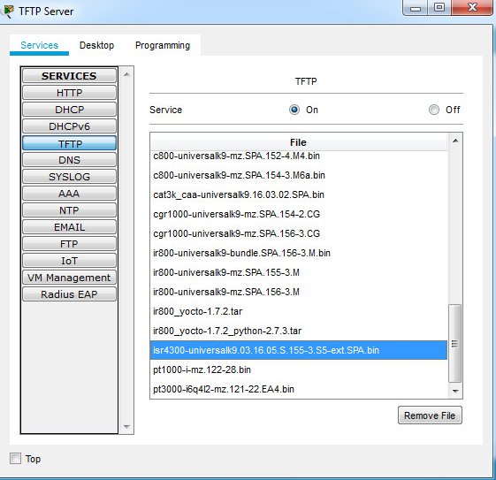

<style>
h1, h4 {
    border-bottom: 0;
    display:flex;
    flex-direction: column;
    align-items: center;
      }
      
centerer{
    display: grid;
    grid-template-columns: 6fr 1fr 4fr;
    grid-template-rows: 1fr;

}
rectangle{
    border: 1px solid black;
    margin: 0px 50px 0px 50px;
    width: 200px;
    height: 4em;
    display: flex;
    flex-direction: column;
    align-items: center;
    justify-items: center;
}
Ltext{
    margin: auto auto auto 0;
    font-weight: bold;
    margin-left: 4em
}
Rtext{
    margin: auto;
}

row {
    display: flex;
    flex-direction: row;
    align-items: center;
    justify-content: center; 
}
 </style>
<h1>LABORATORIUM PROJEKTOWANIE I OBSŁUGA SIECI KOMPUTEROWYCH II</h1>

&nbsp;

&nbsp;

<style>

</style>

<centerer>
    <Ltext>Data wykonania ćwiczenia:</Ltext>
    <div align="center">
        <rectangle>
            <Rtext>27.04.2023</Rtext>
        </rectangle>
    </div>
</centerer>

<centerer>
    <Ltext>Rok studiów:</Ltext>
    <div align="center">
        <rectangle>
            <Rtext>3</Rtext>
        </rectangle>
    </div>
</centerer>

<centerer>
    <Ltext>Semestr:</Ltext>
    <div align="center">
        <rectangle>
            <Rtext>6</Rtext>
        </rectangle>
    </div>
</centerer>

<centerer>
    <Ltext>Grupa studencka:</Ltext>
    <div align="center">
        <rectangle>
            <Rtext>2</Rtext>
        </rectangle>
    </div>
</centerer>

<centerer>
    <Ltext>Grupa laboratoryjna:</Ltext>
    <div align="center">
        <rectangle>
            <Rtext>2B</Rtext>
        </rectangle>
    </div>
</centerer>

&nbsp;

&nbsp;

<row>
    <b>Ćwiczenie nr.</b>
    <rectangle>
        <Rtext>12</Rtext>
    </rectangle>
</row>

&nbsp;

&nbsp;

<b>Temat: </b> Packet Tracer - Tworzenie kopii zapasowych plików konfiguracyjnych / Packet Tracer - Użyj serwera TFTP do aktualizacji obrazu Cisco IOS

&nbsp;

&nbsp;

<b>Osoby wykonujące ćwiczenia: </b>

1. Igor Gawłowicz

&nbsp;

&nbsp;

<h1>Katedra Informatyki i Automatyki</h1>

<div style="page-break-after: always;"></div>

# Packet Tracer - Tworzenie kopii zapasowych plików konfiguracyjnych

W ramach tego działania przywrócisz konfigurację z kopii zapasowej, a następnie wykonasz nową kopię zapasową. Z powodu awarii sprzętu, nowy router został wstawiony w miejsce zepsutego. Na szczęście zapasowe pliki konfiguracyjne zostały zapisane na serwerze Trivial File Transfer Protocol (TFTP). Musisz przywrócić pliki z serwera TFTP, aby jak najszybciej przywrócić router do trybu online.

## Część 1: Ustanowienie połączenia z serwerem TFTP

Uwaga: Ponieważ jest to nowy router, początkowa konfiguracja zostanie przeprowadzona za pomocą połączenia konsolowego z routerem.

a. Kliknij PCA, następnie zakładkę Pulpit, a następnie Terminal, aby uzyskać dostęp do wiersza poleceń RTA.

b. Skonfiguruj i aktywuj interfejs Gigabit Ethernet 0/0. Adres IP powinien odpowiadać domyślnej bramie dla serwera TFTP.

```bash
Router(config)# interface g0/0
Router(config-if)# ip address 172.16.1.1 255.255.255.0
Router(config-if)# no shut
```

c. Przetestuj połączenie z serwerem TFTP. W razie potrzeby przeprowadź troubleshootingu.

# Część 2: Przesyłanie pliku konfiguracyjnego z serwera TFTP

a. Z poziomu uprzywilejowanego trybu EXEC, wydaj następujące polecenie:

```bash
Router# copy tftp running-config
Address or name of remote host []? 172.16.1.2
Source filename []? RTA-confg
Destination filename [running-config]?
```

Router powinien zwrócić:

```bash
Accessing tftp://172.16.1.2/RTA-confg...
Loading RTA-confg from 172.16.1.2: !
[OK - 785 bytes]
785 bytes copied in 0.001 secs
RTA#
%SYS-5-CONFIG_I: Configured from console by console
RTA#
```

b. Wydaj polecenie wyświetlające aktualną konfigurację.

Jakie zmiany zostały dokonane?

Konfiguracja przechowywana na serwerze TFTP została załadowana do routera, a nazwa hosta routera została zmieniona na RTA.

c. Wydaj odpowiednie polecenie show, aby wyświetlić status interfejsu.

Czy wszystkie interfejsy są aktywne?
Nie, G0/1 jest wyłączony administracyjnie.

d. Rozwiąż wszelkie problemy związane z problemami interfejsu i przetestuj łączność między PCA a serwerem TFTP.

```bash
RTA(config)#interface gigabitEthernet 0/1
RTA(config-if)#no shutdown
```

# Część 3: Tworzenie kopii zapasowej konfiguracji i IOS na serwerze TFTP

a. Zmień nazwę hosta RTA na RTA-1.

```bash
RTA(config)#hostname RTA-1
```

b. Zapisz konfigurację w NVRAM.

```bash
RTA-1#copy running-config startup-config
Destination filename [startup-config]?
```

c. Skopiuj konfigurację na serwer TFTP za pomocą polecenia copy:

```bash
RTA-1# copy running-config tftp:
Address or name of remote host []? 172.16.1.2
Destination filename [RTA-1-confg]?
```

d. Wydaj polecenie wyświetlenia plików w flash.

```bash
RTA-1#show flash:
```

e. Wykonaj kopię IOS z flash na serwer TFTP za pomocą poniższego polecenia:

```bash
RTA-1# copy flash tftp:
Source filename []? c1900-universalk9-mz.SPA.151-4.M4.bin
Address or name of remote host []? 172.16.1.2
Destination filename [c1900-universalk9-mz.SPA.151-4.M4.bin]?
```

Jaki specjalny znak powtarza się, co wskazuje na to, że plik IOS jest pomyślnie kopiowany na serwer TFTP?

Wykrzyknik !.

f. Otwórz serwer TFTP, przejdź do zakładki Usługi, wybierz TFTP i przewiń listę plików IOS.

Czy plik IOS c1900-universalk9-mz.SPA.151-4.M4.bin został skopiowany na serwer TFTP?

Tak, plik c1900-universalk9-mz.SPA.151-4.M4.bin jest wymieniony w plikach na serwerze TFP.

# Packet Tracer - Użyj serwera TFTP do aktualizacji obrazu Cisco IOS

Serwer TFTP może wspomóc zarządzanie przechowywaniem obrazów IOS oraz ich uaktualnianiem. Dobrą praktyką dla każdej sieci jest zachowywanie kopii zapasowej obrazu oprogramowania Cisco IOS na sytuacje, gdy obraz systemu na routerze zostanie uszkodzony lub przypadkowo usunięty. Serwer TFTP może być także używany do przechowywania nowych uaktualnień oprogramowania IOS i rozmieszczania ich w całej sieci, gdzie są one potrzebne. W tym ćwiczeniu zaktualizujesz obrazy IOS na urządzeniach firmy Cisco za pomocą serwera TFTP. Utworzysz także kopię zapasową obrazu IOS przy użyciu serwera TFTP.

# Część 1: Aktualizacja obrazu IOS na urządzeniu Cisco

Krok 1: Aktualizacja obrazu IOS na routerze.

a. Wejdź do serwera TFTP i włącz usługę TFTP.

Przejdź do TFTP Server -> zakładka Usługi -> TFTP -> zaznacz On

b. Zanotuj pliki obrazów IOS dostępne na serwerze TFTP.

Które obrazy IOS przechowywane na serwerze są kompatybilne z routerem 1941?

c1900-universalk9-mz.SPA.151-4.M4.bin i c1900-universalk9-mz.SPA.155-3.M4a.bin

c. Z R2 wydaj polecenie show flash: i zapisz dostępną pamięć flash.
221896413

```bash
R2#show flash:
```

d. Skopiuj obraz IOS CISCO1941/K9 w wersji 15.5 dla routera 1941 z serwera TFTP do R2.

```bash
R2# copy tftp: flash:
Address or name of remote host []? 192.168.2.254
Source filename []? c1900-universalk9-mz.SPA.155-3.M4a.bin
Destination filename [c1900-universalk9-mz.SPA.155-3.M4a.bin]?
```

e. Zweryfikuj, czy obraz IOS został skopiowany do pamięci flash.

Ile obrazów IOS znajduje się w pamięci flash?

2

```bash
R2#show flash:
```

f. Użyj polecenia boot system, aby załadować obraz wersji 15.5 IPBase podczas następnego ponownego uruchomienia.

```bash
R2(config)# boot system flash c1900-universalk9-mz.SPA.155-3.M4a.bin
```

g. Zapisz konfigurację i zrestartuj R2.

```bash
R2#copy running-config startup-config
R2#reload
```

h. Użyj polecenia show version, aby zweryfikować, czy zaktualizowany obraz IOS jest ładowany po ponownym uruchomieniu R2.

```bash
R2# show version
```

Krok 2: Aktualizacja obrazu IOS na przełączniku.

a. Wejdź na serwer TFTP i skopiuj obraz c2960-lanbasek9-mz.150-2.SE4.bin na S1.

```bash
S1#copy tftp: flash:
Address or name of remote host []? 192.168.2.254
Source filename []? c2960-lanbasek9-mz.150-2.SE4.bin
Destination filename [c2960-lanbasek9-mz.150-2.SE4.bin]?
```

b. Użyj polecenia boot system, aby skonfigurować przełącznik do ładowania nowego obrazu IOS podczas uruchamiania.

```bash
S1(config)#boot system flash0:c2960-lanbasek9-mz.150-2.SE4.bin
```

c. Zrestartuj S1 i zweryfikuj, czy nowy obraz został załadowany do pamięci.

```bash
S1#copy running-config startup-config
S1#reload
```

d. Zamknij okno konfiguracji TFTP, jeśli jest wciąż otwarte.

# Część 2: Tworzenie kopii zapasowej obrazu IOS na serwerze TFTP

a. Na R1 wyświetl zawartość flash i zanotuj obraz IOS.

isr4300-universalk9.03.16.05.S.155-3.S5-ext.SPA.bin

```bash
R1#show flash:
```

b. Użyj polecenia copy, aby zrobić kopię obrazu IOS w pamięci flash na R1 na serwerze TFTP.

```bash
R1# copy flash: tftp:
Source filename []? isr4300-universalk9.03.16.05.S.155-3.S5-ext.SPA.bin
Address or name of remote host []? 192.168.2.254
Destination filename [isr4300-universalk9.03.16.05.S.155-3.S5-ext.SPA.bin]?
```

c. Wejdź na serwer TFTP i zweryfikuj, czy obraz IOS został skopiowany na serwer TFTP.



Uwaga: Może być konieczne uruchomienie i zatrzymanie usługi TFTP na serwerze, aby plik pojawił się na liście plików.
