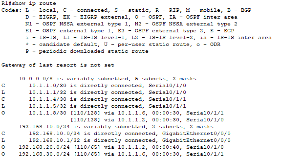
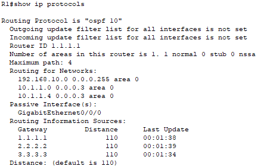

<style>
h1, h4 {
    border-bottom: 0;
    display:flex;
    flex-direction: column;
    align-items: center;
      }
      
centerer{
    display: grid;
    grid-template-columns: 6fr 1fr 4fr;
    grid-template-rows: 1fr;

}
rectangle{
    border: 1px solid black;
    margin: 0px 50px 0px 50px;
    width: 200px;
    height: 4em;
    display: flex;
    flex-direction: column;
    align-items: center;
    justify-items: center;
}
Ltext{
    margin: auto auto auto 0;
    font-weight: bold;
    margin-left: 4em
}
Rtext{
    margin: auto;
}

row {
    display: flex;
    flex-direction: row;
    align-items: center;
    justify-content: center; 
}
 </style>
<h1>LABORATORIUM PROJEKTOWANIE I OBSŁUGA SIECI KOMPUTEROWYCH II</h1>

&nbsp;

&nbsp;

<style>

</style>

<centerer>
    <Ltext>Data wykonania ćwiczenia:</Ltext>
    <div align="center">
        <rectangle>
            <Rtext>29.02.2023</Rtext>
        </rectangle>
    </div>
</centerer>

<centerer>
    <Ltext>Rok studiów:</Ltext>
    <div align="center">
        <rectangle>
            <Rtext>3</Rtext>
        </rectangle>
    </div>
</centerer>

<centerer>
    <Ltext>Semestr:</Ltext>
    <div align="center">
        <rectangle>
            <Rtext>6</Rtext>
        </rectangle>
    </div>
</centerer>

<centerer>
    <Ltext>Grupa studencka:</Ltext>
    <div align="center">
        <rectangle>
            <Rtext>2</Rtext>
        </rectangle>
    </div>
</centerer>

<centerer>
    <Ltext>Grupa laboratoryjna:</Ltext>
    <div align="center">
        <rectangle>
            <Rtext>2B</Rtext>
        </rectangle>
    </div>
</centerer>

&nbsp;

&nbsp;

<row>
    <b>Ćwiczenie nr.</b>
    <rectangle>
        <Rtext>2</Rtext>
    </rectangle>
</row>

&nbsp;

&nbsp;

<b>Temat: </b> Packet Tracer - Konfiguracja OSPFv2 punkt-punkt

&nbsp;

&nbsp;

<b>Osoby wykonujące ćwiczenia: </b>

1. Igor Gawłowicz

&nbsp;

&nbsp;

<h1>Katedra Informatyki i Automatyki</h1>

<div style="page-break-after: always;"></div>

# Packet Tracer - Konfiguracja OSPFv2 punkt-


## Część 1: Konfigurowanie identyfikatorów routera.

*Uruchom proces routingu OSPF na wszystkich trzech routerach. Jako ID procesu użyj wartości 10.*

*Użyj polecenia router-id, aby ustawić identyfikatory OSPF trzech routerów w następujący sposób*

```bash
R1(config)# router ospf 10
R1(config-router)# router-id 1.1.1.1

R2(config)# router ospf 10
R2(config-router)# router-id 2.2.2.2

R3(config)# router ospf 10
R3(config-router)# router-id 3.3.3.3
```

## Część 2: Konfigurowanie sieci dla routingu OSPF.

### Krok 1: Skonfiguruj sieci dla routingu OSPF za pomocą poleceń network i masek blankietowych.

Ile instrukcji jest wymaganych do skonfigurowania protokołu OSPF do routowania wszystkich sieci podłączonych do routera R1?

`3`

Sieć LAN podłączona do routera R1 ma maskę /24. Jaki jest odpowiednik tej maski w reprezentacji dziesiętnej?

`255.255.255.0`

Odejmij dziesiętną maskę podsieci od 255.255.255.255. Jaki jest wynik?

`0.0.0.255`

Jaki jest dziesiętny odpowiednik maski podsieci /30?

`255.255.255.252`

Odejmij dziesiętną reprezentację maski /30 od 255.255.255.255. Jaki jest wynik?

`0.0.0.3`

*Skonfiguruj proces routingu na R1 za pomocą instrukcji network i masek blankietowych, które są wymagane do aktywowania routingu OSPF dla wszystkich podłączonych sieci. Wartości w instrukcji network powinny być adresami sieci lub podsieci skonfigurowanych sieci.*

```bash
R1(config-router)# network 192.168.10.0 0.0.0.255 area 0
R1(config-router)# network 10.1.1.0 0.0.0.3 area 0
R1(config-router)# network 10.1.1.4 0.0.0.3 area 0
```

### Krok 2: Skonfiguruj sieci dla routingu OSPF przy użyciu adresów IP interfejsu i masek z samymi zerami.

*Na routerze R2 skonfiguruj protokół OSPF za pomocą poleceń network z adresami IP interfejsów i maskami z samymi zerami. Składnia polecenia network jest taka sama, jak została użyta powyżej.*

```bash
R2(config-router)# network 192.168.20.1 0.0.0.0 area 0
R2(config-router)# network 10.1.1.2 0.0.0.0 area 0
R2(config-router)# network 10.1.1.9 0.0.0.0 area 0
```

### Krok 3: Konfigurowanie routingu OSPF na interfejsach routera

*Na routerze R3 skonfiguruj wymagane interfejsy z protokołem OSPF.*

Które interfejsy R3 powinny być skonfigurowane z protokołem OSPF?

`G0/0/0, S0/1/0, S0/1/1`

Skonfiguruj każdy interfejs za pomocą składni polecenia przedstawionej poniżej:

`Router(config-if)# ip ospf process-id area area-id`

```bash
R3(config)# interface GigabitEthernet0/0/0
R3(config-if)# ip ospf 10 area 0
R3(config-if)# interface Serial0/1/0
R3(config-if)# ip ospf 10 area 0
R3(config-if)# interface Serial0/1/1
R3(config-if)# ip ospf 10 area 0
```

## Część 3: Konfiguracja interfejsów pasywnych.

*Protokół OSPF wyśle swój ruch protokołu wszystkimi interfejsami uczestniczących w procesie OSPF. W przypadku łączy, które nie są skonfigurowane do innych sieci, takich jak sieci LAN, ten niepotrzebny ruch zużywa zasoby. Polecenie passive-interface uniemożliwia wysyłanie przez proces OSPF niepotrzebnego ruchu protokołu routingu poza interfejsy LAN.*

Które interfejsy R1, R2 i R3 są interfejsami LAN?

`G0/0/0 na każdym routerze`

Skonfiguruj proces OSPF na każdym z trzech routerów za pomocą polecenia passive-interface .

`Router(config-router)# passive-interface interface`

```bash
R1(config)# router ospf 10
R1(config-router)# passive-interface GigabitEthernet0/0/0

R2(config)# router ospf 10
R2(config-router)# passive-interface GigabitEthernet0/0/0

R3(config)# router ospf 10
R3(config-router)# passive-interface GigabitEthernet0/0/0
```

## Część 4: Weryfikacja konfiguracji OSPF

Za pomocą polecenia show możemy zweryfikować poprawnośc naszej konfiguracji.



