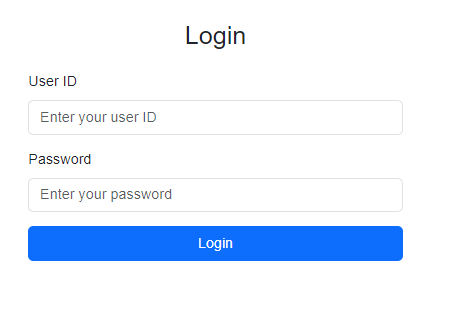
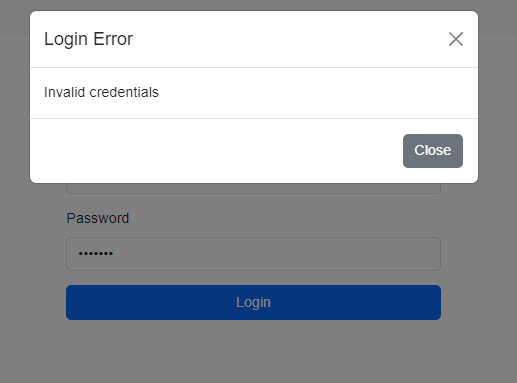
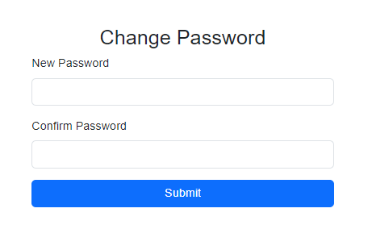
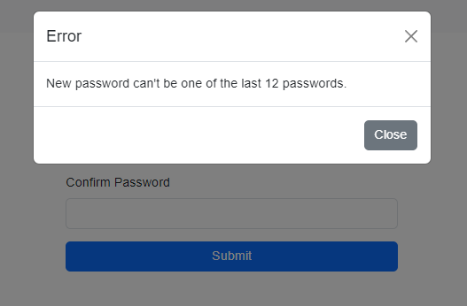
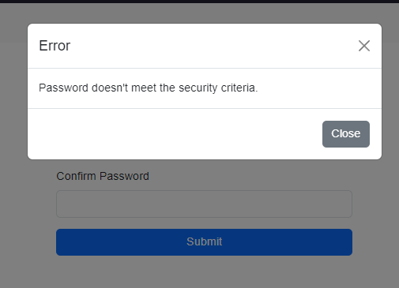
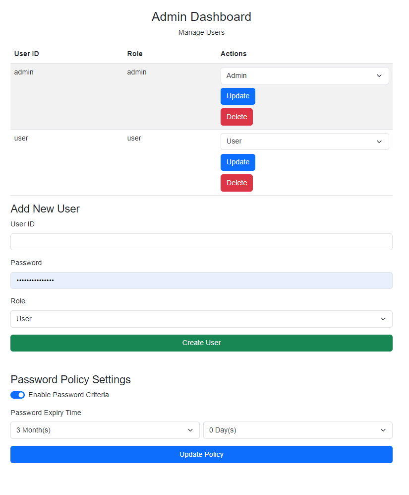

<h1>LABORATORIUM CYBERBEZPIECZEŃSTWO</h1>

&nbsp;

&nbsp;

<centerer>
    <Ltext>Data wykonania ćwiczenia:</Ltext>
    

        <rectangle>
            <Rtext>07.10.2024</Rtext>
        </rectangle>
    

</centerer>

<centerer>
    <Ltext>Rok studiów:</Ltext>
    

        <rectangle>
            <Rtext>4</Rtext>
        </rectangle>
    

</centerer>

<centerer>
    <Ltext>Semestr:</Ltext>
    

        <rectangle>
            <Rtext>7</Rtext>
        </rectangle>
    

</centerer>

<centerer>
    <Ltext>Grupa studencka:</Ltext>
    

        <rectangle>
            <Rtext>2</Rtext>
        </rectangle>
    

</centerer>

<centerer>
    <Ltext>Grupa laboratoryjna:</Ltext>
    

        <rectangle>
            <Rtext>2B</Rtext>
        </rectangle>
    

</centerer>

&nbsp;

&nbsp;

<row>
    <b>Ćwiczenie nr.</b>
    <rectangle>
        <Rtext>1</Rtext>
    </rectangle>
</row>

&nbsp;

&nbsp;

<b>Temat: </b> Systemy bezpieczeństwa oparte na hasłach

&nbsp;

&nbsp;

<b>Osoby wykonujące ćwiczenia: </b>

1. Igor Gawłowicz

&nbsp;

&nbsp;

<h1>Katedra Informatyki i Automatyki</h1>

# Sprawozdanie z realizacji zadania – Systemy bezpieczeństwa oparte na hasłach

## 1. Wprowadzenie

Hasła stanowią podstawowy sposób ochrony dostępu do poufnych informacji oraz systemów. Aby skutecznie pełnić tę rolę, muszą być odpowiednio zarządzane i dostosowane do wymogów technicznych oraz organizacyjnych. Proces uwierzytelniania pozwala na weryfikację tożsamości użytkowników poprzez wprowadzenie tajnego sekretu, jakim jest hasło. W ramach tego zadania celem było stworzenie systemu bezpieczeństwa, który zapewniałby skuteczne zarządzanie użytkownikami, hasłami oraz regułami dotyczącymi ich tworzenia.

## 2. Cel zadania

Zadanie obejmowało stworzenie programu implementującego system bezpieczeństwa haseł z następującymi funkcjonalnościami:

1. Obsługa dwóch ról: administratora (ADMIN) oraz użytkownika.
2. Administrator posiada możliwość:
   - zmiany hasła,
   - dodawania, modyfikowania oraz usuwania użytkowników,
   - blokowania kont oraz włączania/wyłączania ograniczeń dotyczących haseł,
   - ustawiania ważności hasła oraz wymuszania jego zmiany po określonym czasie.
3. Zwykły użytkownik może zmieniać swoje hasło oraz wylogować się.
4. Program zawiera mechanizm logowania z weryfikacją poprawności identyfikatora i hasła.
5. Przy pierwszym logowaniu użytkownik jest proszony o zmianę hasła.
6. Program korzysta z bezpiecznego algorytmu do hashowania haseł (bcrypt).
7. System musi weryfikować spełnianie indywidualnych zasad dotyczących hasła, które musi zawierać co najmniej 8 znaków, w tym jedną wielką literę i jeden znak specjalny.

## 3. Implementacja programu

### 3.1. Struktura aplikacji

Aplikacja została stworzona z wykorzystaniem frameworka Flask, co umożliwia łatwe zarządzanie sesjami użytkowników oraz dynamiczną obsługę danych w formacie JSON. Program wykorzystuje bibliotekę `bcrypt` do bezpiecznego przechowywania haseł.

#### Najważniejsze elementy aplikacji:

- **Logowanie i uwierzytelnianie:** Aplikacja wymaga od użytkowników podania poprawnego identyfikatora oraz hasła. Administrator ma możliwość wymuszenia zmiany hasła podczas kolejnego logowania.
- **Zarządzanie użytkownikami:** Administrator może tworzyć nowych użytkowników, modyfikować ich dane, a także usuwać konta.
- **Zmiana hasła:** Użytkownicy mogą zmieniać swoje hasła, a system wymusza spełnienie określonych kryteriów bezpieczeństwa, takich jak długość hasła oraz zawartość znaków specjalnych.
- **Ciasteczka JWT:** Tokeny JWT są wykorzystywane do uwierzytelniania i zarządzania sesjami użytkowników w sposób bezpieczny.

### 3.2. Weryfikacja haseł

Aplikacja zawiera funkcję `validate_password`, która sprawdza, czy hasło spełnia wymagania dotyczące długości, obecności wielkich liter oraz znaków specjalnych. Hasła są przechowywane w formie zaszyfrowanej, a przy każdej zmianie użytkownik nie może wykorzystać jednego z ostatnich 12 haseł.

### 3.3. Zarządzanie sesjami

W celu zapewnienia bezpieczeństwa i wygody użytkowania, aplikacja wykorzystuje mechanizmy zarządzania sesjami oparte na tokenach JWT, które są zapisywane w ciasteczkach. Administratorzy mają dostęp do panelu, w którym mogą zarządzać kontami użytkowników oraz polityką haseł.

## 4. Podsumowanie

Stworzony program spełnia wszystkie wymagania zadania. Umożliwia skuteczne zarządzanie kontami użytkowników, weryfikację haseł zgodnie z przyjętymi normami bezpieczeństwa, a także obsługę różnych ról w systemie. Wdrożenie tego rozwiązania w rzeczywistym środowisku pozwoliłoby na zwiększenie bezpieczeństwa danych poprzez wdrożenie rygorystycznych zasad dotyczących uwierzytelniania użytkowników.
