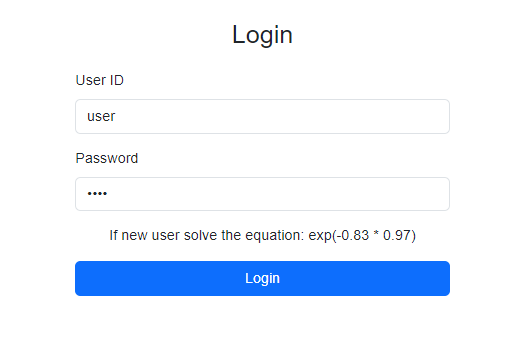
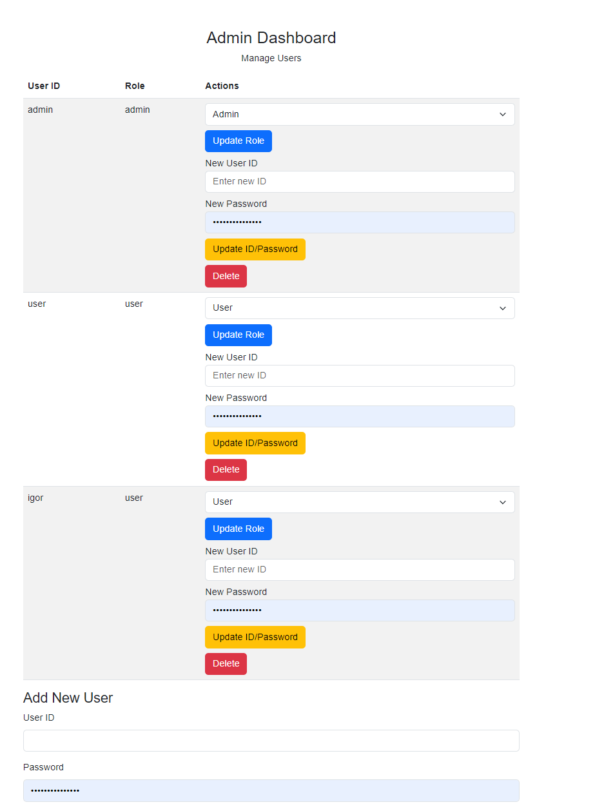
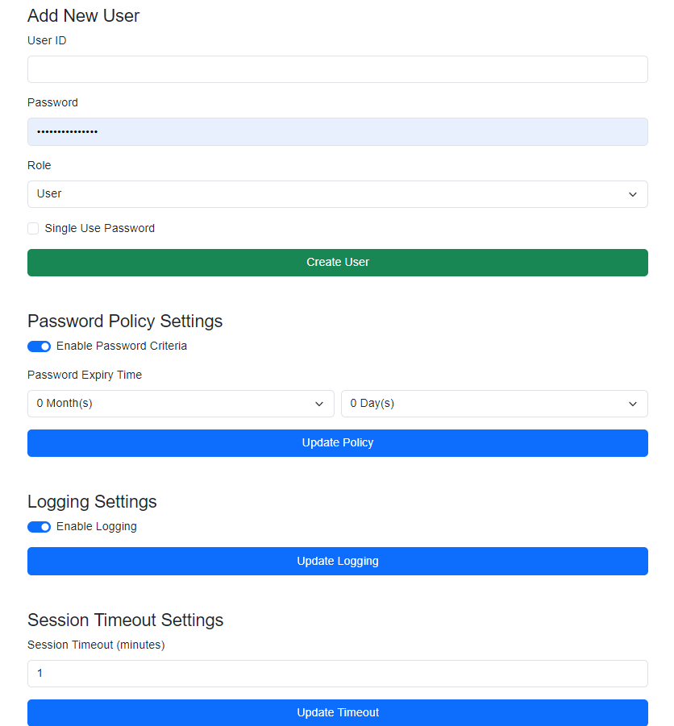
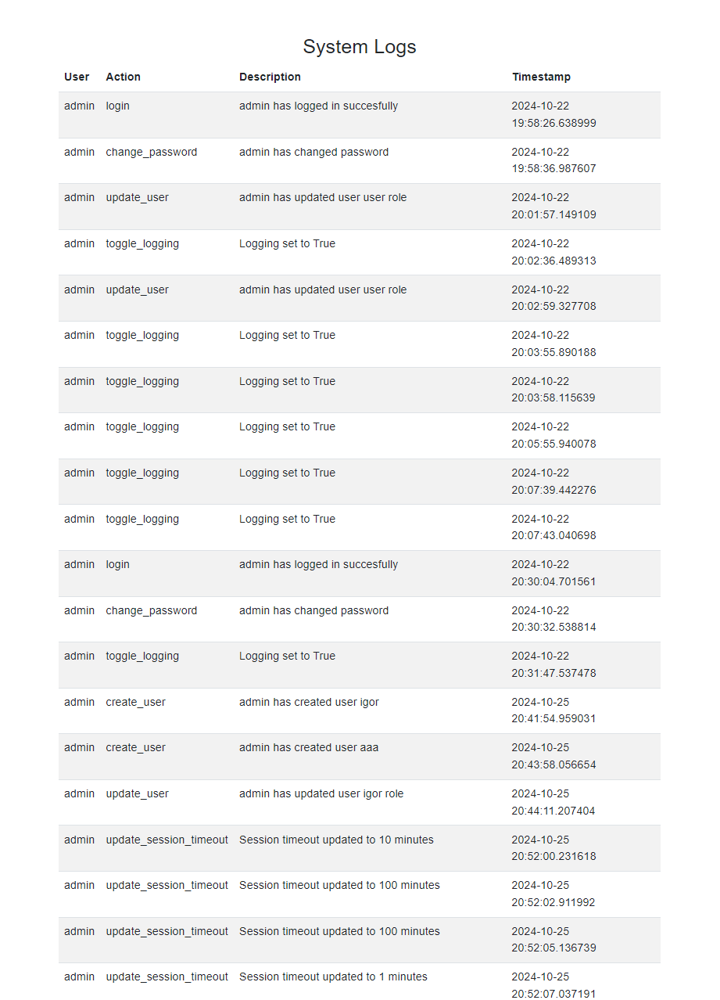
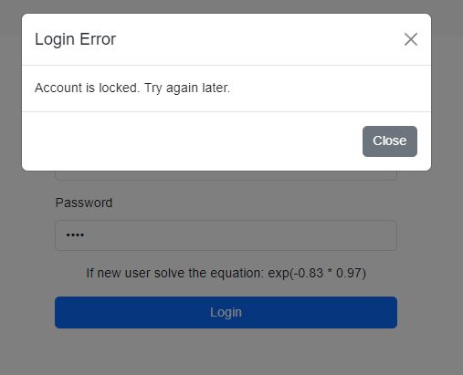

<h1>LABORATORIUM CYBERBEZPIECZEŃSTWO</h1>

&nbsp;

&nbsp;

<centerer>
    <Ltext>Data wykonania ćwiczenia:</Ltext>
    

        <rectangle>
            <Rtext>21.10.2024</Rtext>
        </rectangle>
    

</centerer>

<centerer>
    <Ltext>Rok studiów:</Ltext>
    

        <rectangle>
            <Rtext>4</Rtext>
        </rectangle>
    

</centerer>

<centerer>
    <Ltext>Semestr:</Ltext>
    

        <rectangle>
            <Rtext>7</Rtext>
        </rectangle>
    

</centerer>

<centerer>
    <Ltext>Grupa studencka:</Ltext>
    

        <rectangle>
            <Rtext>2</Rtext>
        </rectangle>
    

</centerer>

<centerer>
    <Ltext>Grupa laboratoryjna:</Ltext>
    

        <rectangle>
            <Rtext>2B</Rtext>
        </rectangle>
    

</centerer>

&nbsp;

&nbsp;

<row>
    <b>Ćwiczenie nr.</b>
    <rectangle>
        <Rtext>2</Rtext>
    </rectangle>
</row>

&nbsp;

&nbsp;

<b>Temat: </b> Mechanizmy identyfikacji, uwierzytelniania oraz autoryzacji

&nbsp;

&nbsp;

<b>Osoby wykonujące ćwiczenia: </b>

1. Igor Gawłowicz

&nbsp;

&nbsp;

<h1>Katedra Informatyki i Automatyki</h1>

### Sprawozdanie dotyczące implementacji systemu kontroli dostępu

#### 1. **Wprowadzenie**

W dzisiejszym środowisku informatycznym ochrona dostępu do systemów jest kluczowym elementem zapewniającym bezpieczeństwo danych oraz integralność operacji. Celem niniejszego sprawozdania jest przedstawienie implementacji systemu kontroli dostępu, w którym za pomocą funkcji jednokierunkowych oraz mechanizmów monitorowania aktywności użytkowników zapewniono ochronę przed nieuprawnionym dostępem.

System ten umożliwia uwierzytelnienie użytkowników, zarządzanie ich rolami oraz monitorowanie działań w systemie. Ważnym elementem jest użycie funkcji jednokierunkowych, które pozwalają na przechowywanie haseł w sposób bezpieczny, a także implementacja dodatkowych funkcji, takich jak hasła jednorazowe, limity nieudanych logowań oraz automatyczne wylogowanie użytkowników po określonym czasie bezczynności.

#### 2. **Zadanie do zrealizowania**

Zadaniem było stworzenie aplikacji webowej, która umożliwia:

1. **Monitorowanie aktywności użytkowników**, takich jak logowanie, wylogowanie, tworzenie i usuwanie kont użytkowników, zmiana haseł oraz nadawanie lub odbieranie uprawnień. Dla każdej akcji system rejestruje nazwę użytkownika, datę oraz czas zdarzenia, a także opis akcji (czy zakończyła się sukcesem czy porażką).
2. **Zarządzanie użytkownikami i ich uprawnieniami przez administratora**, w tym:
   - Generowanie haseł jednorazowych dla nowo tworzonych użytkowników lub podczas edycji istniejących kont. W tym celu zastosowano funkcje jednokierunkowe (np. `bcrypt`) zapewniające bezpieczeństwo przechowywania haseł.
   - Przeglądanie logów aktywności wszystkich użytkowników.
   - Ustalanie limitu nieudanych prób logowania, po przekroczeniu którego konto użytkownika zostanie tymczasowo zablokowane (na okres 15 minut).
   - Wylogowanie użytkownika po upływie ustalonego czasu bezczynności.

#### 3. **Opis implementacji systemu**

##### 3.1 **System uwierzytelniania**

Podstawową funkcjonalnością aplikacji jest proces uwierzytelniania użytkownika:

1. **Logowanie użytkownika**: Użytkownik wprowadza swoje dane uwierzytelniające (identyfikator oraz hasło). Dane te są weryfikowane na podstawie zaszyfrowanych haseł przechowywanych w bazie.
2. **Weryfikacja haseł**: W przypadku hasła jednorazowego system sprawdza poprawność hasła i oznacza je jako wykorzystane, co uniemożliwia jego ponowne użycie.
3. **Generowanie i przechowywanie haseł**: Wszystkie hasła są przechowywane w postaci skrótów (`hash`), co zapewnia bezpieczeństwo w przypadku potencjalnego wycieku danych.

##### 3.2 **Zarządzanie użytkownikami**

System pozwala administratorowi na:

- **Tworzenie nowego użytkownika** wraz z przypisaniem odpowiednich ról (np. `admin`, `user`) oraz generowaniem jednorazowego hasła w przypadku takiej potrzeby.
- **Usuwanie użytkowników** oraz edytowanie ich ról i uprawnień.
- **Logowanie zmian** dotyczących tworzenia, edytowania oraz usuwania użytkowników.

##### 3.3 **Monitorowanie i logowanie aktywności**

Każda akcja w systemie jest monitorowana i zapisywana w dzienniku aktywności. Logi obejmują:

- Identyfikację użytkownika wykonującego akcję.
- Datę oraz godzinę zdarzenia.
- Opis akcji, czy zakończyła się sukcesem, czy wystąpił błąd (np. nieprawidłowe dane logowania).

Dodatkowo wprowadzono możliwość przeglądania logów przez administratora, co umożliwia weryfikację poprawności działań użytkowników i identyfikację potencjalnych zagrożeń.

##### 3.4 **Bezpieczeństwo systemu**

W celu zwiększenia bezpieczeństwa systemu zaimplementowano następujące mechanizmy:

- **Limit nieudanych logowań**: Po określonej liczbie błędnych prób logowania konto użytkownika jest tymczasowo blokowane na 15 minut.
- **Wylogowanie po bezczynności**: Użytkownik zostaje automatycznie wylogowany po upływie określonego czasu bezczynności, co zapobiega nieautoryzowanemu dostępowi w przypadku pozostawienia sesji bez nadzoru.

#### 4. **Podsumowanie**

Implementacja systemu kontroli dostępu została zrealizowana zgodnie z wymaganiami dotyczącymi bezpieczeństwa oraz funkcjonalności. Użycie funkcji jednokierunkowych zapewnia wysokie bezpieczeństwo przechowywanych haseł, a monitorowanie aktywności użytkowników pozwala na pełną kontrolę nad działaniami w systemie.

System został przygotowany z myślą o elastycznym zarządzaniu użytkownikami oraz łatwej konfiguracji polityk bezpieczeństwa, takich jak limity logowań oraz czas trwania sesji. Dzięki zastosowanym rozwiązaniom zapewniono ochronę przed próbami nieuprawnionego dostępu oraz umożliwiono łatwe zarządzanie systemem przez administratorów.

**Wnioski**:

- Funkcje jednokierunkowe (takie jak `bcrypt`) są kluczowym elementem w zapewnieniu bezpieczeństwa haseł użytkowników.
- Monitorowanie aktywności użytkowników pozwala na bieżące śledzenie działań oraz identyfikację potencjalnych zagrożeń.
- Elastyczne zarządzanie dostępem oraz konfiguracją systemu (np. limity logowań, czas sesji) zwiększa ochronę danych oraz wygodę użytkowania.
