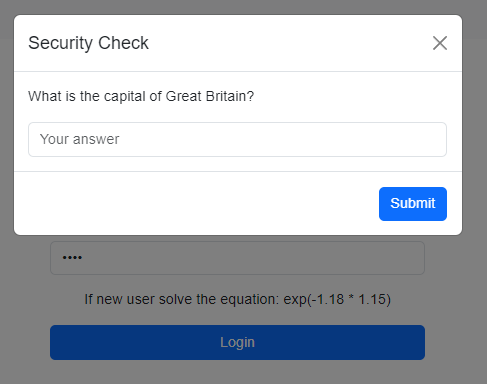
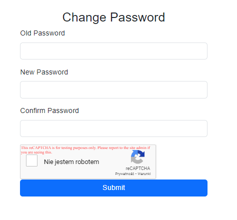

<style>
h1, h4 {
    border-bottom: 0;
    display:flex;
    flex-direction: column;
    align-items: center;
      }
      
centerer{
    display: grid;
    grid-template-columns: 6fr 1fr 4fr;
    grid-template-rows: 1fr;

}
rectangle{
    border: 1px solid black;
    margin: 0px 50px 0px 50px;
    width: 200px;
    height: 4em;
    display: flex;
    flex-direction: column;
    align-items: center;
    justify-items: center;
}
Ltext{
    margin: auto auto auto 0;
    font-weight: bold;
    margin-left: 4em
}
Rtext{
    margin: auto;
}

row {
    display: flex;
    flex-direction: row;
    align-items: center;
    justify-content: center; 
}
 </style>
<h1>LABORATORIUM CYBERBEZPIECZEŃSTWO</h1>

&nbsp;

&nbsp;

<style>

</style>

<centerer>
    <Ltext>Data wykonania ćwiczenia:</Ltext>
    <div align="center">
        <rectangle>
            <Rtext>18.11.2024</Rtext>
        </rectangle>
    </div>
</centerer>

<centerer>
    <Ltext>Rok studiów:</Ltext>
    <div align="center">
        <rectangle>
            <Rtext>4</Rtext>
        </rectangle>
    </div>
</centerer>

<centerer>
    <Ltext>Semestr:</Ltext>
    <div align="center">
        <rectangle>
            <Rtext>7</Rtext>
        </rectangle>
    </div>
</centerer>

<centerer>
    <Ltext>Grupa studencka:</Ltext>
    <div align="center">
        <rectangle>
            <Rtext>2</Rtext>
        </rectangle>
    </div>
</centerer>

<centerer>
    <Ltext>Grupa laboratoryjna:</Ltext>
    <div align="center">
        <rectangle>
            <Rtext>2B</Rtext>
        </rectangle>
    </div>
</centerer>

&nbsp;

&nbsp;

<row>
    <b>Ćwiczenie nr.</b>
    <rectangle>
        <Rtext>3</Rtext>
    </rectangle>
</row>

&nbsp;

&nbsp;

<b>Temat: </b> Ochrona przed botami, spamem i wprowadzaniem niepożądanych treści

&nbsp;

&nbsp;

<b>Osoby wykonujące ćwiczenia: </b>

1. Igor Gawłowicz

&nbsp;

&nbsp;

<h1>Katedra Informatyki i Automatyki</h1>

<div style="page-break-after: always;"></div>

## Sprawozdanie na temat zabezpieczeń CAPTCHA i Google reCAPTCHA

### 1. Wprowadzenie

Z powodu rozwoju technologii, strony internetowe i aplikacje muszą stawiać czoła coraz większej liczbie zagrożeń związanych z automatycznymi działaniami botów. Choć nie wszystkie z nich stanowią bezpośrednie zagrożenie, mogą one znacząco wpłynąć na funkcjonowanie strony. Jednym z popularniejszych rozwiązań do ochrony przed automatycznymi botami jest zastosowanie systemu CAPTCHA (Completely Automated Public Turing test to tell Computers and Humans Apart), który pozwala odróżnić ludzi od maszyn.

W ramach tego sprawozdania omówimy implementację systemów CAPTCHA i Google reCAPTCHA w aplikacji internetowej, celem zabezpieczenia formularzy logowania i zmiany hasła przed atakami botów.

### 2. Implementacja mechanizmu CAPTCHA w logowaniu

W celu ochrony przed botami przy logowaniu, zastosowano klasyczny system CAPTCHA, który wyświetla użytkownikowi pytanie (np. "Co jest stolicą Wielkiej Brytanii?"), które użytkownik musi poprawnie odpowiedzieć. System ten został zaimplementowany w JavaScript przy użyciu modali Bootstrap.

#### Proces implementacji:

1. **Generowanie pytania CAPTCHA**: Po załadowaniu strony logowania, wygenerowane jest pytanie CAPTCHA, które pojawia się w modalnym oknie Bootstrap. Użytkownik musi odpowiedzieć na pytanie przed próbą zalogowania się.
2. **Walidacja odpowiedzi**: W formularzu logowania po kliknięciu przycisku "Zaloguj" sprawdzana jest poprawność odpowiedzi na pytanie CAPTCHA. Dopiero po jej poprawnym udzieleniu użytkownik może przejść do procesu logowania.
3. **Pop-up z modali Bootstrap**: Mechanizm wyświetlania pytania i walidacji odpowiedzi został zaimplementowany w formie modalu Bootstrap, co zapewnia przejrzystość i łatwość w integracji z istniejącym interfejsem użytkownika.

kod JavaScript:

```javascript
  // Sample questions and answers for CAPTCHA
  const captchaQuestions = [
    { question: "What is the capital of Great Britain?", answer: "London" },
    { question: "What is 5 + 3?", answer: "8" },
    { question: "What color is the sky on a clear day?", answer: "Blue" },
    { question: "What is the square root of 16?", answer: "4" },
    { question: "What is the capital of France?", answer: "Paris" },
  ];

  // Show CAPTCHA modal on form submission
  document.getElementById("login-form").addEventListener("submit", async function (event) {
    event.preventDefault();

    // Generate random CAPTCHA question
    const randomIndex = Math.floor(Math.random() * captchaQuestions.length);
    const captcha = captchaQuestions[randomIndex];
    sessionStorage.setItem("captchaAnswer", captcha.answer);

    // Display CAPTCHA modal
    document.getElementById("captchaQuestion").textContent = captcha.question;
    new bootstrap.Modal(document.getElementById("captchaModal")).show();
  });

  // Handle CAPTCHA submission
  document.getElementById("submitCaptcha").addEventListener("click", async function () {
    const userCaptchaAnswer = document.getElementById("captchaAnswer").value.trim();
    const correctCaptchaAnswer = sessionStorage.getItem("captchaAnswer");

    if (userCaptchaAnswer.toLowerCase() === correctCaptchaAnswer.toLowerCase()) {
      sessionStorage.removeItem("captchaAnswer");
      document.getElementById("captchaModal").classList.remove("show");
      ...Reszta kodu
```



Dzięki temu użytkownik musi wykonać czynność, która jest trudna do automatyzacji, co zwiększa bezpieczeństwo formularza logowania.

### 3. Implementacja Google reCAPTCHA przy zmianie hasła

Z kolei przy zmianie hasła użyto systemu Google reCAPTCHA, który jest bardziej zaawansowaną wersją zabezpieczenia, wymagającą od użytkownika wykonania prostych testów weryfikujących, czy jest on człowiekiem, czy botem. Google reCAPTCHA zostało dodane do formularza zmiany hasła w celu zabezpieczenia przed atakami botów, które mogą próbować zautomatyzować proces resetowania haseł.

#### Proces implementacji:

1. **Weryfikacja reCAPTCHA na froncie**: Zastosowano reCAPTCHA v2 (wybór "Nie jestem robotem") na formularzu zmiany hasła. Klucz publiczny API Google reCAPTCHA został umieszczony w kodzie front-endowym.

2. **Weryfikacja reCAPTCHA na backendzie**: Aby zapewnić pełne bezpieczeństwo, odpowiedź z reCAPTCHA jest wysyłana do backendu, gdzie na podstawie sekretnego klucza API Google reCAPTCHA weryfikowana jest prawidłowość odpowiedzi.

#### kod JavaScript (front-end):

```javascript
<div
class="g-recaptcha"
data-sitekey="6LeIxAcTAAAAAJcZVRqyHh71UMIEGNQ_MXjiZKhI"
></div>

<script src="https://www.google.com/recaptcha/api.js" async defer></script>

```

#### kod Python (back-end):

```python
...
    recaptcha_response = request.form.get('g-recaptcha-response')

    secret_key = '6LeIxAcTAAAAAGG-vFI1TnRWxMZNFuojJ4WifJWe'
    recaptcha_url = 'https://www.google.com/recaptcha/api/siteverify'
    payload = {
        'secret': secret_key,
        'response': recaptcha_response
    }
    recaptcha_verification = requests.post(recaptcha_url, data=payload)
    recaptcha_result = recaptcha_verification.json()

    if not recaptcha_result.get('success'):
        error_message = "reCAPTCHA verification failed. Please try again."
        ...
```



### 4. Podsumowanie

Wdrożenie mechanizmów CAPTCHA oraz Google reCAPTCHA w aplikacji internetowej zwiększa poziom bezpieczeństwa przed automatycznymi atakami botów. System CAPTCHA przy logowaniu zmusza użytkownika do interakcji z prostym pytaniem, co skutecznie blokuje próby logowania przez boty. Z kolei Google reCAPTCHA w procesie zmiany hasła zabezpiecza aplikację przed nieautoryzowanymi próbami zmiany haseł, wymagając weryfikacji użytkownika przed wykonaniem tej czynności.

Takie podejście znacząco zmniejsza ryzyko ataków typu brute-force, spamu czy próby przejęcia konta, zapewniając równocześnie wygodę użytkownika i bezpieczeństwo aplikacji.
