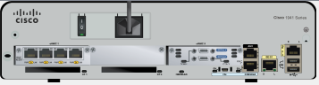

<style>
h1,h2,h3,h4 {
    border-bottom: 0;
    display:flex;
    flex-direction: column;
    align-items: center;
      }
      
centerer{
    display: grid;
    grid-template-columns: 6fr 1fr 4fr;
    grid-template-rows: 1fr;

}
rectangle{
    border: 1px solid black;
    margin: 0px 50px 0px 50px;
    width: 200px;
    height: 4em;
    display: flex;
    flex-direction: column;
    align-items: center;
    justify-items: center;
}
Ltext{
    margin: auto auto auto 0;
    font-weight: bold;
    margin-left: 4em
}
Rtext{
    margin: auto;
}

row {
    display: flex;
    flex-direction: row;
    align-items: center;
    justify-content: center; 
}
 </style>
<h1>LABORATORIUM SIECI KOMPUTEROWYCH</h1>

&nbsp;

&nbsp;

<style>

</style>

<centerer>
    <Ltext>Data wykonania ćwiczenia:</Ltext>
    <div align="center">
        <rectangle>
            <Rtext>11.05.2023</Rtext>
        </rectangle>
    </div>
</centerer>

<centerer>
    <Ltext>Rok studiów:</Ltext>
    <div align="center">
        <rectangle>
            <Rtext>2</Rtext>
        </rectangle>
    </div>
</centerer>

<centerer>
    <Ltext>Semestr:</Ltext>
    <div align="center">
        <rectangle>
            <Rtext>4</Rtext>
        </rectangle>
    </div>
</centerer>

<centerer>
    <Ltext>Grupa studencka:</Ltext>
    <div align="center">
        <rectangle>
            <Rtext>2</Rtext>
        </rectangle>
    </div>
</centerer>

<centerer>
    <Ltext>Grupa laboratoryjna:</Ltext>
    <div align="center">
        <rectangle>
            <Rtext>2B</Rtext>
        </rectangle>
    </div>
</centerer>

&nbsp;

&nbsp;

<row>
    <b>Ćwiczenie nr.</b>
    <rectangle>
        <Rtext>11</Rtext>
    </rectangle>
</row>

&nbsp;

&nbsp;

<b>Temat: </b> Budowanie sieci w oparciu o przełącznik i router

&nbsp;

&nbsp;

<b>Osoby wykonujące ćwiczenia: </b>

1. Igor Gawłowicz

&nbsp;

&nbsp;

<h2 >Katedra Informatyki i Automatyki</h1>

<div style="page-break-after: always;"></div>

## Określenie właściwości fizycznych urządzeń pracujących w intersieci

Po wciśnięciu na router o nazwie **East** możemy zobaczyć jego fizyczną formę, z której jesteśmy w stanie wyczytać wszystkie dostępne porty na tylnym panelu urządzenia takie jak: \
 Ethernet, Serial czy Vlan \
 Następnie z konsoli CLI możemy otrzymać dokładne dane:

```
    East>show ip interface brief
    Interface              IP-Address      OK? Method Status                Protocol
    GigabitEthernet0/0     172.30.1.1      YES NVRAM  up                    down
    GigabitEthernet0/1     172.31.1.1      YES NVRAM  up                    down
    Serial0/0/0            10.10.10.1      YES NVRAM  down                  down
    Serial0/0/1            unassigned      YES NVRAM  down                  down
    Vlan1                  172.29.1.1      YES NVRAM  up                    down
```

Po wprowadzeniu polecenia **show interface gigabitethernet 0/0** _alternatywnie dla każdego z powyższych_ \
 Dla portu z powyższego polecenia możemy odczytać że domyślna szerokość pasma dla tego portu to 1000000 Kbit. \
 Dla portu seryjnego domyślna szerokość to 1544 Kbit \
 Jest jeszcze jedna wyróżniająca się rzecz w naszym routerze, którą są złącza rozszerzeń w tym przypadku mamy je 4.
Dla porównania w Switchu 2 mamy 5 portów rozszerzeń. \

## Wybierz poprawne moduły dla połączeń

W sytuacji w której mamy połączyć 3 komputery do naszego routera bez możliwości użycia switcha możemy
wykorzystać nasze wejścia rozszerzeniowe HWIC-4ESW. W ten sposób moglibyśmy podłączyć 4 hostów. \
 Aby zapewnić gigabitowe połączenie optyczne pomiędzy switchem 2 i 3 możemy wykorzystać moduł PT-SWITCH-NM-1CGE. \
 Wracając do routera możemy sprawdzić nasz wybór poprzez dodanie naszego modułu do urządzenia przeciągając go.
Jednak najpierw powinniśmy wyłączyć router. Po podłączeniu nasz router powinien wyglądać w sposób następująćy.

   <div align="center">
   
   </div>

Taka sama sytuacja z naszym switchem.

   <div align="center">
   
   </div>

Możemy teraz zobaczyć że nasz moduł został umieszczony w 5 złączu

```
 Switch2>show ip interface brief
     Interface              IP-Address      OK? Method Status                Protocol
     FastEthernet0/1        unassigned      YES manual down                  down
     FastEthernet1/1        unassigned      YES manual down                  down
     FastEthernet2/1        unassigned      YES manual down                  down
     GigabitEthernet3/1     unassigned      YES manual down                  down
     FastEthernet4/1        unassigned      YES manual down                  down
     GigabitEthernet5/1     unassigned      YES manual down                  down
     Vlan1                  unassigned      YES manual administratively down down
```

## Łączenie urządzeń

    Po połączeniu całej sieci urządzeń powiniśmy otrzymać coś takiego:

    <div align="center">

   
   </div>

<div style="page-break-after: always;"></div>

```
East>show ip interface brief
 Interface              IP-Address      OK? Method Status                Protocol
 GigabitEthernet0/0     172.30.1.1      YES NVRAM  up                    up
 GigabitEthernet0/1     172.31.1.1      YES NVRAM  up                    up
 Serial0/0/0            10.10.10.1      YES NVRAM  up                    up
 Serial0/0/1            unassigned      YES NVRAM  down                  down
 FastEthernet0/1/0      unassigned      YES unset  up                    up
 FastEthernet0/1/1      unassigned      YES unset  up                    up
 FastEthernet0/1/2      unassigned      YES unset  up                    up
 FastEthernet0/1/3      unassigned      YES unset  up                    down
 Vlan1                  172.29.1.1      YES NVRAM  up                    up
```

Następnie przejdziemy do podłączania urządzeń bezprzewodowych, zaczynając od laptopa możemy zauważyć że po
uruchomieniu sieci bezprzewodowej, połączenie działa bez zarzutów. Jednakowo postąpimy z tabletem. \
 Możemy też zmienić ustawienia łączności na 3g/4g obie opcje dają nam dostęp do internetu.

## Wnioski

W programie **Cisco Packet Tracer** możemy symulować połączenia nawet dla większych sieci w bardzo realistyczny sposób.
