
<h1>LABORATORIUM SIECI KOMPUTEROWYCH</h1>

&nbsp;

&nbsp;

<centerer>
    <Ltext>Data wykonania ćwiczenia:</Ltext>
    

        <rectangle>
            <Rtext>08.06.2023</Rtext>
        </rectangle>
    

</centerer>

<centerer>
    <Ltext>Rok studiów:</Ltext>
    

        <rectangle>
            <Rtext>2</Rtext>
        </rectangle>
    

</centerer>

<centerer>
    <Ltext>Semestr:</Ltext>
    

        <rectangle>
            <Rtext>4</Rtext>
        </rectangle>
    

</centerer>

<centerer>
    <Ltext>Grupa studencka:</Ltext>
    

        <rectangle>
            <Rtext>2</Rtext>
        </rectangle>
    

</centerer>

<centerer>
    <Ltext>Grupa laboratoryjna:</Ltext>
    

        <rectangle>
            <Rtext>2B</Rtext>
        </rectangle>
    

</centerer>

&nbsp;

&nbsp;

<row>
    <b>Ćwiczenie nr.</b>
    <rectangle>
        <Rtext>15</Rtext>
    </rectangle>
</row>

&nbsp;

&nbsp;

<b>Temat: </b> Zadanie podsumowujące umiejętności

&nbsp;

&nbsp;

<b>Osoby wykonujące ćwiczenia: </b>

1. Igor Gawłowicz

&nbsp;

&nbsp;

<h1>Katedra Informatyki i Automatyki</h1>

| Urządzenie | Interfejs      | Adres IP/Prefiks      | Brama domyślna |
| ---------- | -------------- | --------------------- | -------------- |
| R1         | G0/0           | 192.168.0.1/25        | nd.            |
|            |                | 2001:db8:acad::1/64   |                |
|            |                | fe80::1               |                |
|            | G0/1           | 192.168.0.129/26      | nd.            |
|            |                | 2001:db8:acad:1::1/64 |                |
|            |                | fe80::1               |                |
|            | G0/2           | 192.168.0.193/27      | nd.            |
|            |                | 2001:db8:acad:2::1/64 |                |
|            |                | fe80::1               |                |
|            | S0/0/1         | 172.16.1.2 /30        | nd.            |
|            |                | 2001:db8:2::1/64      |                |
|            |                | fe80::1               |                |
| Central    | S0/0/0         | 209.165.200.226 /30   | nd.            |
|            |                | 2001:db8:1::1/64      |                |
|            |                | fe80::2               |                |
|            | S0/0/1         | 172.16.1.1 /30        | nd.            |
|            |                | 2001:db8:2::2/64      |                |
|            |                | fe80::2               |                |
| S1         | VLAN 1         | 192.168.0.2/25        | 192.168.0.1    |
| S2         | VLAN 1         | 192.168.0.130/26      | 192.168.0.129  |
| S3         | VLAN 1         | 192.168.0.194/27      | 192.168.0.193  |
| Staff      | Karta sieciowa | 192.168.0.3/25        | 192.168.0.1    |
|            |                | 2001:db8:acad::2/64   | fe80::1        |
|            |                | fe80::2               |                |
| Sales      | Karta sieciowa | 192.168.0.195/27      | 192.168.0.129  |
|            |                | 2001:db8:acad:1::2/64 | fe80::1        |
|            |                | fe80::2               |                |
| IT         | Karta sieciowa | 192.168.0.195/27      |                |
|            |                | 2001:db8:acad:2::2/64 | fe80::1        |
|            |                | fe80::2               |                |
| Web        | Karta sieciowa | 64.100.0.3/29         | 64.100.0.1     |
|            |                | 2001:db8:cafe::3/64   | fe80::1        |
|            |                | fe80::2               |                |

| 192.168.0.0/24   | Adres IP      | Maska           | Adres rozgłoszeniowy |
| ---------------- | ------------- | --------------- | -------------------- |
| staff 100 hostow | 192.168.0.0   | 255.255.255.128 | 192.168.0.127        |
| sales 50 hostow  | 192.168.0.128 | 255.255.255.192 | 192.168.0.191        |
| IT 15 hostow     | 192.168.0.191 | 255.255.255.224 | 192.168.0.223        |

## Konfiguracja Staff

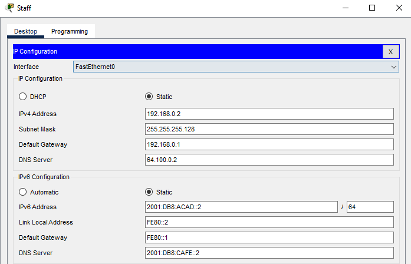

## Konfiguracja Sales

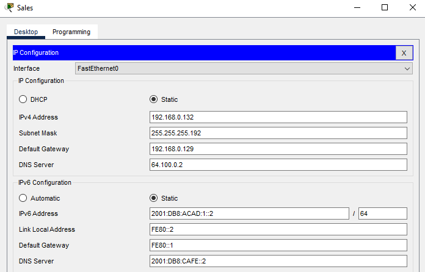

## Konfiguracja IT

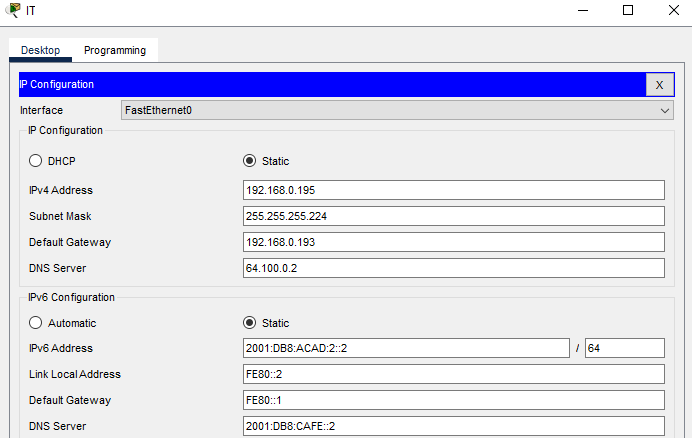

## Konfiguracja R1

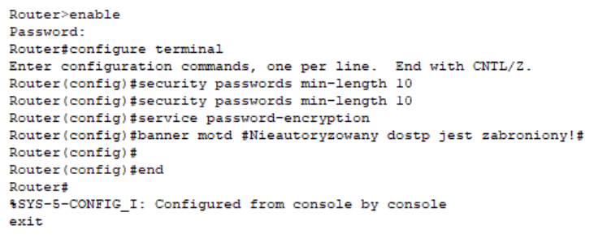
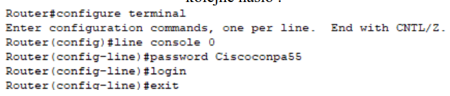
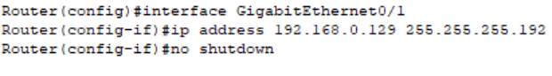
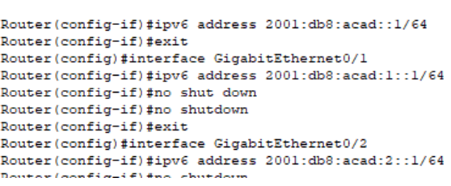

## Konfiguracja SSH

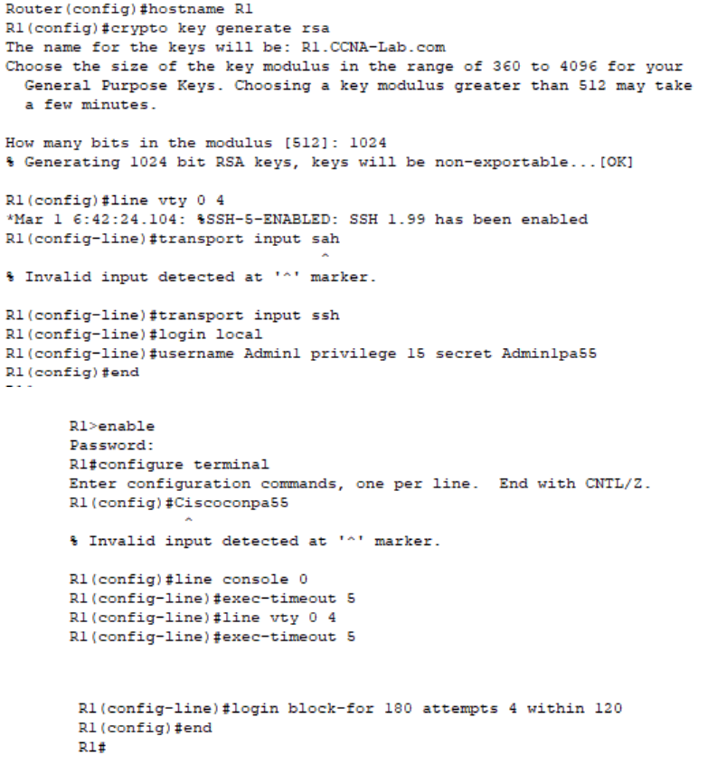

## Przykładowa konfiguracja switcha

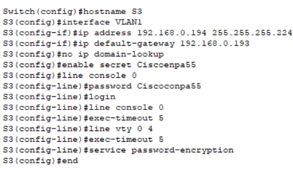

## Test połączenia

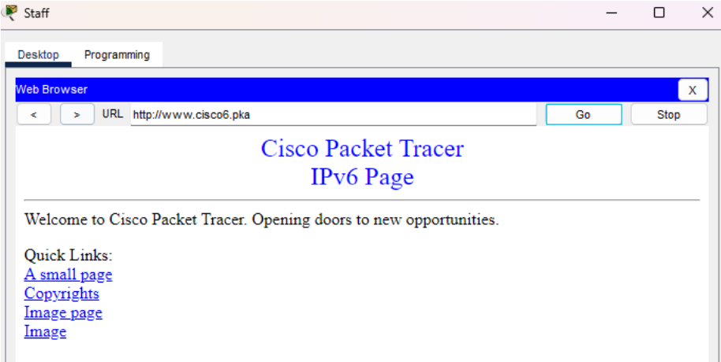

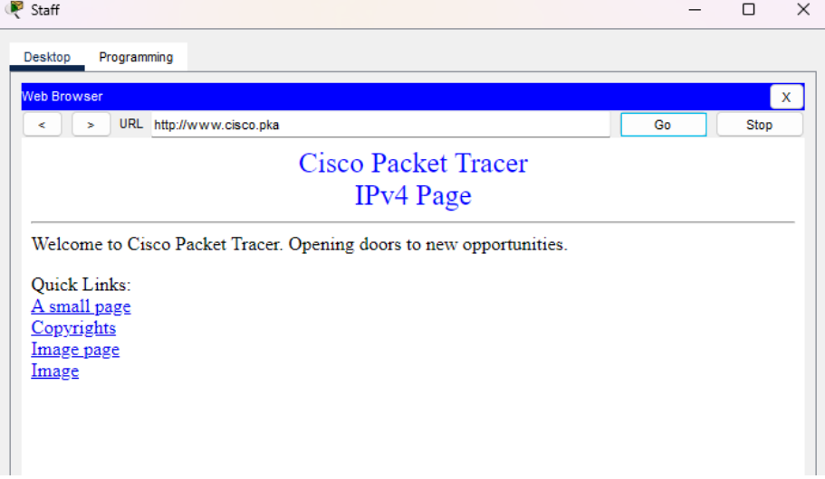

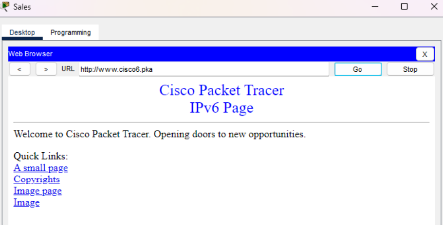

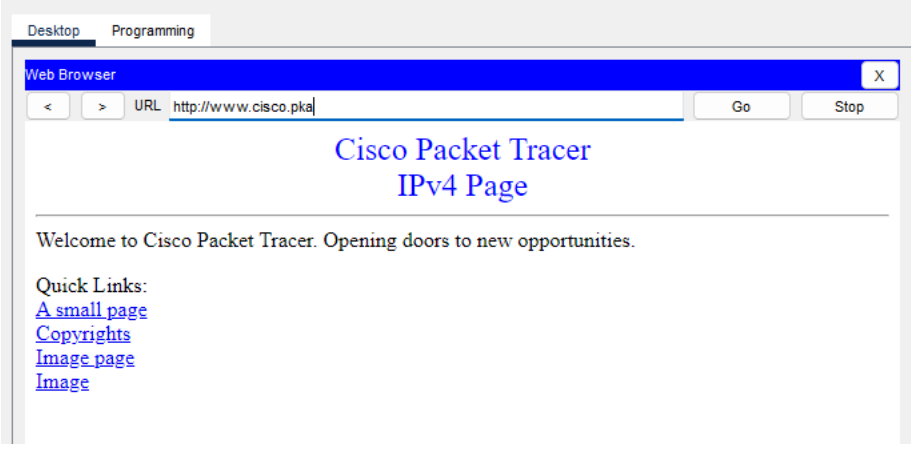

## IT ping Staff

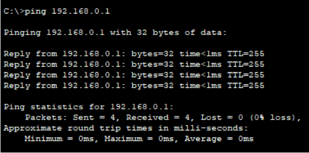

## Sales ping IT

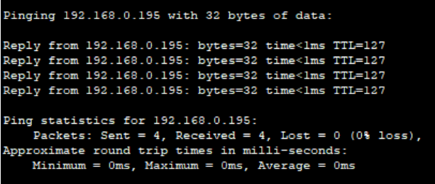

## Wynik

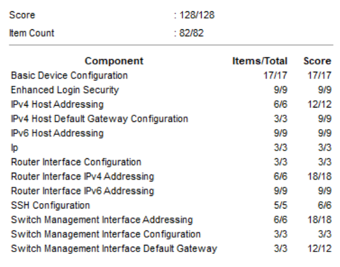
