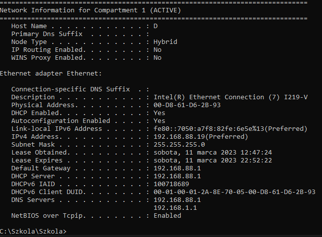
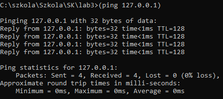
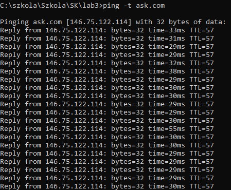
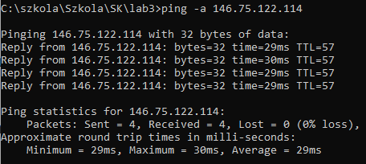

<h1>LABORATORIUM SIECI KOMPUTEROWYCH</h1>

&nbsp;

&nbsp;

<centerer>
    <Ltext>Data wykonania ćwiczenia:</Ltext>
    

        <rectangle>
            <Rtext>03.09.2023</Rtext>
        </rectangle>
    

</centerer>

<centerer>
    <Ltext>Rok studiów:</Ltext>
    

        <rectangle>
            <Rtext>2</Rtext>
        </rectangle>
    

</centerer>

<centerer>
    <Ltext>Semestr:</Ltext>
    

        <rectangle>
            <Rtext>4</Rtext>
        </rectangle>
    

</centerer>

<centerer>
    <Ltext>Grupa studencka:</Ltext>
    

        <rectangle>
            <Rtext>2</Rtext>
        </rectangle>
    

</centerer>

<centerer>
    <Ltext>Grupa laboratoryjna:</Ltext>
    

        <rectangle>
            <Rtext>2B</Rtext>
        </rectangle>
    

</centerer>

&nbsp;

&nbsp;

<row>
    <b>Ćwiczenie nr.</b>
    <rectangle>
        <Rtext>2B</Rtext>
    </rectangle>
</row>

&nbsp;

&nbsp;

<b>Temat: </b> Narzędzia diagnostyczne protokołów TCP/IP

&nbsp;

&nbsp;

<b>Osoby wykonujące ćwiczenia: </b>

1. Igor Gawłowicz

&nbsp;

&nbsp;

<h2 >Katedra Informatyki i Automatyki</h1>

1. za pomocą narzędzia IPCONFIG uzyskać szczegółowe informacje o wszystkich działach połączeń sieciowych. \
   
<b>(ipconfig /allcompartments /all).</b>

   - Wypełnij poniższą tabelę otrzymanymi danymi.
      
Tabela 1. Informacje o sieci dla sekcji

     | Nazwa komputera | Podstawowy sufiks DNS | Typ węzła | Routing IP jest włączony | WINS Proxy jest włączony |
     | --------------- | --------------------- | --------- | ------------------------ | ------------------------ |
     | DESKTOP-6GVNM2J | None                  | Hybrid    | No                       | No                       |
     | D               | None                  | Hybrid    | No                       | No                       |

     &nbsp;

      
Tabela 2. Adapter Ethernet. Połączenie z siecią lokalną

      

     |                                         |                                 |
     | --------------------------------------- | ------------------------------- |
     | None                                    | Sufiks połączenia DNS           |
     | Intel(R) Ethernet Connection (7) I219-V | Opis                            |
     | 00-D8-61-D6-2B-93                       | Adres fizyczny                  |
     | Yes                                     | DHCP jest włączony              |
     | Yes                                     | Autoconfiguration jest włączony |
     | fe80::7050:a7f8:82fe:6e5e%13(Preferred) | Adres IPv6 kanału               |
     | 192.168.88.19(Preferred)                | Adres IPv4                      |
     | 255.255.255.0                           | Maska podsieci                  |
     | 192.168.88.1                            | Brama domyślna                  |
     | 192.168.88.1                            | DHCP server                     |
     | 100718689                               | IAID DHCPv6                     |
     | 192.168.88.1                            | Serwery DNS                     |
     | Enabled                                 | NetBIOS over TCP/IP             |
     |                                         | Ethernet Adapter                |
     |                                         | Opis                            |
     |                                         | Adres fizyczny                  |

      

     

&nbsp;

1. Za pomocą narzędzia **IPCONFIG** pobierz zawartość pamięci podręcznej serwera DNS systemu operacyjnego i zapisać wyniki do pliku raportu displaydnsXX.txt.Zastąp znaki w nazwie pliku "XX" numerem podanym przez prowadzącego.

<b>(ipconfig /displaydns> D:nowak-displaydnsXX.txt).</b>

Tabela 3.

| No  | Adres serwera DNS (Przed wyczyszczeniem pamięci podręcznej DNS) | Adres serwera DNS (Powyczyszczeniem pamięci podręcznej DNS) |
| --- | --------------------------------------------------------------- | ----------------------------------------------------------- |
| 1.  | sdc.student.ath.edu.pl                                          | NULL                                                        |
| 2.  | cache2-waw1.steamcontent.com                                    | NULL                                                        |
| 3.  | ext2-fra1.steamserver.net                                       | NULL                                                        |
| 4.  | ext1-fra2.steamserver.net                                       | NULL                                                        |

Po wyczyszczeniu pamięci podręcznej DNS komenda nie zwraca żadnych wyników.

2.5. Po zwolnieniu adresów IPv4 za pomocą polecenia **ipconfig /release** następuje rozłączenie komputera z siecią Wi-Fi. \
2.8. Po odnowieniu połączenia za pomocą polecenia **ipconfig /renew** komputer stwierdza brak możliwości odnowienia połączenia do sieci Ethernet ponieważ kabel nie jest podłączony do komputera po czym łączy się z siecią Wi-Fi. \

&nbsp;

1. Sprawdź, czy protokół TCP/IP jest prawidłowo skonfigurowany w systemie operacyjnym komputera lokalnego. W tym celu wpisz w wierszu poleceń adres loopback.

<b>(ping 127.0.0.1)</b>

3.3.

<b>(ping -t ask.com)</b>

3.4.

<b>(ping -a 146.75.122.114)</b>

3.5.
| Publiczny adres IP | Domena |
| --- | --- |
| 146.75.122.114 | ask.com |
