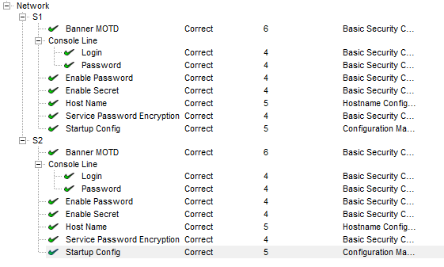

<style>
h1,h2,h3,h4 {
    border-bottom: 0;
    display:flex;
    flex-direction: column;
    align-items: center;
      }
      
centerer{
    display: grid;
    grid-template-columns: 6fr 1fr 4fr;
    grid-template-rows: 1fr;

}
rectangle{
    border: 1px solid black;
    margin: 0px 50px 0px 50px;
    width: 200px;
    height: 4em;
    display: flex;
    flex-direction: column;
    align-items: center;
    justify-items: center;
}
Ltext{
    margin: auto auto auto 0;
    font-weight: bold;
    margin-left: 4em
}
Rtext{
    margin: auto;
}

row {
    display: flex;
    flex-direction: row;
    align-items: center;
    justify-content: center; 
}
 </style>
<h1>LABORATORIUM SIECI KOMPUTEROWYCH</h1>

&nbsp;

&nbsp;

<style>

</style>

<centerer>
    <Ltext>Data wykonania ćwiczenia:</Ltext>
    <div align="center">
        <rectangle>
            <Rtext>13.04.2023</Rtext>
        </rectangle>
    </div>
</centerer>

<centerer>
    <Ltext>Rok studiów:</Ltext>
    <div align="center">
        <rectangle>
            <Rtext>2</Rtext>
        </rectangle>
    </div>
</centerer>

<centerer>
    <Ltext>Semestr:</Ltext>
    <div align="center">
        <rectangle>
            <Rtext>4</Rtext>
        </rectangle>
    </div>
</centerer>

<centerer>
    <Ltext>Grupa studencka:</Ltext>
    <div align="center">
        <rectangle>
            <Rtext>2</Rtext>
        </rectangle>
    </div>
</centerer>

<centerer>
    <Ltext>Grupa laboratoryjna:</Ltext>
    <div align="center">
        <rectangle>
            <Rtext>2B</Rtext>
        </rectangle>
    </div>
</centerer>

&nbsp;

&nbsp;

<row>
    <b>Ćwiczenie nr.</b>
    <rectangle>
        <Rtext>7</Rtext>
    </rectangle>
</row>

&nbsp;

&nbsp;

<b>Temat: </b> Konfiguracja ustawień początkowych przełączników

&nbsp;

&nbsp;

<b>Osoby wykonujące ćwiczenia: </b>

1. Igor Gawłowicz

&nbsp;

&nbsp;

<h2 >Katedra Informatyki i Automatyki</h1>

<div style="page-break-after: always;"></div>

1. Sprawdź domyślną konfigurację przełącznika

   - Po naciśnięciu odpowiedniego switcha w panelu CLI możemy wpisywać tekst, jedną z kluczowych komend jest tutaj komenda **enable**, która pozwala nam wejść w tryb uprzywilejowanego użytkownika.
   - Następnie możemy wyświetlić bieżącą konfigurację poprzez **show running-config** lub w skrócie **show run**

     ```
     Switch#show run
     Building configuration...

     Current configuration : 1086 bytes
     version 15.0
     no service timestamps log datetime msec
     no service timestamps debug datetime msec
     no service password-encryption
     hostname Switch
     spanning-tree mode pvst
     spanning-tree extend system-id

     interface FastEthernet0/1
     interface FastEthernet0/2
     interface FastEthernet0/3
      |
      \/
     interface FastEthernet0/24

     interface GigabitEthernet0/1
     interface GigabitEthernet0/2
     interface Vlan1
     no ip address
     shutdown

     line con 0

     line vty 0 4
     login
     line vty 5 15
     login

     end
     ```

2. Stworzenie podstawowej konfiguracji przełącznika.

   - z trybu uprzywilejowanego użytkownika za pomocą komendy **configure terminal** możemy wejść w tryb konfiguracji. Z poziomu, którego możemy wprowadzić wiele zmian takich jak na przykład zmiana nazwy hosta - **hostname S1**, od teraz zamiast _switch_ nazwa naszego switcha to _S1_.
   - Oprócz zmiany nazwy możemy także ustalić hasła dla poszczególnych elementów switcha. Dla przykładu wejdziemy w konfiguracje pierwszej linii konsoli za pomocą polecenia **line console 0**, a następnie ustawić hasło poleceniem **password letmein**, gdzie fraza _letmein_ będzie naszym hasłem.

   ```
       S1#configure t
       Enter configuration commands, one per line.  End with CNTL/Z.
       S1(config)#line console 0
       S1(config-line)#password letmein
       S1(config-line)#login
       S1(config-line)#exit
   ```

   Będziemy mogli teraz zauważyć że wyjściu na początek konsoli poleceniem exit terminal poprosi nas o hasło, aby kontynuować.

   - Nakładanie hasła na poszczególne linie nie jest jedynym co możemy zrobić żeby wmocnić zabezpieczenia, możemy także nałożyć hasła na sam tryb uprzywilejowany.
     Zrobimy to za pomocą polecenia **enable password c1$c0**, które sprawia że od teraz za każdym razem gdy użyjemy polecenia **enable** terminal poprosi nas o hasło.
   - Możemy teraz sprawdzić czy hasła zostały nałożone poprawnie ponawiając komende **show run**

   ```
   Building configuration...

        Current configuration : 1131 bytes
        version 15.0
        no service timestamps log datetime msec
        no service timestamps debug datetime msec
        no service password-encryption
        hostname S1

        **enable password c1$c0**

        spanning-tree mode pvst
        spanning-tree extend system-id
        interface FastEthernet0/1
        interface FastEthernet0/2
        |
        \/
        interface FastEthernet0/24
        interface GigabitEthernet0/1
        !
        interface GigabitEthernet0/2
        !
        interface Vlan1
        no ip address
        shutdown

        line con 0
        **password letmein**
        login
        !
        line vty 0 4
        login
        line vty 5 15
        login

        end

   ```

   - Możemy zaobserwować, że hasła są tutaj zapisane jawnym tekstem, aby temu zapobiec możemy użyć polecenia **secret** do komendy nakładającej hasło **enable secret itsasecret**.
     Po zrobieniu tego możemy zobaczyć że hasła do polecenia **enable** wyglądają następująco:

   ```
        enable secret 5 $1$mERr$ILwq/b7kc.7X/ejA4Aosn0
        enable password c1$c0
   ```

   nasze sekretne hasło jest teraz zaszyfrowane. \
   Jeśli chcemy zaszyfrować także wcześniejsze hasła możemy użyć polecenia **service password-encryption**, które sprawi że wszystkie hasła w tym switchu zostaną ukryte.

3. Konfiguracja banera MOTD

   - W terminalu switcha możemy ustawić coś takiego jak MOTD - Messege of the Day czyli wiadomość dnia, dzięki czemu każdy użytkownik otwierający terminal zobaczy ustawioną przez nas wiadomość. \
     Zrobimy to za pomocą polecenia **banner motd "This is a secure system. Authorized Access Only!"**.

4. Upewnij się, że konfiguracja jest ustawiona za pomocą polecenia show run.

   - Po sprawdzeniu, że konfiguracja jest prawidłowa pozostaje nam zapisanie jej lokalnie za pomocą polecenia: \
     **copy run startup-config** \

<div style="page-break-after: always;"></div>

5. Konfiguracja S2
<div align="center">
    
</div>

6. Wnioski \
   Packet tracker od Cisco jest bardzo przydatnym narzędziem służącym do symylowania rzeczywistych sieci, za pomocą którego możemy naprawdę wiele się nauczyć.
