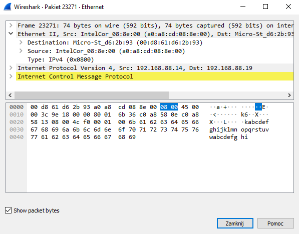

<h1>LABORATORIUM SIECI KOMPUTEROWYCH</h1>

&nbsp;

&nbsp;

<centerer>
    <Ltext>Data wykonania ćwiczenia:</Ltext>
    

        <rectangle>
            <Rtext>20.04.2023</Rtext>
        </rectangle>
    

</centerer>

<centerer>
    <Ltext>Rok studiów:</Ltext>
    

        <rectangle>
            <Rtext>2</Rtext>
        </rectangle>
    

</centerer>

<centerer>
    <Ltext>Semestr:</Ltext>
    

        <rectangle>
            <Rtext>4</Rtext>
        </rectangle>
    

</centerer>

<centerer>
    <Ltext>Grupa studencka:</Ltext>
    

        <rectangle>
            <Rtext>2</Rtext>
        </rectangle>
    

</centerer>

<centerer>
    <Ltext>Grupa laboratoryjna:</Ltext>
    

        <rectangle>
            <Rtext>2B</Rtext>
        </rectangle>
    

</centerer>

&nbsp;

&nbsp;

<row>
    <b>Ćwiczenie nr.</b>
    <rectangle>
        <Rtext>8</Rtext>
    </rectangle>
</row>

&nbsp;

&nbsp;

<b>Temat: </b> Wykorzystanie programu Wireshark do badania ruchu sieciowego

&nbsp;

&nbsp;

<b>Osoby wykonujące ćwiczenia: </b>

1. Igor Gawłowicz

&nbsp;

&nbsp;

<h2 >Katedra Informatyki i Automatyki</h1>

1. Użycie programu Wireshark do przechwycenia i analizy lokalnych
   danych ICMP

Po sprawdzeniu adresów komputera i laptopa w tej samej sieci oraz uruchomienia filtru w programie za pomocą polecenia ping wysyłamy sygnały do drugiego urządzenia.

    

Odbieramy te sygnały w programie wireshark

    

Na podstawie tych sygnałów możemy zobaczyć dane na temat źródła oraz celu sygnału włącznie z adresami MAC obu urządzeń.

    

2. Użycie programu Wireshark do przechwycenia i analizy zdalnych
   danych ICMP

Następnym krokiem jest wysłanie sygnału ping do 3 domen internetowych i spisanie wyników.

- www.yahoo.com - 87.248.100.215 \
   Address: Micro-St_d6:2b:93 (00:d8:61:d6:2b:93)
- www.cisco.com - 104.81.209.77
  Address: Micro-St_d6:2b:93 (00:d8:61:d6:2b:93)
- www.google.com - 216.58.209.4
  Address: Micro-St_d6:2b:93 (00:d8:61:d6:2b:93)

Możemy zaobserwować że adres MAC dla wszystkich trzech został zwrócony dokładnie taki sam znaczy to że nie uzyskujemy dokładnego adresu MAC więc jest to trochę zbytczne by sprawdzać go dla adresów zdalnych. Może to być powiązane z tym że w ramach zabezpieczenia adres MAC jest chroniony przez system i nie wysyłany do adresata taka długo jak nie jest się z nim w jednej sieci lokalnej.

3. Wnioski

Urządzenie WireShark jest bardzo przydatnym narzędziem przy śledzieniu aktywności dużych sieci lokalnych takich jak biura czy firmy. Pozwala nam on bardzo łatwo wychwycić wszelki ruch wypływający i przypływający do naszej sieci.
