
<h1>Akademia Techniczno-Humanistyczna w Bielsku-Białej </h1>

&nbsp;

&nbsp;

&nbsp;

&nbsp;

&nbsp;

&nbsp;

&nbsp;

&nbsp;

&nbsp;

<h1 style="text-align: center;"><b>LABORATORIUM</b></h1>
<h1 style="text-align:center"><b>Systemy Monitorowania i Sterowania</b></h1>

&nbsp;

&nbsp;

<h2 style="text-align:center; border: none;"><b>Sprawozdanie nr 1</b></h3>
<h2 style="text-align:center; border: none;">Układy kombinacyjne</h2>

&nbsp;

&nbsp;

&nbsp;

&nbsp;

&nbsp;

&nbsp;

&nbsp;

GRUPA: 2B / SEMESTR: 5 / ROK: 3

Igor Gawłowicz / 59096

### Zadanie L1.12

*Skrzyżowanie 2.*

Zaprojektować system sterowania światłami na sygnalizatorach w trybie pracy ręcznej. Przez
zmianę stanu jednego z czterech przełączników operator może ustawić kolejną fazę świateł.
Niewykorzystane ustawienia przełączników powinny włączyć tryb mrugania świateł żółtych.

  

Takie zadanie rozwiążemy w sposób następujący:

- Zapoznamy się z grafiką reprezentującą 8 faz świateł które musimy uwzględnić
- Stworzymy siatkę zależności wyjść od wejść na podstawie faz
- Na podstawie schematu zrobimy siatkę wykorzystując metodę Karnaugha dla każdego wyjścia
- Rozpiszemy jeszcze wszystkie pozostałe 8 scenariuszy, które nie zostały uwzględnione w podanych fazach
- Na podstawie pozostałych scenariuszy stworzymy siatkę uwzględniającą każdy z nie uwzględnionych scenariuszy, która będzie odpowiadać za włączenie migających żółtych świateł.
- Na podstawie naszych siatek napiszemy skrócone wzory dla każdego wyjścia
- Przeniesiemy nasze wzory do schematu drabinkowego w odpowiednim programie.

Kolejność faz świateł:

  

Na podstawie powyższych informacji wiemy że mamy 4 wejścia:

W1, W2, W3 i W4

oraz 20 wyjść, oznacza to więc że musimy przygotować siatkę zależności zmiennych wejściowych na wyjściowe:

  

Na wyżej załączonym obrazie możemy zauważyć, że w tym przypadku jak i w większości przypadków taka siatka jest po prostu zbyt długa i zbyt skomplikowana żeby w taki sposób przedstawiać ją w programie. Rozwiążemy ten problem poprzez zastosowanie siatek Carnough dla każdej zmiennej wyjściowej.

Oraz aby rozwiązać problem dla każdej kombinacji wejść innej od podanych faz, rozwiążemy jeszcze jedną siatkę dla wszystkich innych opcji.

  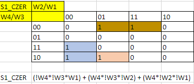

  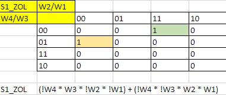

  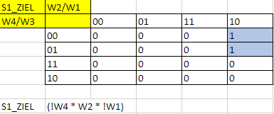

  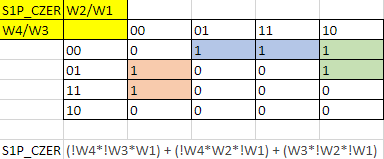

  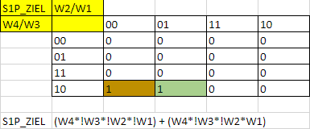

  

  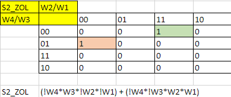

  

  

  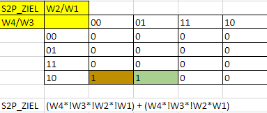

  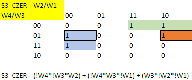

  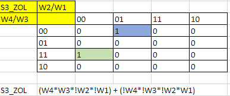

  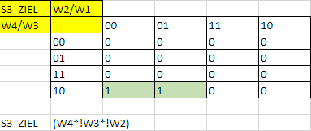

  

  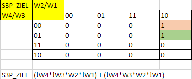

  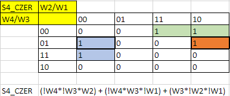

  

  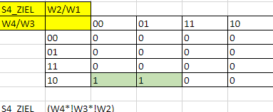

  

  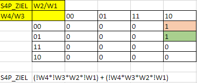

  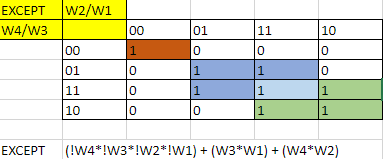

Kolejnym krokiem będzie przełożenie naszych wzorów do odpowiedniego programu, który zapisze nam nasze dane wejściowe dla urządzenia do formatu możliwego do odczytania przez program PAC. 

Dla przykładu, tak wygląda schemat drabinkowy dla S1_CZER

  

### Wnioski

Nasz projekt systemu sterowania światłami na sygnalizatorach w trybie pracy ręcznej opiera się na analizie ośmiu faz świateł, a metoda Karnaugha pomaga w zoptymalizowaniu logicznych funkcji. Siatki Karnaugha ułatwiają reprezentację tych funkcji. Dodatkowo, stworzyliśmy schemat drabinkowy dla wszystkich innych scenariuszy, co sprawia, że nasze rozwiązanie jest elastyczne i efektywne. Dzięki temu projekt pozwala na sprawną kontrolę nad sygnalizacją świetlną, niezależnie od potrzeb operatora i pojawiających się sytuacji.