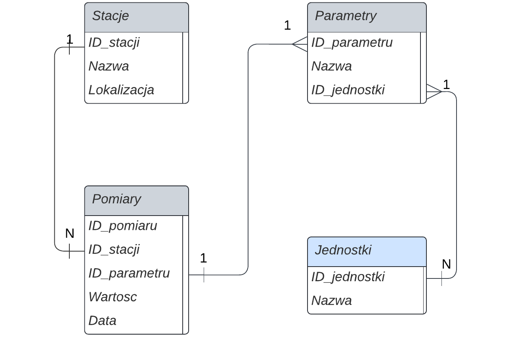
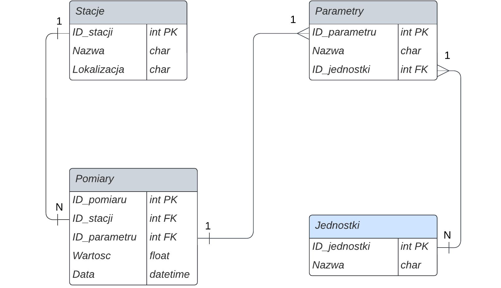
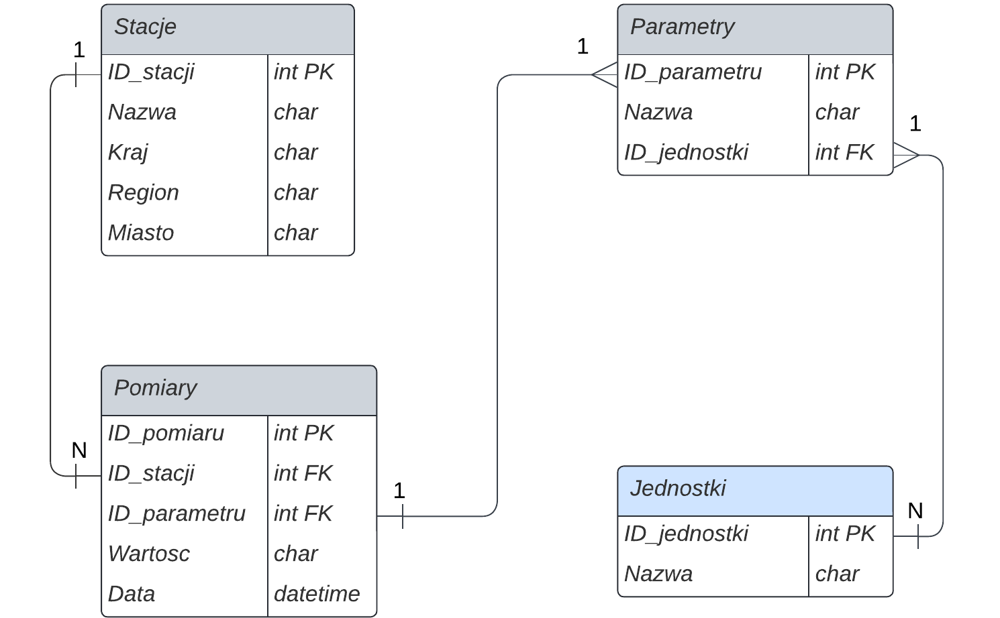

# Obsługa meteorologicznych danych pomiarowych

## Cel

### Celem systemu jest

**przechowywanie i zarządzanie danymi pomiarowymi dotyczącymi różnych parametrów meteorologicznych, zapewniając łatwy dostęp i analizę danych.**

### tak aby

**łatwo i efektywnie zarządzać, przechowywać oraz udostępniać dane meteorologiczne, umożliwiając ich dokładną analizę i wykorzystanie do podejmowania decyzji.**

### po to by

**umożliwić naukowcom, badaczom i decydentom dostępu do dokładnych i kompletnych danych meteorologicznych, co umożliwi podejmowanie lepszych decyzji dotyczących zarządzania i ochrony środowiska, zapobiegania skutkom klęsk żywiołowych oraz projektowania zrównoważonych działań gospodarczych.**

## Wymagania

| Lp. | Opis                                                                                                                                                                                        | Źródło            | Waga | Miara                                | Uwagi |
| --- | ------------------------------------------------------------------------------------------------------------------------------------------------------------------------------------------- | ----------------- | ---- | ------------------------------------ | ----- |
| 1.  | System musi przechowywać dane pomiarowe dotyczące różnych parametrów meteorologicznych, takich jak temperatura, wilgotność, ciśnienie atmosferyczne, opady deszczu, prędkość wiatru, itp.   | System            | 9    | Licba rekordów                       | -     |
| 2.  | System musi umożliwiać wprowadzanie, edycję i usuwanie danych pomiarowych.                                                                                                                  | Pracownik         | 6    | Liczba operacji                      | -     |
| 3.  | System musi udostępniać interfejs do eksportowania danych w różnych formatach, takich jak CSV, XML i JSON.                                                                                  | Pracownik, klient | 5    | Liczba eksportowanych plików         | -     |
| 4.  | System musi umożliwiać przetwarzanie danych pomiarowych, takie jak agregacja, grupowanie i sortowanie danych.                                                                               | System            | 6    | Liczba operacji przetwarzania danych | -     |
| 5.  | System musi zapewnić bezpieczeństwo danych, w tym ochronę przed nieautoryzowanym dostępem i utratą danych.                                                                                  | System            | 9    | -                                    | -     |
| 6.  | System musi umożliwiać dostęp do danych poprzez interaktyne wykresy i narzędzia umożliwiające analizę danych.                                                                               | Pracownik, klient | 7    | Liczba interakcji z narzędziami      | -     |
| 7.  | System musi działać na różnych platformach sprzętowych i oprogramowaniach.                                                                                                                  | System            | 8    | Kompatybilność z różnymi platformami | -     |
| 8.  | System musi umożliwiać analizę danych za pomocą różnych narzędzi i technologii, takich jak języki programowania, narzędzia do wizualizacji danych, itp.                                     | Pracownik         | 7    | Liczba dostępnych narzędzi           | -     |
| 9.  | System musi stosować standardy i protokoły, takie standardy ISO i protokoły HTTP, w celu zapewnienia interoperacyjności i bezpieczeństwa danych.                                            | System            | 8    | Liczba stosowanych standardów        | -     |
| 10. | System musi stosować procedury i zabezpieczenia, takie jak procedury kopii zapasowych, szyfrowanie danych i autoryzacja użytkowników, w celu zapewnienia bezpieczeństwa i poufności danych. | System            | 9    | Liczba stosowanych procedur          | -     |

## Schemat DZE



<div style="page-break-after: always;"></div>

## Model logiczny (UML)



## Model logiczny znormalizowany



<div style="page-break-after: always;"></div>

## Tworzenie bazy

```SQL
USE master

DROP DATABASE IF EXISTS PomiaryPogodowe;
CREATE DATABASE PomiaryPogodowe ON
(
	NAME = PomiaryPogodowe_dat,
	FILENAME = 'C:\szkola\Szkola\bd\PomiaryPogodowe_dat.mdf',
	SIZE = 10,
	MAXSIZE = 50,
	FILEGROWTH = 5
)
LOG ON
(
	NAME = PomiaryPogodowe_log,
	FILENAME = 'C:\szkola\Szkola\bd\PomiaryPogodowe_log.ldf',
	SIZE = 5 MB,
	MAXSIZE = 25 MB,
	FILEGROWTH = 5 MB
);
GO

USE PomiaryPogodowe;

DROP TABLE IF EXISTS dbo.Stacje;
CREATE TABLE dbo.Stacje
(
	ID_stacji INT NOT NULL PRIMARY KEY,
	Nazwa CHAR(255) NOT NULL,
	Kraj CHAR(255) NOT NULL,
	Region CHAR(255),
	Miasto CHAR(255)
);

DROP TABLE IF EXISTS dbo.Jednostki;
CREATE TABLE dbo.Jednostki
(
	ID_jednostki INT NOT NULL PRIMARY KEY,
	Nazwa CHAR(255) NOT NULL
);

DROP TABLE IF EXISTS dbo.Parametry;
CREATE TABLE dbo.Parametry
(
	ID_parametru INT NOT NULL PRIMARY KEY,
	Nazwa CHAR(255) NOT NULL,
	ID_jednostki INT NOT NULL FOREIGN KEY REFERENCES dbo.Jednostki(ID_jednostki)
);


DROP TABLE IF EXISTS dbo.Pomiary;
CREATE TABLE dbo.Pomiary
(
	ID_pomiaru INT NOT NULL PRIMARY KEY,
	ID_stacji INT NOT NULL FOREIGN KEY REFERENCES Stacje(ID_stacji),
	ID_parametru INT NOT NULL FOREIGN KEY REFERENCES dbo.Parametry(ID_parametru),
	Wartosc FLOAT NOT NULL,
	Data_pomiaru DATETIME NOT NULL
);

GO;
```

## Zapełnianie bazy danych

```SQL
USE PomiaryPogodowe
GO

INSERT INTO dbo.Stacje (ID_stacji, Nazwa, Kraj, Region, Miasto)
VALUES	(1, 'Stacja 1', 'Polska', 'Mazowieckie', 'Warszawa'),
		(2, 'Stacja 2', 'Polska', 'Małopolskie', 'Kraków'),
		(3, 'Stacja 3', 'Polska', 'Wielkopolskie', 'Poznań');

INSERT INTO dbo.Jednostki (ID_jednostki, Nazwa)
VALUES	(1, 'Stopień Celsjusza'),
		(2, 'Stopień Fahrenheita'),
		(3, 'Gram na metr sześcienny'),
		(4, 'Paskal');

INSERT INTO dbo.Parametry (ID_parametru, Nazwa, ID_jednostki)
VALUES	(1, 'Temperatura', 1),
		(2, 'Wilgotność', 3),
		(3, 'Ciśnienie atmosferyczne', 4);


INSERT INTO dbo.Pomiary (ID_pomiaru, ID_stacji, ID_parametru, Wartosc, Data_pomiaru)
VALUES	(1, 1, 1, 20.5, '2023-05-22 12:00:00'),
		(2, 1, 2, 50, '2023-05-22 12:00:00'),
		(3, 1, 3, 1013, '2023-05-22 12:00:00'),
		(4, 2, 1, 18.2, '2023-05-22 12:00:00'),
		(5, 2, 2, 60, '2023-05-22 12:00:00'),
		(6, 2, 3, 1015, '2023-05-22 12:00:00'),
		(7, 3, 1, 22.1, '2023-05-22 12:00:00'),
		(8, 3, 2, 45, '2023-05-22 12:00:00'),
		(9, 3, 3, 1010, '2023-05-22 12:00:00');

```

<div style="page-break-after: always;"></div>

## Funkcje

### Średnia dla parametru w danym okresie czasowym:

```SQL
CREATE FUNCTION fn_srednia_parametru (@id_parametru INT, @data_od DATETIME, @data_do DATETIME)
RETURNS DECIMAL(10,2)
AS
BEGIN
    DECLARE @srednia DECIMAL(10, 2)
    SELECT @srednia = AVG(Wartosc)
    FROM dbo.Pomiary
    WHERE ID_parametru = @id_parametru AND Data_pomiaru BETWEEN @data_od AND @data_do
    RETURN @srednia
END
GO;
```

### Funkcja generująca raport dla danej stacji i parametru w podanym okresie czasowym.

```SQL
CREATE FUNCTION fn_generuj_raport (@id_stacji INT, @id_parametru INT, @data_od DATETIME, @data_do DATETIME)
RETURNS TABLE
AS
RETURN
(
    SELECT
	pom.ID_stacji, sta.Nazwa, pom.ID_parametru, par.Nazwa AS Nazwa_parametru,
	AVG(Wartosc) AS Sred_wartosc, MIN(Wartosc) AS Minimalna_wartosc,
	MAX(Wartosc) AS Maksymalna_wartosc, COUNT(*) AS Liczba_pomiarow
    FROM dbo.Pomiary AS pom
    INNER JOIN dbo.Stacje AS sta ON pom.ID_stacji = sta.ID_stacji
    INNER JOIN dbo.Parametry AS par ON pom.ID_parametru = par.ID_parametru
	WHERE pom.ID_stacji = @id_stacji AND pom.ID_parametru = @id_parametru
	AND pom.Data_pomiaru BETWEEN @data_od AND @data_do
    GROUP BY pom.ID_stacji, sta.Nazwa, pom.ID_parametru, par.Nazwa
)
GO;
```

<div style="page-break-after: always;"></div>

### Funkcja wyświetlająca dane na podstawie podanych parametrów:

```SQL
CREATE FUNCTION fn_wyszukaj_pomiary (@id_stacji INT, @id_parametru INT, @data_od DATETIME, @data_do DATETIME)
RETURNS TABLE
AS
RETURN
(
    SELECT pom.ID_pomiaru, pom.ID_stacji, sta.Nazwa AS Nazwa_stacji, pom.ID_parametru, par.Nazwa AS Nazwa_parametru, Wartosc, Data_pomiaru
    FROM dbo.Pomiary AS pom
    INNER JOIN dbo.Stacje AS sta ON pom.ID_stacji = sta.ID_stacji
    INNER JOIN dbo.Parametry AS par ON pom.ID_parametru = par.ID_parametru
    WHERE pom.ID_stacji = sta.ID_stacji AND pom.ID_parametru = @id_parametru AND pom.Data_pomiaru BETWEEN @data_od AND @data_do
)
GO
```

## Triggery

Trigger dodający nową stacje meteorologiczną do bazy gdy tylko pojawi się w systemie:

```SQL
CREATE TRIGGER tr_dodaj_nowe_stacje
ON dbo.Stacje
AFTER INSERT
AS
BEGIN
	DECLARE @id_stacji INT
	SELECT @id_stacji = ID_stacji FROM inserted
	IF NOT EXISTS (SELECT * FROM dbo.Pomiary WHERE ID_stacji = @id_stacji)
	BEGIN
		INSERT INTO dbo.Pomiary (ID_stacji, ID_parametru, Wartosc, Data_pomiaru)
		VALUES (@id_stacji, 1, 0, GETDATE())
	END
END
```
