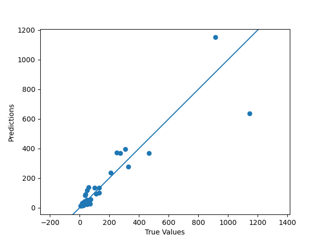
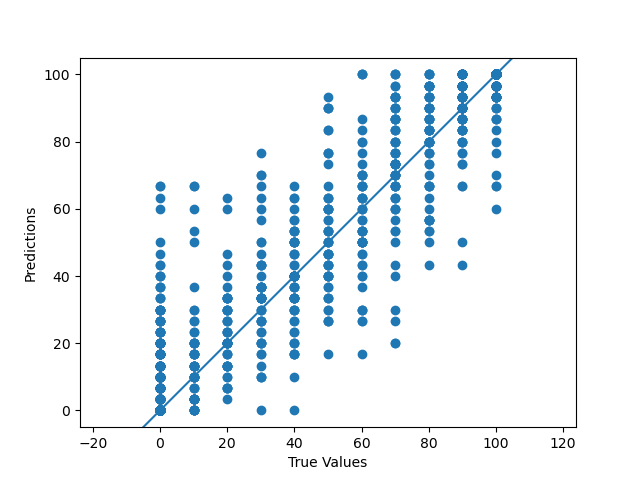

# Implementacja algorytmu k-NN z regresją danych w języku Python

- [Implementacja algorytmu k-NN z regresją danych w języku Python](#implementacja-algorytmu-k-nn-z-regresją-danych-w-języku-python)
  - [Funkcja `process`](#funkcja-process)
  - [Normalizacja danych wejściowych](#normalizacja-danych-wejściowych)
  - [Podział danych na zbiory treningowe i testowe](#podział-danych-na-zbiory-treningowe-i-testowe)
  - [Trenowanie modelu regresji k-nn z cross-validation](#trenowanie-modelu-regresji-k-nn-z-cross-validation)
  - [Testowanie modelu na zbiorze testowym](#testowanie-modelu-na-zbiorze-testowym)
  - [Zapisywanie wyników do pliku](#zapisywanie-wyników-do-pliku)
  - [Generowanie wykresu punktowego](#generowanie-wykresu-punktowego)
- [Analiza zestawów danych w regresji za pomocą algorytmu k-NN](#analiza-zestawów-danych-w-regresji-za-pomocą-algorytmu-k-nn)
  - [autoMPG6](#autompg6)
  - [california](#california)
  - [compactiv](#compactiv)
  - [concrete](#concrete)
  - [delta ail](#delta-ail)
  - [delta elv](#delta-elv)
  - [elevators](#elevators)
  - [friedman](#friedman)
  - [machineCPU](#machinecpu)
  - [pole](#pole)
  - [wankara](#wankara)
  - [wizmir](#wizmir)

W ramach prezentacji jednego z algorytmów uczenia maszynowego na zestawie danych regresji lub klasyfikacji, wybrałem algorytm k-najbliższych sąsiadów (k-NN) z regresją danych. W tym sprawozdaniu przedstawię szczegółowy opis implementacji tego algorytmu w języku Python z wykorzystaniem bibliotek **sklearn**, **pandas** oraz **matplotlib** do wizualizacji danych.

## Funkcja `process`

Funkcja `process` przyjmuje ścieżkę do pliku CSV jako argument i odczytuje plik za pomocą biblioteki Pandas. Następnie wyodrębnia dane wejściowe i wyjściowe z pliku i przechowuje długość danych wejściowych w zmiennej `size`.

```Python
def process(f):
    name = os.path.basename(f)
    data = pd.read_csv(f)
    input = data.iloc[:, :-1].values
    ouput = data.iloc[:, -1].values
    size = len(input)
```

<div style="page-break-after: always;"></div>

## Normalizacja danych wejściowych

Dane wejściowe są normalizowane za pomocą klasy `MinMaxScaler` z biblioteki Scikit-learn. Metoda `fit_transform` skaluje dane wejściowe do zakresu od 0 do 1.

```Python
    scaler = MinMaxScaler()
    inputs_normalized = scaler.fit_transform(input)
```

## Podział danych na zbiory treningowe i testowe

Dane są dzielone na zbiory treningowe i testowe za pomocą funkcji `train_test_split` z biblioteki Scikit-learn. Parametr `test_size` określa proporcję danych, która ma być użyta do testowania, a parametr `random_state` zapewnia, że ​​ten sam podział jest używany za każdym razem, gdy kod jest uruchamiany.

```Python
    input_train, input_test, output_train, output_test = train_test_split(
        inputs_normalized,
        ouput,
        test_size=0.2,
        random_state=42,
        # shuffle = False # (if same order is required)
    )
```

## Trenowanie modelu regresji k-nn z cross-validation

Model regresji k-NN jest trenowany za pomocą **cross-validation**, aby znaleźć optymalną liczbę sąsiadów k. Do stworzenia modelu używana jest klasa `KNeighborsRegressor` z biblioteki Scikit-learn, a funkcja `cross_val_score` służy do przeprowadzenia walidacji krzyżowej z 5 podziałami. Metryka oceny `neg_mean_squared_error` jest używana do oceny wydajności modelu. Słownik `scores` przechowuje wyniki RMSE dla każdej wartości k, a lista `models` przechowuje wytrenowane modele dla każdej wartości k. Funkcja `min` jest używana do znalezienia wartości k z najniższym wynikiem RMSE, a wyniki są drukowane na konsoli.

```Python
    scores = {}
    models = []
    for k in range(1, 21):
        knn = KNeighborsRegressor(n_neighbors=k)
        cv_scores = cross_val_score(
            knn,
            inputs_normalized,
            ouput,
            cv=5,
            scoring="neg_mean_squared_error",
        )
        rmse_scores = (-cv_scores) ** 0.5
        scores[k] = rmse_scores.mean()
        models.append(knn)

    best_k = min(scores, key=scores.get)
    print(
        "k =",
        best_k,
        "\nMean cross-validation score:",
        scores[best_k],
    )
```

## Testowanie modelu na zbiorze testowym

Model regresji k-NN z optymalną wartością k jest trenowany i testowany na zbiorze testowym. Metoda `predict` jest używana do wygenerowania prognoz dla zbioru testowego, a RMSE jest obliczane za pomocą średniego błędu kwadratowego (MSE) i pierwiastka kwadratowego.

```Python
    knn = models[best_k - 1]
    knn.fit(input_train, output_train)

    output_pred = knn.predict(input_test)
    mse = ((output_pred - output_test) ** 2).mean()
    rmse = mse**0.5
    print("Root Mean Squared Error:", rmse)
```

## Zapisywanie wyników do pliku

Wyniki są zapisywane do pliku tekstowego w katalogu `output`. Plik zawiera informacje o nazwie zestawu danych, RMSE, optymalnej wartości k, zakresie danych i rozmiarze zestawu danych. Przewidywane i rzeczywiste wartości dla zbioru testowego są również zapisywane do pliku.

```Python
    dataset_range = (min(output_test), max(output_test))
    with open(f"output/{name}.txt", "w") as f:
        f.write(
            f"Name:\t{name} \nRoot Mean Squared Error:\t{rmse}\nbest k:\t{best_k}\ndata range:\t{dataset_range}\ndataset size:\t{size}\n"
        )
        f.write(f"Predicted Data\tRaw Data\n")
        for i in range(len(output_pred)):
            f.write("{:.2f}\t{:.2f}\n".format(output_pred[i], output_test[i]))
```

<div style="page-break-after: always;"></div>

## Generowanie wykresu punktowego

Generowany jest wykres punktowy przewidywanych wartości w porównaniu do rzeczywistych wartości dla zbioru testowego i zapisywany jako plik PNG w katalogu `output`. Wykres jest tworzony za pomocą biblioteki **Matplotlib** i pokazuje zależność między prawdziwymi wartościami a przewidywanymi wartościami.

```Python
    plt.clf()
    plt.scatter(output_test, output_pred)
    plt.xlabel("True Values")
    plt.ylabel("Predictions")
    plt.axis("equal")
    plt.xlim(plt.xlim())
    plt.ylim(plt.ylim())
    plt.plot([-100, 100], [-100, 100])
    plt.savefig(f"output/{name}.png")
```

<div style="page-break-after: always;"></div>

# Analiza zestawów danych w regresji za pomocą algorytmu k-NN

## autoMPG6

Dla zestawu danych **autoMPG6** optymalna liczba sąsiadów k wynosiła 7 a wartość RMSE wynosiła 2.676700853775874. Zestaw zawierał dane z zakresu: (12, 44), a ilość wierszy w tym zbiorze to 392. Możemy zauważyć tutaj że dane były dość dobrze zróżnicowane i można było z nich wyciągać odpowiednie wnioski aby w miarę dobrze przewidzieć wynik dla każdego wiersza.


<div style="page-break-after: always;"></div>

## california

Dla zestawu danych **California** optymalna liczba sąsiadów k wynosiła 9 a wartość RMSE wynosiła 63076.29887951363. Zestaw zawierał dane z zakresu: (17500, 500001), a ilość wierszy w tym zbiorze to 20640. Był to największy pod względem ilości danych zbiór, jednak ponownie pomimo dużych wartości liczby były ze sobą na tyle powiązane że wyniki był dość dokładne.


<div style="page-break-after: always;"></div>

## compactiv

Dla zestawu danych **Compactiv** optymalna liczba sąsiadów k wynosiła 3 a wartość RMSE wynosiła 3.2027397430276325. Zestaw zawierał dane z zakresu: (0.0, 99.0), a ilość wierszy w tym zbiorze to 8192.


<div style="page-break-after: always;"></div>

## concrete

Dla zestawu danych **Concrete** optymalna liczba sąsiadów k wynosiła 3 a wartość RMSE wynosiła 8.81998769161311. Zestaw zawierał dane z zakresu: (6.27, 81.75), a ilość wierszy w tym zbiorze to 1030. Był to zbiór dość podobny do poprzedniego zbioru [compactiv](#compactiv), jednak jest on nieco mniec precyjny gdyż w odróżnieniu od poprzedniego dane są nieco bardziej rozrzucone przez co nasz RMSE jest o wiele wyższy dla mniejszego przedziału danych.


<div style="page-break-after: always;"></div>

## delta ail

Dla zestawu danych **Delta_ail** optymalna liczba sąsiadów k wynosiła 19 a wartość RMSE wynosiła 0.00017136252456243889. Zestaw zawierał dane z zakresu: (-0.0019, 0.0014), a ilość wierszy w tym zbiorze to 7129. Bardzo niski błąd RMSE wynika z tego że nasz przedział danych jest niesamowicie niski przez co o wiele ciężej zestawić ze sobą dane w czytelny sposób.


<div style="page-break-after: always;"></div>

## delta elv

Dla zestawu danych **Delta_elv** optymalna liczba sąsiadów k wynosiła 20 a wartość RMSE wynosiła 0.001416365462707129. Zestaw zawierał dane z zakresu: (-0.008, 0.008), a ilość wierszy w tym zbiorze to 9517. Ponownie jest on niemalże identyczny do swojego poprzednika [delta_ail](#delta_ail) jedyna znacząca różnica to że zakres danych jest nieco mniejszy mamy tam tylko zaokrąglenie do częsci tysięcznej w odróżnieniu do części dziesięciotysięcznej swojego poprzednika.


<div style="page-break-after: always;"></div>

## elevators

Dla zestawu danych **elevators** optymalna liczba sąsiadów k wynosiła 7 a wartość RMSE wynosiła 0.0036329689292255137. Zestaw zawierał dane z zakresu: (0.012, 0.074), a ilość wierszy w tym zbiorze to 16599. Duży zestaw danych z jeszcze mniejszym zakresem danych niż poprzednicy, dzięki czemu dane można od siebie odróżnić i zidentyfikować efektywniej niż w poprzednich zestawach.


<div style="page-break-after: always;"></div>

## friedman

Dla zestawu danych **friedman** optymalna liczba sąsiadów k wynosiła 8 a wartość RMSE wynosiła 1.8539789884921636. Zestaw zawierał dane z zakresu: (0.664014955, 28.5903858), a ilość wierszy w tym zbiorze to 1200.


<div style="page-break-after: always;"></div>

## machineCPU

Dla zestawu danych **machineCPU** optymalna liczba sąsiadów k wynosiła 1 a wartość RMSE wynosiła 95.19178636035879. Zestaw zawierał dane z zakresu: (6, 1144), a ilość wierszy w tym zbiorze to 209. Bardzo mały zestaw danych, z którego ciężko wyciągać wnioski rozrzut danych jest dość spory, a stosunkowo wysokie.



<div style="page-break-after: always;"></div>

## pole

Dla zestawu danych **pole** optymalna liczba sąsiadów k wynosiła 3 a wartość RMSE wynosiła 8.371910707173654. Zestaw zawierał dane z zakresu: (0.0, 100.0), a ilość wierszy w tym zbiorze to 14998. Bardzo ciekawy przykład, gdyż pomimo że dane skaczą w pozornie losowy sposób pomiędzy 0, a pełnymi wartościami podzielnymi przez 10. Dzięki dużej ilości danych w zbiorze algorytm jest w stanie dojść do stosunkowo poprawnych wniosków.



<div style="page-break-after: always;"></div>

## wankara

Dla zestawu danych **wankara** optymalna liczba sąsiadów k wynosiła 8 a wartość RMSE wynosiła 1.9482245211827842. Zestaw zawierał dane z zakresu: (8.4, 78.9), a ilość wierszy w tym zbiorze to 1609. Dzięki dość wysokiemu współczynnikowi **k** wyniki są bardzo dokładne pomimo średniej ilości danych. Może to oznaczać także że powiązanie pomiędzy konkretnymi danymi wejściowymi jest mocno i dość oczywiste dla danych wyjściowych.


<div style="page-break-after: always;"></div>

## wizmir

Dla zestawu danych **wizmir** optymalna liczba sąsiadów k wynosiła 10 a wartość RMSE wynosiła 1.7500007801070907. Zestaw zawierał dane z zakresu: (34.8, 88.6), a ilość wierszy w tym zbiorze to 1461.


