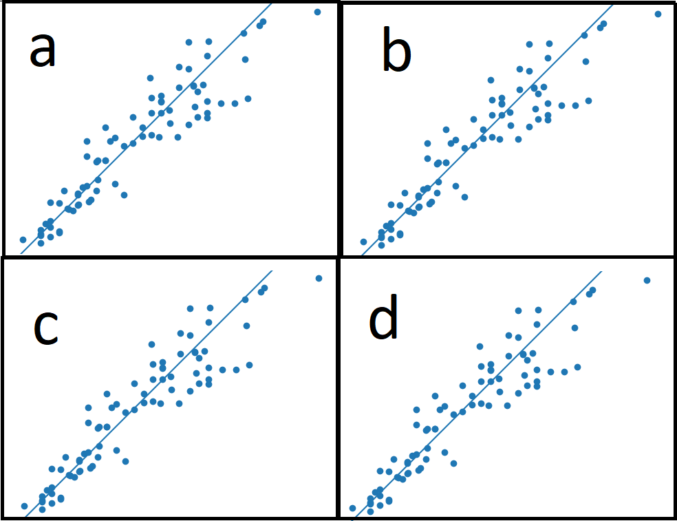

## Algorytm knn z wykorzystaniem filtru cech i wektorów.

### Przetwarzanie danych:

Program rozpoczyna się od odczytu pliku CSV zawierającego zbiór danych. Dane wejściowe i wyjściowe są odpowiednio oznaczone, a rozmiar zbioru danych jest określany. Ten krok zapewnia prawidłową strukturę danych dla dalszej analizy.

### Oryginalny model (Przypadek 'a'):

Program przechodzi do oceny oryginalnego modelu bez żadnej selekcji cech. Dane wejściowe są normalizowane za pomocą MinMaxScaler, a zbiór danych jest dzielony na zbiór treningowy i testowy. Następnie trenowany jest model regresji K najbliższych sąsiadów (KNN), który jest oceniany za pomocą walidacji krzyżowej. Obliczany jest błąd średniokwadratowy (RMSE), aby ocenić wydajność modelu.

```Python
def process_case(inputs, outputs, size, name, case):
    # Normalize
    scaler = MinMaxScaler()
    inputs_normalized = scaler.fit_transform(inputs)

    # Split the dataset
    input_train, input_test, output_train, output_test = train_test_split(
        inputs_normalized,
        outputs,
        test_size=0.2,
        random_state=42,
        # shuffle = False # (if same order is required)
    )

    # Train model
    scores = {}
    models = []
    for k in range(1, 21):
        knn = KNeighborsRegressor(n_neighbors=k)
        cv_scores = cross_val_score(
            knn,
            inputs_normalized,
            outputs,
            cv=5,
            scoring="neg_mean_squared_error",
        )
        rmse_scores = (-cv_scores) ** 0.5
        scores[k] = rmse_scores.mean()
        models.append(knn)

    best_k = min(scores, key=scores.get)
    print(f"Case {case}: k = {best_k}, Mean cross-validation score: {scores[best_k]}")

    # Train model with best k
    knn = models[best_k - 1]
    knn.fit(input_train, output_train)

    # Test model
    output_pred = knn.predict(input_test)
    mse = ((output_pred - output_test) ** 2).mean()
    rmse = mse**0.5
    print(f"Case {case}: Root Mean Squared Error: {rmse}")

    dataset_range = (min(output_test), max(output_test))
    with open(f"./output2/{name}_{case}.txt", "w") as f:
        f.write(
            f"Name: {name}\nCase: {case}\nRoot Mean Squared Error: {rmse}\nbest k: {best_k}\ndata range: {dataset_range}\ndataset size: {size}\n"
        )
        f.write(f"Predicted Data\tRaw Data\n")
        for i in range(len(output_pred)):
            f.write("{:.2f}\t{:.2f}\n".format(output_pred[i], output_test[i]))

    # plot displaying comparison of data
    plt.clf()
    plt.scatter(output_test, output_pred)
    plt.xlabel("True Values")
    plt.ylabel("Predictions")
    plt.axis("equal")
    plt.xlim(plt.xlim())
    plt.ylim(plt.ylim())
    plt.plot([-100000, 100000], [-100000, 100000])
    plt.savefig(f"output2/{name}_{case}.png")
```


### Selekcja cech za pomocą filtra cech (Przypadek 'b'):

Następnie program stosuje selekcję cech za pomocą techniki filtra cech. Wykorzystywany jest przekształtnik VarianceThreshold do wyboru cech na podstawie wartości progowej. Wybrane cechy są następnie używane do trenowania i oceny modelu regresji KNN, podobnie jak w przypadku oryginalnego modelu.

```Python
def feature_filter(inputs, threshold):
    # Perform feature filtering using VarianceThreshold
    selector = VarianceThreshold(threshold=threshold)
    selected_features = selector.fit_transform(inputs)
    return selected_features
```


### Selekcja wektorów (Przypadek 'c'):

W tym kroku program przeprowadza selekcję wektorów przy użyciu metody SelectKBest z funkcją oceny f_regression. Parametr 'k' określa liczbę najlepszych cech do wyboru. Program stosuje technikę selekcji wektorów i trenuje model regresji KNN z wybranymi wektorami. Wydajność modelu jest oceniana za pomocą metryki RMSE.

```Python
def vector_selection(inputs, outputs, k):
    # Perform vector selection using SelectKBest and f_regression
    selector = SelectKBest(score_func=f_regression, k=k)
    selected_vectors = selector.fit_transform(inputs, outputs)
    return selected_vectors
```


### Selekcja cech i wektorów (Przypadek 'd'):

Ostatni przypadek łączy selekcję cech i wektorów. Wybrane cechy z kroku selekcji cech są dalej przetwarzane przy użyciu techniki selekcji wektorów. Powstałe wektory cech są wykorzystywane do trenowania i oceny modelu regresji KNN, jak w przypadku poprzednich przypadków.



